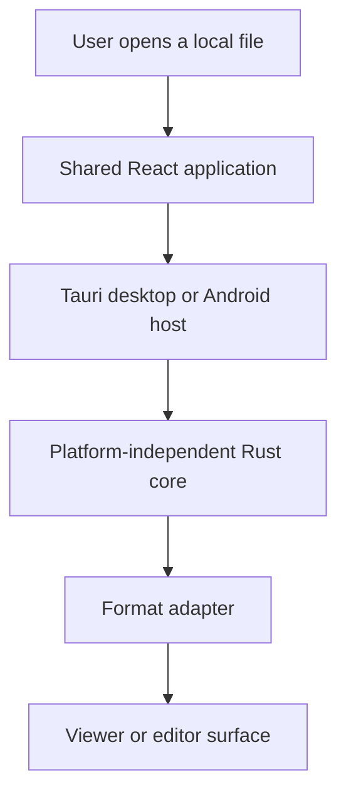

<div align="center">

# Glitchpad

**A focused, cross-platform viewer and editor for your files.**

[](https://github.com/ShruggieTech/glitchpad/actions/workflows/ci.yml) [](https://github.com/ShruggieTech/glitchpad/actions/workflows/codeql.yml) [](https://github.com/ShruggieTech/glitchpad/releases) [](LICENSE) [](#supported-platforms) [](#status)

</div>

Glitchpad is a minimal desktop and Android application for opening, inspecting, viewing, and selectively editing common local file formats. The interface stays out of the way so attention remains on the active file, while compact tabs make related files easy to keep together.

## Status

Glitchpad is at version 0.0.0. The repository contains the technical specification, buildable foundation shell, shared verification tooling, and desktop/Android host scaffolding. No installable release or production viewer is available yet.

The specification version remains in lockstep with the latest official application release. Every release requires a documentation reconciliation pass before publication.

## Planned capabilities

- Markdown viewing and in-place editing, including Mermaid diagram source, preview, and validation.
- Plain-text and source-code viewing and editing with language detection and syntax highlighting.
- Image viewing and inspection, including WebP, SVG, and multi-image ICO containers.
- PDF viewing with page navigation, document outlines, search, and metadata.
- DOCX and OpenDocument viewing through a safe, read-only rendering pipeline.
- A compact metadata inspector for filesystem properties, document metadata, image dimensions, and EXIF data.
- Small, keyboard-friendly tabs without workspace or project-management UI.

Capability claims are promoted from planned to implemented only after their specification, implementation, tests, and platform evidence land together.

## Supported platforms

| Platform | Foundation target | Distribution status |
| --- | --- | --- |
| Windows 10 and 11 | Tauri desktop host | No public binary |
| Current macOS releases | Tauri desktop host | No public binary |
| Supported Linux desktop distributions | Tauri desktop host | No public package |
| Supported Android releases | Tauri Android host | No public APK |

Platform support is evidence-based. A platform becomes supported for a release only when its build, smoke-test, packaging, and documentation gates pass for that release.

## Development

The shared toolchain is Rust 1.96.0, Node.js 24.11.0, pnpm 10.28.2, PowerShell 7, and Git. Desktop and Android builds add the platform SDKs described in [CONTRIBUTING.md](CONTRIBUTING.md).

```powershell
corepack prepare pnpm@10.28.2 --activate
pnpm install --frozen-lockfile
cargo xtask doctor
cargo xtask check
pnpm tauri dev
```

`cargo xtask check` is the local authority for native checks, frontend checks, documentation validation, version consistency, strict UTF-8, Mermaid direction, and public metadata.

## Architecture

Glitchpad keeps file interpretation and product behavior independent from platform hosts. The React application provides the shared presentation layer, Tauri provides narrow desktop and Android integration, and Rust owns trusted file and document processing.



The repository is organized as follows:

- `apps/glitchpad`: shared React application and component tests.
- `crates/glitchpad-core`: platform-independent Rust domain core.
- `crates/glitchpad-host`: Tauri desktop and Android host boundary.
- `crates/xtask`: cross-platform contributor and CI commands.
- `docs`: normative technical documentation.
- `specs`: Spec Kit feature specifications, plans, contracts, and tasks.
- `fixtures`: safe document fixtures for format, corruption, and hostile-input testing.

The normative architecture, security model, capability rules, and release requirements live in [the technical specification](docs/glitchpad-technical-specification.md).

## Security and privacy

Glitchpad is local-first. Documents remain on the device unless a future feature explicitly states otherwise and receives its own security review. File content is untrusted input, active content is disabled by default, and host permissions remain deny-by-default.

Do not report vulnerabilities in a public issue. Follow [SECURITY.md](SECURITY.md) to submit a private report.

## Contributing

Contributions are welcome after the foundation requirements in [CONTRIBUTING.md](CONTRIBUTING.md) are understood. All product changes begin with Spec Kit artifacts, include tests appropriate to their risk, and update the technical specification in the same change when behavior or architecture changes.

For usage questions and design discussions, see [SUPPORT.md](SUPPORT.md). Participation is governed by the [Code of Conduct](CODE_OF_CONDUCT.md).

## License

Glitchpad is licensed under the [Apache License, Version 2.0](LICENSE). See [NOTICE](NOTICE) for attribution information.

Copyright 2026 ShruggieTech.
