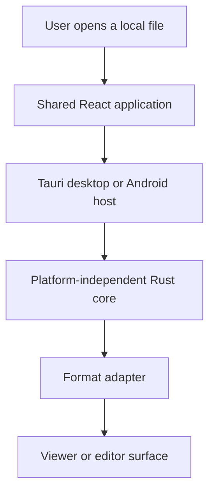

<div align="center">

<picture>
  <source media="(prefers-color-scheme: dark)" srcset="brand/logos/png/glitchpad-horizontal-color-1024.png">
  
</picture>

# Glitchpad

**A fast, cross-platform viewer and editor for local files.**

[](https://github.com/ShruggieTech/glitchpad/actions/workflows/ci.yml) [](https://github.com/ShruggieTech/glitchpad/actions/workflows/codeql.yml) [](https://github.com/ShruggieTech/glitchpad/releases) [](LICENSE) [](#supported-platforms) [](#status)

</div>

Glitchpad is a minimal desktop and Android application for opening, inspecting, viewing, and selectively editing common local file formats. The interface stays out of the way so attention remains on the active file, while compact tabs make related files easy to keep together.

## Status

Glitchpad v0.1.1 is the current corrective community release, with installable packages for Windows, macOS, Linux, and Android. It replaces the initial v0.1.0 packages with the content-first interface corrections from S027. Windows packages are unsigned and the macOS DMG is not Apple-notarized; see the [release notes](docs/releases/v0.1.1.md) for integrity checks and platform guidance.

The specification version remains in lockstep with the latest official application release. Every release requires a documentation reconciliation pass before publication.

## Current and planned capabilities

- Markdown viewing and in-place editing, including Mermaid diagram source, preview, and validation (available in v0.1.1).
- Plain-text and supported source-code viewing and editing with language detection and syntax highlighting (available in v0.1.1).
- Image viewing and inspection, including WebP, SVG, and multi-image ICO containers.
- PDF viewing with page navigation, document outlines, search, and metadata.
- DOCX and OpenDocument viewing through a safe, read-only rendering pipeline.
- A compact metadata inspector for supported text-family filesystem and document properties (available in v0.1.1); image metadata is planned.
- Small, keyboard-friendly tabs without workspace or project-management UI (available in v0.1.1).

Capability claims are promoted from planned to implemented only after their specification, implementation, tests, and platform evidence land together.

## Supported platforms

| Platform | v0.1.1 baseline | Distribution status |
| --- | --- | --- |
| Windows 11 x86_64 | Tauri desktop host | Unsigned NSIS installer and portable ZIP |
| macOS 13+ universal | Tauri desktop host | Ad-hoc-signed application in a non-notarized DMG |
| Ubuntu 22.04/24.04 x86_64 | Tauri desktop host | Repository-attested AppImage and Debian package |
| Android 7.0+ | Tauri Android host | Stable-project-key universal APK, ARM64 APK, and AAB |

Platform support is evidence-based. A platform becomes supported for a release only when its build, smoke-test, packaging, and documentation gates pass for that release.

## Development

The shared toolchain is Rust 1.96.0, Node.js 24.11.0, pnpm 10.28.2, PowerShell 7, and Git. Desktop and Android builds add the platform SDKs described in [CONTRIBUTING.md](CONTRIBUTING.md).

```powershell
corepack prepare pnpm@10.28.2 --activate
pnpm install --frozen-lockfile
cargo xtask doctor
cargo xtask check
pnpm tauri dev
```

`cargo xtask check` is the local authority for native checks, frontend checks, documentation validation, brand-canon integrity, website export validation, version consistency, strict UTF-8, Mermaid direction, and public metadata. Run `pnpm check:brand` for the focused brand contract and `pnpm check:site` for the production-equivalent public site.

## Architecture

Glitchpad keeps file interpretation and product behavior independent from platform hosts. The React application provides the shared presentation layer, Tauri provides narrow desktop and Android integration, and Rust owns trusted file and document processing.



The repository is organized as follows:

- `apps/glitchpad`: shared React application and component tests.
- `crates/glitchpad-core`: platform-independent Rust domain core.
- `crates/glitchpad-host`: Tauri desktop and Android host boundary.
- `crates/xtask`: cross-platform contributor and CI commands.
- `docs`: normative technical documentation.
- `brand`: approved brand canon, governed assets, and integration guidance.
- `site`: the static-exported Glitchpad landing page and public documentation application.
- `specs`: Spec Kit feature specifications, plans, contracts, and tasks.
- `fixtures`: safe document fixtures for format, corruption, and hostile-input testing.

The normative architecture, security model, capability rules, and release requirements live in [the technical specification](docs/glitchpad-technical-specification.md).

## Security and privacy

Glitchpad is local-first. Documents remain on the device unless a future feature explicitly states otherwise and receives its own security review. File content is untrusted input, active content is disabled by default, and host permissions remain deny-by-default.

Do not report vulnerabilities in a public issue. Follow [SECURITY.md](SECURITY.md) to submit a private report.

## Contributing

Contributions are welcome after the foundation requirements in [CONTRIBUTING.md](CONTRIBUTING.md) are understood. All product changes begin with Spec Kit artifacts, include tests appropriate to their risk, and update the technical specification in the same change when behavior or architecture changes.

For usage questions and design discussions, see [SUPPORT.md](SUPPORT.md). Participation is governed by the [Code of Conduct](CODE_OF_CONDUCT.md).

## License

Glitchpad is licensed under the [Apache License, Version 2.0](LICENSE). See [NOTICE](NOTICE) for attribution information.

Copyright 2026 ShruggieTech.
