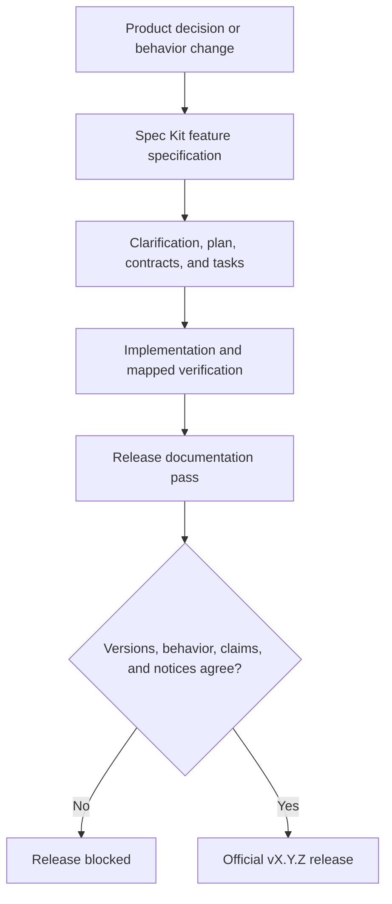
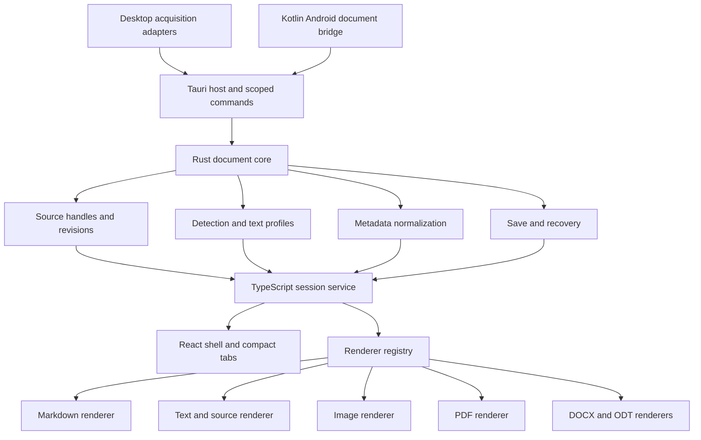
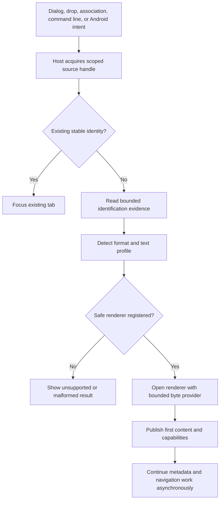
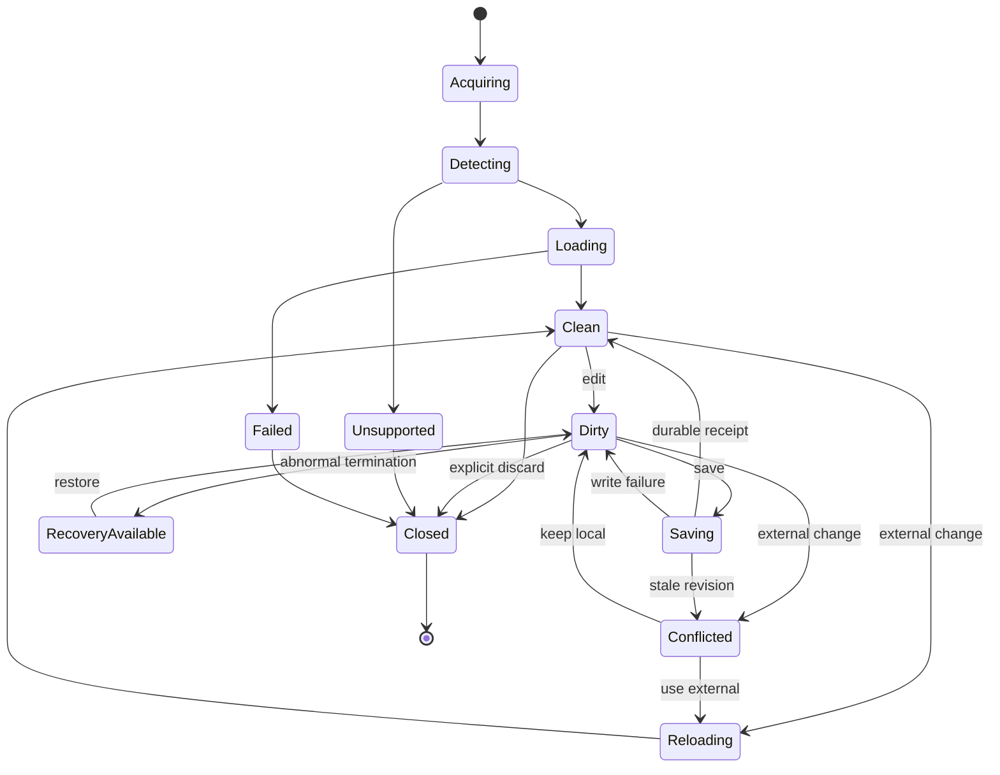
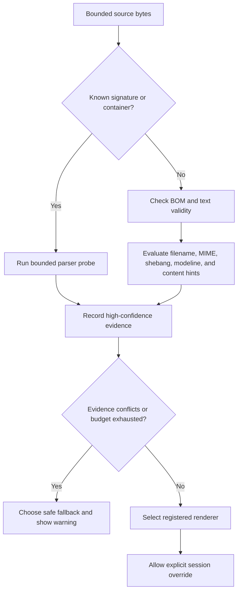
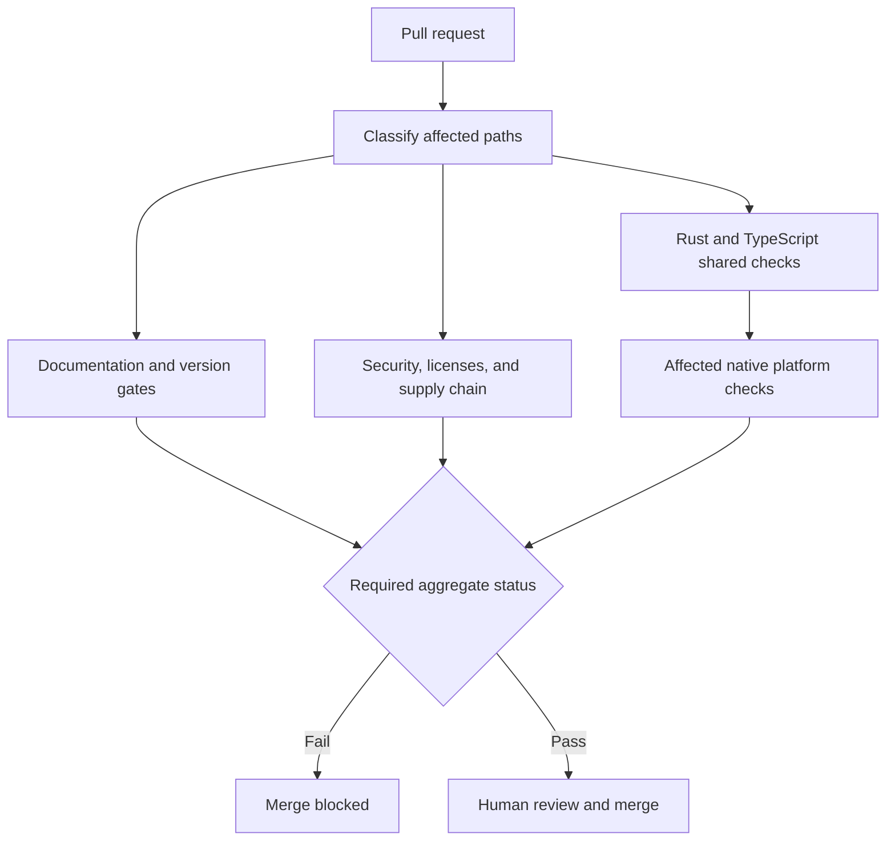
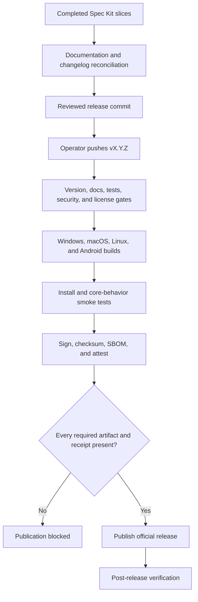

# Glitchpad Technical Specification v0.0.0

| Field | Value |
| --- | --- |
| Status | Draft normative foundation baseline |
| Specification version | 0.0.0 |
| Product version | 0.0.0 |
| Release class | Documentation and repository-foundation release; no application binaries |
| First binary release | 0.1.0 |
| Audience | Maintainers, contributors, reviewers, release operators, and implementation agents |
| Issued | 2026-08-30 |
| Repository | `github.com/ShruggieTech/glitchpad` |
| License | Apache License 2.0 (`Apache-2.0`) |

## Table of Contents

1. [Document Control and Authority](#1-document-control-and-authority)
2. [Product Definition and Positioning](#2-product-definition-and-positioning)
3. [Goals, Non-Goals, and Success Criteria](#3-goals-non-goals-and-success-criteria)
4. [Glossary and Normative Language](#4-glossary-and-normative-language)
5. [Scope and Capability Status](#5-scope-and-capability-status)
6. [Constraints and Assumptions](#6-constraints-and-assumptions)
7. [Functional Requirements](#7-functional-requirements)
8. [Quality Attributes and Budgets](#8-quality-attributes-and-budgets)
9. [Required Technology Stack](#9-required-technology-stack)
10. [System Architecture](#10-system-architecture)
11. [Domain Model and State Ownership](#11-domain-model-and-state-ownership)
12. [Document Sources and Platform Hosts](#12-document-sources-and-platform-hosts)
13. [File Identification, Format Detection, and Text Decoding](#13-file-identification-format-detection-and-text-decoding)
14. [File Lifecycle and Data Integrity](#14-file-lifecycle-and-data-integrity)
15. [Tabs, Windows, Sessions, and Recovery](#15-tabs-windows-sessions-and-recovery)
16. [Renderer System](#16-renderer-system)
17. [Markdown Viewing and Editing](#17-markdown-viewing-and-editing)
18. [Text and Source Viewing and Editing](#18-text-and-source-viewing-and-editing)
19. [Image Viewing and Inspection](#19-image-viewing-and-inspection)
20. [PDF Viewing and Navigation](#20-pdf-viewing-and-navigation)
21. [Office Open XML and OpenDocument Viewing](#21-office-open-xml-and-opendocument-viewing)
22. [Metadata and EXIF Inspector](#22-metadata-and-exif-inspector)
23. [User Interface, Interaction, and Accessibility](#23-user-interface-interaction-and-accessibility)
24. [Platform Strategy](#24-platform-strategy)
25. [Security and Privacy](#25-security-and-privacy)
26. [Performance and Large-File Strategy](#26-performance-and-large-file-strategy)
27. [Configuration, Persistence, and Diagnostics](#27-configuration-persistence-and-diagnostics)
28. [Repository Layout and Dependency Governance](#28-repository-layout-and-dependency-governance)
29. [Contributors and Development Environment](#29-contributors-and-development-environment)
30. [Build, Continuous Integration, and Documentation](#30-build-continuous-integration-and-documentation)
31. [Testing Strategy](#31-testing-strategy)
32. [Packaging, Distribution, and Updates](#32-packaging-distribution-and-updates)
33. [Release and Versioning Process](#33-release-and-versioning-process)
34. [Brand System and Required Brand Kit](#34-brand-system-and-required-brand-kit)
35. [Spec Kit Decomposition and Decision Records](#35-spec-kit-decomposition-and-decision-records)
36. [Roadmap Beyond v0.0.0](#36-roadmap-beyond-v000)
37. [Open Questions](#37-open-questions)
38. [Appendices](#38-appendices)

## 1. Document Control and Authority

This document is the architecture, behavior, platform, security, development, and delivery contract for the latest official Glitchpad release. Its version MUST equal the product version. v0.0.0 establishes the normative foundation and makes no claim that installable application artifacts exist.

The root Rust workspace version becomes the canonical product-version authority when the repository-foundation slice creates application manifests. Tauri configuration, npm package metadata, Android version name, this document, changelog release heading, release tag, artifact filenames, SBOM metadata, and provenance attestations MUST mirror that value. Automated consistency checks MUST reject any mismatch.

Unreleased changes belong in numbered Spec Kit feature directories under `specs/`. A completed feature does not alter the latest-release architecture of record until a release documentation pass reconciles it into this document. The pass MUST review every completed slice since the prior release, update affected architecture and behavior, revise capability and platform matrices, update contributor prerequisites and security posture, assemble changelog fragments, regenerate notices, and produce a reviewed documentation-pass receipt before the release tag is created.



### Revision history

| Specification | Date | Product release | Change |
| --- | --- | --- | --- |
| 0.0.0 | 2026-08-30 | 0.0.0 | Established the product, architecture, platform, security, contributor, license, release, and standalone/embedded Mermaid baseline |

Changes to normative released behavior require a product release and a matching specification version. Typographical corrections that do not alter meaning may be applied to the current version with a dated revision-history note and reviewed pull request.

## 2. Product Definition and Positioning

Glitchpad is a zero-cost, local-first application for opening, reading, inspecting, and selectively editing files. The document owns the viewport. The application supplies only the compact controls needed to interact with the active file and avoids turning file viewing into project, workspace, account, or service management.

The primary jobs are reading rendered Markdown, viewing and editing Mermaid diagrams, editing Markdown and plain text in place, viewing syntax-highlighted source without IDE behavior, opening several related files in compact tabs, checking file and embedded metadata without leaving the application, and viewing images, PDFs, DOCX documents, and ODT documents as their capability gates mature.

Public descriptions MUST follow the released capability matrix. “Everything viewer” is a product direction, not permission to claim unsupported formats.

## 3. Goals, Non-Goals, and Success Criteria

### Goals

- Open an explicitly selected file and display useful content with minimal delay and chrome.
- Preserve editable text encoding, byte-order-mark intent, newline structure, and external revisions without silent data loss.
- Support up to 32 open documents through compact tabs while keeping one active document visually dominant.
- Expose available host, provider, embedded, derived, and renderer-specific metadata through a dismissible inspector.
- Provide one shared behavior contract across Windows, macOS, Linux, and Android, including provider-backed Android documents.
- Keep core viewing, editing, inspection, recovery, and diagnostics offline and account-free.
- Add format families through isolated renderer contracts, hostile-file limits, conformance tests, and truthful release gates.
- Support standalone and Markdown-embedded Mermaid diagrams without rewriting authored layout or requiring an online renderer.
- Produce signed, checksummed, licensed, testable artifacts at a zero-dollar application price.

### Non-goals

- Workspaces, project trees, project indexing, project restore, or repository management.
- Language servers, compilation, debugging, terminals, refactoring, package management, or IDE extension systems.
- Browser extensions, browser-hosted file uploads, cloud conversion, accounts, synchronization, collaboration, or telemetry-dependent operation.
- A public plugin marketplace or third-party native-code loading surface.
- Rich document authoring, PDF editing, office-format editing, format conversion, or layout-publishing tools.
- Automatic loading of remote images, fonts, scripts, styles, documents, or office references.
- Electron or a bundled Chromium runtime.

### Product success criteria

- v0.1.0 ships official Windows, macOS, Linux, and Android artifacts with Markdown, Mermaid, and text/source view/edit, tabs, metadata inspection, save conflict protection, and crash recovery.
- Every official support claim has automated evidence or an explicit, repeatable manual verification record.
- No save path silently overwrites a conflicting external revision or discards dirty editor state.
- A user can open a file, switch among tabs, inspect metadata, search, edit supported text, and save using keyboard alone on desktop and touch alone on Android.
- Core operation produces no file-content network request and requires no sign-in.

## 4. Glossary and Normative Language

The key words **MUST**, **MUST NOT**, **REQUIRED**, **SHOULD**, **SHOULD NOT**, and **MAY** are interpreted as requirement levels consistent with RFC 2119 and RFC 8174 when capitalized.

| Term | Definition |
| --- | --- |
| Capability | One independently advertised operation such as view, edit, save, search, navigate, zoom, print, copy, or inspect |
| Document identity | The strongest stable host identity available for duplicate detection and external-revision tracking |
| Document session | Runtime state for one open source, renderer, tab, navigation state, editable buffer, and recovery relationship |
| Document source | A native source handle plus explicit read, seek, metadata, watch, permission, and write capabilities |
| External revision | Host-observed facts used to determine whether a source changed outside the session |
| Foundation | Normative design exists, but no released application artifact implements the capability |
| Host | The platform adapter that acquires and persists sources and owns native authority |
| Metadata fact | A typed value with provenance, availability, sensitivity, and copy policy |
| Mermaid diagram document | Standalone `.mmd` or `.mermaid` text source with rendered and source modes; Mermaid is its own diagram language and is also commonly embedded in Markdown fences |
| Planned | A versioned roadmap target with no current support claim |
| Renderer | An internal format module implementing the renderer contract and no broad native authority |
| Stable | Supported in official artifacts and covered by release-blocking evidence |
| Experimental | Available behind an explicit label with documented limitations and non-stable compatibility |
| Release documentation pass | Blocking reconciliation of completed Spec Kit slices and shipped behavior into release-facing records |

Notes and rationale are non-normative. Tables labeled as matrices are normative unless their heading states “informative.” Roadmap version targets are commitments subject to the same feature and release gates as any other behavior; they are not current support claims.

## 5. Scope and Capability Status

v0.0.0 contains no application artifacts. Every application capability is therefore `foundation` or `planned`. A capability becomes `experimental` or `stable` only through a release that includes the renderer, platform artifacts, conformance evidence, file associations, documentation, and notices.

| Format family | Examples | v0.0.0 status | First target | Target capabilities | Fidelity boundary |
| --- | --- | --- | --- | --- | --- |
| Markdown | `.md`, `.markdown` | Foundation | v0.1.0 | View, edit, save, search, navigate, inspect, print | CommonMark, GFM, footnotes, independently bounded fenced Mermaid blocks |
| Mermaid diagrams | `.mmd`, `.mermaid` | Foundation | v0.1.0 | View, edit, save, search, zoom, pan, inspect | Local strict rendering; no active links, callbacks, source rewriting, or generated-output export |
| Plain text and source | `.txt`, recognized language files | Foundation | v0.1.0 | View, edit, save, search, inspect, syntax highlight | Text editing without IDE services |
| Raster images | PNG, JPEG, GIF, WebP, BMP, TIFF | Planned | v0.2.0 | View, zoom, pan, frame navigation, inspect | Bounded decode and metadata; no editing |
| Vector images | SVG | Planned | v0.2.0 | View, zoom, inspect | Script-free, remote-resource-free rendering |
| Icon containers | ICO | Planned | v0.2.0 | View, inspect entries, export selected entry | Every embedded entry listed independently |
| PDF | `.pdf` | Planned | v0.3.0 | View, search, outline navigation, zoom, rotate, print, inspect | Viewing only; no JavaScript, forms submission, or editing |
| Office Open XML | `.docx` | Planned | v0.4.0 | View, heading navigation, search, inspect | Semantic readability, not page-perfect layout |
| OpenDocument Text | `.odt` | Planned | v0.5.0 | View, heading navigation, search, inspect | Semantic readability, not office-suite fidelity |
| Other binary | Executables, archives, unknown containers | Unsupported | None | Inspect basic host and detection facts | No hex editor or archive browser |

File dialogs, Android intent filters, desktop file associations, website copy, README claims, and release notes MUST be generated from or checked against the released matrix. Planned rows MUST NOT appear as supported associations.

## 6. Constraints and Assumptions

### Hard constraints

- Tauri 2 is the application and packaging framework. Electron is prohibited.
- Rust owns privileged native operations and untrusted-byte services. TypeScript owns the shared interface and renderer presentation. Kotlin is limited to Android platform integration.
- The application core works offline, without an account, remote service, or telemetry dependency.
- Windows, macOS, Linux, and Android are foundational targets and release-blocking for v0.1.0.
- Markdown prose uses one physical line per paragraph. Project text files use UTF-8 without BOM.
- Normative project diagrams use Mermaid. Project flowcharts and explicit project subgraph directions use top-to-bottom layout; this documentation convention MUST NOT rewrite, reject, or warn about a valid direction authored in an opened user file.
- Original project source and distributable original assets use Apache-2.0.

### Validated platform premises

- Tauri 2 supports desktop packaging and Android APK/AAB generation with a minimum Android API level of 24.
- System WebViews differ by platform; renderer conformance and package smoke tests are required on every target family.
- Android document providers may omit stable paths, seek, timestamps, persistent grants, or write support; source capabilities preserve those absences.
- Semantic DOCX and ODT rendering is a deliberate fidelity contract. Page-perfect office layout is outside scope.
- Release signing requires operator-owned platform credentials. Their absence blocks official publication but does not block unsigned development builds.

If a premise becomes false, implementation MUST stop at the affected gate and open a Spec Kit architecture-amendment slice. Implementations MUST NOT conceal the failure through platform-specific behavior that violates the shared contract.

## 7. Functional Requirements

- **TS-FR-001**: The application MUST open sources from desktop dialogs, drag-and-drop, command-line or association delivery, and Android view, open-document, create-document, and share intents where applicable.
- **TS-FR-002**: Opening a source with an identity equal to an existing session MUST focus the existing tab; uncertain identities MUST remain separate.
- **TS-FR-003**: The active document MUST receive at least 90 percent of the application client area at the 1280 by 800 desktop reference viewport when contextual drawers are closed.
- **TS-FR-004**: Tabs MUST remain compact, show name and dirty state, support reorder and keyboard switching, and provide bounded overflow without adding a workspace surface.
- **TS-FR-005**: The metadata inspector MUST be dismissible, preserve document context, and distinguish unavailable, unsupported, redacted, pending, and errored facts.
- **TS-FR-006**: Format detection MUST use bounded content evidence and MUST NOT trust an extension or externally claimed MIME type as sole authority.
- **TS-FR-007**: Editable text MUST preserve the accepted encoding, BOM, newline pattern, terminal newline, and undecodable-byte decision.
- **TS-FR-008**: Save MUST revalidate the external revision and MUST reject a stale write as a conflict.
- **TS-FR-009**: Close, reload, source revocation, deletion, rename, and abnormal termination MUST preserve dirty content until the user explicitly saves, discards, or declines recovery.
- **TS-FR-010**: Renderer controls MUST be derived from the active renderer's advertised capabilities.
- **TS-FR-011**: Every renderer MUST support cancellation, deterministic disposal, malformed-input reporting, resource-limit reporting, and metadata provenance.
- **TS-FR-012**: Markdown MUST render locally, sanitize generated output, disable raw HTML, and prevent remote resource loading.
- **TS-FR-013**: Text/source editing MUST provide line numbers, undo/redo, find and replace, go-to-line, wrapping, indentation, encoding/newline visibility, and lazy syntax highlighting without IDE services.
- **TS-FR-014**: Image viewing MUST support bounded zoom and pan; animated formats MUST expose pause and frame state; ICO MUST expose every embedded image entry.
- **TS-FR-015**: PDF viewing MUST provide virtualized pages, text search, thumbnails, document outline navigation, page labels, zoom, rotation, internal links, printing, and metadata without executing PDF JavaScript.
- **TS-FR-016**: DOCX and ODT viewing MUST report unsupported constructs and MUST NOT execute macros, formulas, scripts, or external references.
- **TS-FR-017**: External links MUST open through the operating system only after scheme validation and explicit user action.
- **TS-FR-018**: The application MUST remain functional without network access and MUST issue no implicit document-content request.
- **TS-FR-019**: Crash recovery MUST snapshot dirty editable text, enforce private-storage quotas, expire records after seven days, and remove records after confirmed save or discard.
- **TS-FR-020**: A malformed, encrypted, oversized, inaccessible, unsupported, or revoked source MUST produce a stable user-visible result without crashing the process.
- **TS-FR-021**: Every official artifact MUST contain license and notice material, expose the exact product version, and pass install/open/core-action/uninstall smoke tests.
- **TS-FR-022**: Every product change MUST include a documentation-impact declaration and follow the repository-installed Spec Kit workflow.
- **TS-FR-023**: Mermaid MUST support standalone `.mmd` and `.mermaid` documents plus fenced Markdown blocks through one local renderer contract; standalone source MUST be editable and conflict-safe, each embedded block MUST fail independently, authored source and direction MUST remain unchanged, and scripts, callbacks, automatic links, remote resources, and document-content network requests MUST remain disabled.

## 8. Quality Attributes and Budgets

Budgets are measured on release builds with fixtures stored in the repository corpus. CI records hardware class, operating system, WebView version, cold or warm state, fixture digest, sample count, median, p95, and peak memory. A release fails a hard limit; two consecutive warning-limit regressions require a performance slice.

| Attribute | Target | Warning | Hard limit |
| --- | --- | --- | --- |
| Cold shell interactive, desktop | p95 ≤ 1.5 s | > 1.5 s | > 2.5 s |
| Cold shell interactive, Android | p95 ≤ 2.5 s | > 2.5 s | > 4.0 s |
| 1 MiB UTF-8 text to first content | p95 ≤ 300 ms | > 300 ms | > 750 ms |
| 1 MiB Markdown to first rendered content | p95 ≤ 800 ms | > 800 ms | > 1.5 s |
| 1 MiB representative Mermaid to first rendered content, desktop | p95 ≤ 1.5 s | > 1.5 s | > 2.5 s |
| 1 MiB representative Mermaid to first rendered content, Android | p95 ≤ 2.5 s | > 2.5 s | > 4.0 s |
| Normal Mermaid edit to current preview after debounce | p95 ≤ 1.0 s | > 1.0 s | Any stale commit or repeated > 2.0 s result |
| Editor input to paint | p95 ≤ 50 ms | > 50 ms | Any repeated > 100 ms stall |
| Cancellation acknowledgement | p95 ≤ 100 ms | > 100 ms | > 250 ms |
| Idle desktop working set | ≤ 160 MiB | > 160 MiB | > 250 MiB |
| Idle Android proportional set | ≤ 180 MiB | > 180 MiB | > 256 MiB |
| Suspended text tab overhead | ≤ source bytes × 2.5 + 10 MiB | Above target | > source bytes × 4 + 20 MiB |
| Desktop compressed installer | ≤ 35 MiB | > 35 MiB | > 60 MiB |
| Universal Android APK | ≤ 40 MiB | > 40 MiB | > 65 MiB |
| Save durability | 100% revision precondition and recovery corpus pass | Any non-durable fallback | Any silent loss or partial destination |
| Accessibility | WCAG 2.2 AA automated and manual critical-flow pass | Minor non-blocking defect | Keyboard, touch, screen-reader, or contrast blocker |

Package-size hard limits may change only through a dated decision that identifies the dependency or artifact responsible and measures user value against download and storage impact.

## 9. Required Technology Stack

### Language and framework decision

Rust 1.96.0 with edition 2024 is the native and domain language. It owns source handles, raw-byte access, format evidence, metadata normalization, text round-trip profiles, revision checks, durable persistence, recovery storage, parser limits, and Tauri commands. Rust is selected for memory safety, explicit error handling, predictable native packaging, cross-platform libraries, and the ability to place hostile-file operations outside the WebView.

TypeScript 6 is the shared interface and renderer language. React 19 provides component composition, and Vite 8 provides the development and production bundle. TypeScript is selected because CodeMirror, unified, Mermaid, PDF.js, accessible DOM rendering, and Web Workers provide a mature document ecosystem across every Tauri WebView. React is restricted to view composition; explicit services and reducers own document state so renderer behavior remains testable without a component tree.

Kotlin is limited to the Tauri Android mobile-plugin boundary for intents, `ContentResolver`, URI grants, descriptors, provider metadata, and lifecycle callbacks. Business rules and renderer behavior MUST NOT be duplicated in Kotlin.

### Selected dependency families

| Concern | Selection | Boundary |
| --- | --- | --- |
| Application host | Tauri 2 | System WebViews and permissioned commands; no generic shell or broad filesystem capability |
| Editing and syntax | CodeMirror 6 and language-data packages | Lazy language loading; no language server or build integration |
| Markdown | unified, remark, GFM and footnote plugins, rehype, `rehype-sanitize` | One AST pipeline; raw HTML disabled |
| Mermaid diagrams | Mermaid 11.x API in a restricted local render context with final SVG allowlist sanitation | Standalone and Markdown-embedded use one adapter; no network, native bridge, scripts, click callbacks, loose security mode, or source rewrite |
| Raster images | Rust `image` with explicit features | Bounded decode; no default all-codec feature set |
| EXIF | `kamadak-exif` | Parsed in Rust; GPS marked sensitive |
| ICO | `ico` | Enumerate and preview every entry |
| SVG | `resvg` and `usvg` | Rasterized or safe tree output; no DOM insertion or external resources |
| PDF | PDF.js display layer and worker | Custom compact UI; no PDF JavaScript, submission, editing, or attachment launch |
| DOCX | Mammoth plus shared sanitizer | Semantic HTML only |
| ODT | Rust `zip`, `quick-xml`, and an internal semantic document tree | OASIS 1.4 package subset; no macro, formula, or external execution |
| Serialization | Serde and JSON schema-versioned messages | No database in the core product |

An exact dependency enters the repository only after license, provenance, maintenance, vulnerability, bundle, platform, and fixture-corpus review. Patch versions are authoritative in lockfiles, not this prose.

### Rejected stack directions

Electron is prohibited. Flutter and Compose Multiplatform replace mature browser renderer dependencies with a larger FFI or reimplementation burden. A fully native Rust UI lacks the required Android and renderer maturity. Per-platform native applications would duplicate behavior and conformance work. A browser-only application cannot implement associations, durable native sources, Android provider semantics, packaging, or offline local authority.

## 10. System Architecture

Glitchpad uses ports and adapters. The shared shell and renderer registry depend on value contracts. Rust document services implement native source, detection, metadata, save, and recovery ports. Desktop and Android adapters implement platform acquisition and persistence. Renderers cannot import host adapters or invoke arbitrary Tauri APIs.



### Dependency rules

- `glitchpad-core` MUST NOT depend on Tauri, React, WebView, or platform UI packages.
- Renderer modules MAY depend on shared TypeScript contracts and renderer-specific workers; they MUST NOT depend on Tauri invocation or native plugin packages.
- The host MAY depend on `glitchpad-core` and Tauri plugins approved through capability files.
- Android Kotlin code MUST expose the same source operations and error classes as desktop adapters.
- The shell MUST obtain commands from renderer capabilities and MUST NOT branch on file extensions.
- Renderer modularity is internal architecture and does not create a public plugin contract.

### Open flow



## 11. Domain Model and State Ownership

The canonical data contract is specified in `specs/002-v000-technical-specification/data-model.md`. The core entities are `DocumentSource`, `DocumentIdentity`, `SourceCapabilities`, `ExternalRevision`, `FormatDescriptor`, `DocumentSession`, `RendererDescriptor`, `RendererCapabilities`, `TextRoundTripProfile`, `MetadataFact`, and `RecoveryRecord`.

Native source handles are opaque UUID-keyed tokens scoped to one process and session. Desktop identity uses platform file identity with normalized path fallback. Android identity uses provider authority, document ID when available, and canonical URI. A path or URI string alone is never assumed to be stable identity.

Rust owns source handles, external revisions, format evidence, text profiles, normalized metadata, save preconditions, and persisted recovery. TypeScript owns the active editor state, tab order, selections, navigation, visible warnings, and renderer lifecycle. Every editable change increments a session revision. Every save includes the expected session and external revisions.



## 12. Document Sources and Platform Hosts

The host contract is `specs/002-v000-technical-specification/contracts/document-host.md`. A source independently advertises read, seek, stream, stat, watch, revalidate, write, atomic-replace, persistent-permission, rename, and deletion-observation capabilities. An unavailable capability is a normal value and MUST NOT be fabricated.

Desktop adapters accept dialog choices, dropped files, command-line arguments, and operating-system association events. They resolve a platform file identity, open the least-privileged handle needed for advertised operations, and register filesystem watching only while a session needs it.

Android adapters accept system-delivered `ACTION_VIEW`, `ACTION_OPEN_DOCUMENT`, `ACTION_CREATE_DOCUMENT`, and `ACTION_SEND` intents. The Kotlin bridge uses `ContentResolver` for descriptors, streams, provider metadata, and persistable grants. It MUST NOT derive or require a desktop-style path. Temporary grants remain temporary; persistent grants are requested only when the intent and provider permit them.

The unreleased S011 delta implements this boundary as a private Tauri mobile plugin. `ACTION_VIEW` and `ACTION_SEND` remain inbound deliveries, while Open and Create are application-initiated picker operations whose pending Tauri invoke is their one-use result authorization. Raw provider URIs remain native-private. Public source contracts carry opaque IDs, optional provider size and modification facts, explicit grant state, strong DocumentsContract identity only when authority and durable document ID are available, bounded read and Save As receipts, and stable redacted errors. Unknown provider replacement semantics always use Save As because Android exposes no portable atomic-replacement guarantee.

Persisted restoration records are bounded application-private state and are written only after the platform confirms a persistable grant. Startup and activity reload reconcile those records against held URI permissions before rebuilding native-private handles. API 24 and API 36 headless x86_64 controlled-provider tests prove metadata omission, descriptor seek, verified writes, and process-boundary restoration independently from the retained ARM64 packaging job.

The WebView receives source summaries and opaque IDs. It never receives a reusable native path, content URI grant, unrestricted filesystem scope, or generic read/write command.

## 13. File Identification, Format Detection, and Text Decoding

Detection evaluates bounded evidence in this order: container or magic signature, trusted parser probe, BOM, encoding validity, filename and extension, MIME hint, shebang, modeline, and content heuristic. Signature and successful parser evidence outrank extension and MIME claims. Every result preserves confidence, evidence, conflicts, and any user override.



Detection reads at most 256 KiB before renderer selection, spends at most 100 ms desktop or 200 ms Android on synchronous evidence, and runs expensive probes in a worker with a 2-second hard timeout. Archive and PDF probes read only structural ranges when seek is available.

`.mmd` and `.mermaid` are Mermaid candidate evidence, not authority. A standalone Mermaid result requires a valid text profile plus a bounded supported diagram declaration or valid Mermaid frontmatter followed by a declaration. Ambiguous text opens through the highest-confidence safe renderer and retains an explicit session override.

Text decoding supports UTF-8, UTF-16LE, UTF-16BE, and a reviewed set of legacy encodings through a dedicated decoding library. UTF-8 without BOM is the default only when bytes validate. Invalid-byte replacement marks the profile as not round-trip safe and disables ordinary save until the user selects an encoding or explicitly accepts a lossy save. BOM presence, newline kind per line, and terminal-newline state are preserved. A user normalization command is the only operation that rewrites mixed newline structure.

## 14. File Lifecycle and Data Integrity

Opening creates a source handle, observes an external revision, detects the format, selects a renderer, publishes first content, and continues non-critical metadata work asynchronously. Closing disposes the renderer, cancels work, releases object URLs and workers, closes native handles, and removes recovery only after dirty-state resolution.

Desktop save writes a sibling temporary file, flushes content, preserves required permissions, atomically replaces the destination, and syncs the parent directory where the platform provides that primitive. If a platform or filesystem cannot atomically replace, Glitchpad MUST disclose the weaker guarantee before writing and retain a recoverable backup until the replacement succeeds.

Android save writes through a provider descriptor only when the source advertises safe write behavior. A read-only or unsafe provider source uses Save As through `ACTION_CREATE_DOCUMENT`. The application never truncates a provider source before a complete save payload and revision check are ready.

Before every save, Rust revalidates the external revision. A mismatch moves the session to `conflicted`, preserves local edits, and offers: compare available metadata, reload and discard local edits, keep local edits and Save As, or explicitly overwrite after a second confirmation. No default action overwrites either revision.

Rename, deletion, watcher overflow, permission revocation, provider unavailability, storage exhaustion, and partial I/O use stable error categories and preserve dirty content. Save success is recognized only from a durable host receipt carrying the new external revision.

## 15. Tabs, Windows, Sessions, and Recovery

Desktop uses one application window with one compact tab strip. Android uses one activity; phones show the active title and a tab-count switcher that opens a sheet, while tablets may show the desktop-style strip. v0.1.0 does not support multiple application windows.

Tabs have a 32-pixel desktop height, 96-pixel minimum width, 180-pixel preferred maximum width, filename, dirty indicator, close action, accessible full-location tooltip, and drag reorder. Overflow moves excess tabs into a searchable list without creating persistent navigation. The ordinary limit is 32 sessions; opening the thirty-third requires closing a tab or explicitly increasing the safety limit in a future specification.

`Ctrl+Tab` and `Ctrl+Shift+Tab` cycle tabs; platform-standard close and save shortcuts act on the active tab. A second desktop invocation forwards open requests to the running process and focuses or creates tabs. Android intents delivered to a running activity follow the same identity rule.

Routine session restoration is disabled. A launch with an explicit source opens that source only. A launch without a source shows a minimal open/drop surface. Crash recovery is enabled for dirty text sessions and is separate from session restore.

Recovery snapshots use application-private storage, owner-only permissions where supported, atomic writes, a seven-day lifetime, and total quotas of 256 MiB desktop and 128 MiB Android. Snapshots are written after 2 seconds of edit idle time and at least every 30 seconds while dirty. If quota pressure threatens the active document, the application warns immediately. Confirmed save or explicit discard removes the matching record.

## 16. Renderer System

The base renderer contract is `specs/002-v000-technical-specification/contracts/renderer.md`; Mermaid specializes it through `specs/003-mermaid-view-edit/contracts/mermaid-renderer.md`. A renderer registers a stable ID, exact format families and variants, maturity, platform set, operations, limits, worker policy, and lazy module loader. Registration order never decides detection priority.

The open context contains a bounded byte provider, cancellation signal, metadata sink, renderer-scoped asset URL factory, theme and accessibility preferences, and progress sink. It contains no arbitrary Tauri invocation, filesystem API, Android URI, network client, or shell executor.

The shell renders only commands advertised by the active renderer. `edit`, `save`, and `save_as` remain independent. A recovered text buffer can be editable while its original source is unavailable, exposing Save As without Save.

CPU-intensive parsing runs in Web Workers or Rust worker threads. Cancellation MUST stop new work within 250 ms. Background tabs suspend decoded image surfaces, PDF canvases, office trees, object URLs, and other regenerable caches. Disposal is idempotent and releases every worker, lease, observer, subscription, and timer.

Every renderer passes the shared conformance suite for first content, capabilities, cancellation, malformed and oversized input, metadata provenance, suspension, repeated open/close, disposal, and platform parity. Editable renderers also pass undo/redo, dirty state, round-trip preservation, conflict, save, Save As, recovery, and lossy-save denial.

## 17. Markdown Viewing and Editing

Markdown uses one CommonMark-based unified pipeline with GFM tables, task lists, strikethrough, autolinks, and footnotes. Raw HTML is parsed as inert text and never inserted into the document DOM. Generated HTML is sanitized after the final transform through a versioned allowlist.

Rendered view is the default. Source view is the editing surface. A compact mode action toggles between rendered and source views; split view is deferred until a measured workflow demonstrates that its permanent viewport cost is justified. Preview updates are debounced at 100 ms and cancel superseded work.

Local relative images resolve through renderer-scoped asset tokens only after path normalization and source-root checks. Remote images, fonts, styles, embeds, and includes remain blocked. External links display the destination host and open through the operating system after scheme validation and explicit action. `file:`, `javascript:`, `data:` navigation, custom executable schemes, and embedded frames are blocked.

Fenced code receives escaped syntax highlighting from lazy language packages. Fenced `mermaid` content renders through the shared Mermaid adapter with strict immutable security configuration, no click callbacks, no native authority, no remote resources, and a final SVG allowlist after generation. Each block has a revision-bound result and bounded fallback so malformed or over-limit source cannot prevent the surrounding Markdown or another block from rendering. Authored direction is preserved.

Markdown editing provides undo/redo, line numbers, find/replace, go-to-line, wrapping, indentation, bracket handling, and round-trip encoding/newline behavior. The renderer does not provide format conversion, selectable parser engines, HTML authoring, or project-wide link validation.

### Mermaid diagram documents

Mermaid is a text-based diagram language commonly embedded in Markdown, not a Markdown subset. Standalone `.mmd` and `.mermaid` files use the editable-text lifecycle and open in rendered mode when valid. A compact action switches between rendered and source modes; empty, currently unrenderable, or over-limit source opens in source mode when no prior valid preview exists.

Source mode provides the same encoding/newline preservation, undo/redo, find/replace, line navigation, dirty state, recovery, conflict detection, Save, and Save As behavior as editable text. Rendering never serializes, formats, repairs, or rewrites the source. Diagram type, comments, whitespace, safe directives, and layout direction remain authored content. The project's top-to-bottom documentation convention has no effect on opened user documents.

Preview validation begins 300 ms after the newest source edit. Requests are keyed to the exact source revision; superseded, cancelled, hidden, or stale results cannot replace current output. A parse or render failure preserves all source and keeps the last valid preview visibly marked as stale when one exists. Diagnostics classify malformed source, unsupported syntax, resource limits, cancellation, and internal failure, with line and column only when parser evidence is reliable.

Rendered mode provides fit-to-view, actual size, zoom from 10 to 800 percent, reset, bounded pan, rendered-label search, copy, and metadata inspection through compact contextual controls. Keyboard, pointer, and touch paths remain equivalent. Authored `accTitle` and `accDescr` label the sanitized SVG; unannotated diagrams receive a localized filename/type or block-position label plus a direct route to source.

Mermaid does not provide generated SVG/PNG/PDF export, presentation mode, visual graph manipulation, online rendering, collaboration, callbacks, user renderer plugins, or automatic layout conversion.

## 18. Text and Source Viewing and Editing

The text renderer provides a lightweight editor, not an IDE. It includes line numbers, selectable wrapping, find and replace, go-to-line, undo/redo, multi-selection supplied by CodeMirror, indentation commands, encoding and newline status, syntax highlighting, and explicit language override.

Language detection uses exact filename, extension, shebang, modeline, and bounded content evidence. CodeMirror language packages load only when selected. Unknown text opens as plain text. A user override affects the session; persistent extension overrides require an explicit preference action.

Mermaid source mode is a specialized text language mode. It adds diagram diagnostics and preview navigation but MUST NOT acquire language-server, execution, workspace, or visual-source-generation behavior.

The renderer MUST NOT implement language servers, compilers, build commands, debugging, terminals, project search, project symbols, package management, repository operations, AI completion, or IDE refactoring.

Files through 32 MiB support full editing and syntax highlighting subject to line limits. Files from 32 MiB through 256 MiB open in virtualized large-text read-only mode with search and copy; syntax highlighting is disabled. Files above 256 MiB are refused with size and alternative-tool guidance. A single line above 2 MiB disables syntax parsing for that document and remains viewable in plain-text mode.

## 19. Image Viewing and Inspection

Image support activates in v0.2.0. Required raster formats are PNG, JPEG, GIF, WebP, BMP, and TIFF. SVG and ICO are separate variants under the image renderer family.

The renderer provides fit, actual-size, zoom, pan, background selection for transparency, orientation handling, pixel dimensions, animation pause/resume, frame position, and metadata inspection. It does not modify image pixels or write image containers.

Rust identifies and validates containers before presentation. The `image` crate uses explicit codec features. WebView decoding may provide a display fast path only after native size and format checks. A separate `libwebp` dependency is not part of the baseline because pure-Rust and system decoders satisfy required WebP behavior without a C packaging surface.

ICO inspection lists each directory entry with width, height, bit depth, encoding, byte size, and validity. The user may preview and export one embedded entry as PNG without altering the source.

SVG is parsed by `usvg` and rendered by `resvg`. Scripts, event handlers, foreign objects, external styles, fonts, images, links, and network references are discarded or reported. Untrusted SVG is never inserted directly into the application DOM.

## 20. PDF Viewing and Navigation

PDF support activates in v0.3.0 and uses the PDF.js display layer in a dedicated worker. Glitchpad supplies its own compact shell rather than embedding the generic PDF.js viewer.

The renderer provides virtualized page canvases, text selection, search, thumbnails, document outline and table-of-contents navigation, page labels, direct page navigation, zoom, rotation, internal links, metadata, and printing. Only visible and adjacent pages remain rendered; suspended tabs release canvases and retain compact navigation state.

PDF JavaScript, form submission, embedded-file launch, multimedia, remote resource access, automatic external-link opening, annotations editing, signatures, redaction, and document modification are disabled. Encrypted documents may request a password for in-memory use; passwords are never persisted or logged. Unsupported encryption produces a stable error.

The renderer accepts files through 512 MiB desktop and 256 MiB Android, at most 10,000 pages, and at most 200 MiB of active rendered surfaces desktop or 96 MiB Android. Ranged reads are used when the source supports seek. First content is the first requested page, not complete document parsing.

## 21. Office Open XML and OpenDocument Viewing

DOCX support activates in v0.4.0. Mammoth converts Word semantics to a renderer-neutral HTML tree, which passes through the shared sanitizer. Supported content includes headings, paragraphs, lists, tables, hyperlinks, footnotes/endnotes, inline images, basic emphasis, and core document properties. The renderer provides heading navigation, search, copy, and metadata.

ODT support activates in v0.5.0. A bounded Rust parser reads the OASIS OpenDocument 1.4 package structure with `zip` and `quick-xml`, validates required package entries, and emits the same semantic document tree used by the office presentation layer. Supported content includes headings, paragraphs, lists, tables, hyperlinks, notes, inline images, basic text styles, and document metadata.

The fidelity promise for both formats is semantic readability. Pagination, exact font substitution, line wrapping, floating-object placement, tracked changes, comments workflows, fields, formulas, charts, macros, scripts, embedded executables, external resources, and editing are not promised. Unsupported constructs produce a per-document report rather than disappearing silently.

Office containers are limited to 128 MiB compressed input, 10,000 entries, 512 MiB expanded desktop or 256 MiB Android, 100:1 aggregate expansion, 20 nested relationship traversals, and normalized internal paths with traversal rejection. Encrypted packages are reported as unsupported in their first renderer releases.

## 22. Metadata and EXIF Inspector

The metadata inspector is opened by a compact information icon in the active document bar or the platform menu. Desktop uses a dismissible right-side overlay up to 360 pixels wide. Android uses a bottom sheet on phones and a side sheet on tablets. Closing it restores the full document surface.

Facts are grouped as Source, Content, Embedded, Derived, and Renderer. Every fact includes a typed value, source, availability, unit, sensitivity, and copy policy. The interface shows `Not provided`, `Unsupported`, `Redacted`, `Pending`, or a stable error instead of inventing a value.

Source facts include display name, source kind, size, observed modification time, creation/birth time when the host supplies it, permissions or provider write state, identity confidence, and current external revision. Text facts include encoding, BOM, newline pattern, line and character counts, language mode, and round-trip safety. Mermaid facts include detected diagram type, parser version and status, current and preview revisions, stale-preview state, authored accessibility annotation presence, source bytes, edge count, output bytes, timings, and active limit result when available. Image facts include dimensions, frames, color model, orientation, EXIF, IPTC, XMP, and ICO entries. PDF and office facts include title, author, subject, keywords, creator, producer, page or structural counts, and format version when parsable.

EXIF GPS facts are collapsed and marked sensitive by default. Copying coordinates requires an explicit action. Checksums are absent until requested; SHA-256 calculation runs cancellably and reports the external revision it represents.

Metadata extraction obeys the same parser and resource limits as rendering. A metadata failure cannot prevent content viewing unless it proves the source is malformed for the selected renderer.

## 23. User Interface, Interaction, and Accessibility

The file owns the viewport. Permanent UI consists of the platform window frame, one compact document bar, one compact tab surface where space permits, and renderer controls that appear only when the active capability requires them. There is no sidebar, dashboard, project tree, ribbon, status-panel stack, promotional content, or persistent metadata region.

At 1280 by 800 with drawers closed, document content occupies at least 90 percent of client-area pixels. The combined desktop document and tab bars remain at or below 72 pixels. Icons use 16- or 18-pixel artwork inside minimum 32-pixel desktop targets. Android touch targets meet a 48-density-independent-pixel minimum without enlarging the visible icon.

Desktop tabs expose full accessible names, dirty state, close state, and position. Phone layouts expose active title, tab count, open, information, and overflow actions; the tab sheet supports search only when overflow exists. Renderer controls may collapse into overflow before reducing the document below its minimum area.

Keyboard navigation follows platform conventions and maintains a visible focus indicator. Screen readers receive semantic headings, landmarks, tab roles, progress state, error summaries, metadata groups, page counts, and renderer command names. Dynamic updates use restrained live regions and never announce every keystroke or scroll event.

Mermaid rendered/source mode, fit, zoom, reset, pan, search, stale-preview state, diagnostics, and metadata are exposed through renderer-contextual controls. Generated SVG cannot trap sequential focus. Diagram labels remain searchable, authored accessible titles and descriptions are preserved, and every successful unannotated diagram receives a fallback label and source route.

Color meets WCAG 2.2 AA contrast. The application honors system light/dark theme, high-contrast or forced-colors behavior where available, reduced motion, text scaling, and browser zoom. Motion is limited to state continuity and remains below 200 ms; no essential information depends on animation or color alone.

The initial language is US English. All user-visible strings, dates, units, plurals, and shortcuts use localization-ready resources. File names and metadata values are never translated.

## 24. Platform Strategy

All four target families are Tier 1 for v0.1.0. A Tier 1 platform requires an official artifact, native build host, automated shared suite, adapter tests, installation smoke tests, core user-flow evidence, version and license evidence, and a named support baseline.

| Platform | Runtime baseline | Architectures | Official v0.1.0 artifacts | Native WebView |
| --- | --- | --- | --- | --- |
| Windows | Windows 11 | x86_64 | NSIS installer, portable ZIP | WebView2 Evergreen |
| macOS | macOS 13+ | arm64 and x86_64 universal | Signed and notarized DMG | WKWebView |
| Linux | glibc baseline built on Ubuntu 22.04 | x86_64 | AppImage, Debian package | WebKitGTK 4.1 |
| Android | Android 7.0+, min API 24, target API 36 | arm64-v8a and x86_64 required; universal package | Universal APK, split ARM64 APK, AAB | Android System WebView |

Windows file associations and command-line delivery route to the running instance. macOS handles open-document application events. Linux follows freedesktop MIME registration and desktop-entry conventions. Android registers only released format MIME types and extensions and accepts view/open/share intents according to provider grants. `.mmd` and `.mermaid` associations and intent filters activate only when the standalone Mermaid capability reaches stable status on the complete Tier 1 matrix.

Windows ARM64 and Linux ARM64 are planned platform expansions after v0.1.0 and require their own build, package, and device evidence. iOS is outside the current platform boundary.

System WebView versions are recorded in diagnostics and test evidence. Glitchpad does not bundle a browser engine to mask obsolete or broken system WebViews; unsupported runtimes receive a precise prerequisite error.

## 25. Security and Privacy

Every opened source is hostile input. The trust boundary begins at native acquisition and remains in force through detection, parsing, generated markup, metadata, navigation, saving, caching, logs, and packaging.

The Tauri capability set is deny-by-default and scoped by window and command. The application exposes source-handle operations, not generic filesystem or shell plugins. Capability files MUST avoid overlapping grants that silently merge permissions. Development-only capabilities are absent from release bundles.

The release content-security policy uses `default-src 'self'`, denies network connections, objects, arbitrary frames, form submissions, and base changes, and permits only bundled scripts/styles plus scoped blob/data or application-asset sources required by reviewed renderers. The sole framed exception is a bundled, sandboxed Mermaid render context with scripts but no same-origin authority, navigation, opener, forms, downloads, storage, network, or Tauri bridge; its typed message contract contains bounded source and render results only. Inline script and eval are prohibited. Remote images, fonts, styles, workers, and media are prohibited.

Generated Markdown, DOCX, ODT, and Mermaid output is sanitized after the final unsafe transformation. Mermaid's generated SVG passes an application-owned element, attribute, namespace, CSS, URL, and output-size allowlist before insertion; standalone SVG documents remain rasterized or represented through a safe tree and are never inserted as source DOM. PDF JavaScript and office macros never execute. Archive paths are normalized and traversal is rejected. External references are reported and not fetched.

Renderer limits cover source bytes, probe bytes, decoded pixels, pages, canvases, archive entries, expanded bytes, compression ratio, relationship depth, CPU time, memory, and concurrent workers. Timeouts and cancellations produce explicit results. A parser panic or worker termination cannot crash the application host or corrupt a source.

Temporary files and recovery records use application-private directories and owner-only permissions where supported. Sensitive metadata and full locators are redacted from logs. Diagnostic bundles require explicit user creation and preview. No telemetry, crash upload, analytics, or background network report is enabled.

Dependency security uses locked inputs, automated vulnerability and license checks, secret scanning, SBOM generation, provenance attestations, and prompt review of parser advisories. Security reports use the repository security policy and private disclosure channel established by the repository-foundation slice.

## 26. Performance and Large-File Strategy

Whole-file buffering is permitted only inside the format limits below and only when peak decoded memory remains inside the renderer budget. Seek-capable sources use ranged reads for PDF and bounded probes. Stream-only Android sources may use an application-private cache when a renderer requires seek; the cache obeys source-size, quota, privacy, revision, and cleanup rules.

| Workload | Full capability | Degraded capability | Refusal threshold |
| --- | --- | --- | --- |
| Markdown | ≤ 16 MiB rendered and editable | 16–32 MiB source editing without live preview; 32–256 MiB large-text view | > 256 MiB |
| Standalone Mermaid | ≤ 1 MiB source, 2,000 edges, 8 MiB sanitized SVG, 5 s render | 1–32 MiB source editing without preview; 32–256 MiB large-text view | > 256 MiB source or any renderer hard limit for preview |
| Embedded Mermaid | ≤ 256 KiB per block, 64 blocks and 1 MiB aggregate Mermaid source per Markdown document; 2,000 edges, 8 MiB output, and 5 s per block | Source remains available while over-limit blocks show independent fallbacks | Parent Markdown threshold governs source; renderer hard limits govern each preview |
| Text/source | ≤ 32 MiB editable and highlighted | 32–256 MiB virtualized read-only plain text | > 256 MiB |
| Raster image | ≤ 100 megapixels and decoded budget | Preview thumbnail when available | > 200 megapixels or decoded hard budget |
| PDF desktop | ≤ 512 MiB, 10,000 pages | Reduced cache and thumbnails disabled | Above source/page hard limit |
| PDF Android | ≤ 256 MiB, 10,000 pages | Reduced cache and thumbnails disabled | Above source/page hard limit |
| DOCX/ODT | ≤ 128 MiB compressed and expansion limits | Images omitted after decoded-image budget | Any archive hard limit |

Work is chunked around the UI event loop. Main-thread tasks SHOULD remain below 16 ms and MUST NOT repeatedly exceed 50 ms during interaction. Syntax, Markdown, Mermaid, PDF, image, checksum, and office work is cancellable. Mermaid allows one current request per owner and two active render contexts application-wide. Switching tabs prioritizes active content and suspends background rendering.

Performance tests use small, medium, boundary, and hostile fixtures with stable digests. A claim is invalid without the fixture, host, WebView, build profile, sample count, and measurement output.

## 27. Configuration, Persistence, and Diagnostics

The v0.1.0 preference schema contains theme, editor font family and size, line wrapping, tab width, Markdown default mode, and explicit language overrides. It contains no account, synchronization, workspace, telemetry, remote-resource, plugin, or recent-file setting.

Preferences are schema-versioned JSON in the platform application-config directory. Writes are atomic. A migration is deterministic and covered by fixtures; an unreadable future schema is preserved and reported instead of overwritten.

Recovery records and bounded renderer caches live in application-private data/cache directories. Recovery survives abnormal termination and expires after seven days. Regenerable caches are disposable, revision-keyed, quota-bound, and cleared by the user or automatically after expiry. No database is used.

Structured logs include timestamp, level, stable event ID, platform, component, duration, byte count, and stable error code. They exclude content, editor text, passwords, full paths, raw Android URIs, EXIF values, and recovery payloads. Release logs default to information level with bounded rolling retention.

The About/Environment surface shows product version, specification version, platform, architecture, WebView version, Rust core version, renderer versions, capability status, build commit, and license links. An explicit diagnostic export lets the user preview redacted logs and environment facts before saving a local bundle.

## 28. Repository Layout and Dependency Governance

```text
apps/glitchpad/          Shared TypeScript, React, renderers, workers, and UI tests
crates/glitchpad-core/   Platform-independent document, detection, metadata, and persistence rules
crates/glitchpad-host/   Tauri host, scoped capabilities, desktop adapters, generated Android host
crates/xtask/            Cross-platform doctor, bootstrap, check, test, docs, package, and release gates
docs/                    Technical specification, ADRs, brand, contributor, security, and operations docs
fixtures/                Licensed document corpus, hostile cases, expected outputs, and provenance
specs/                   Spec Kit feature specifications, plans, contracts, tasks, and analysis
scripts/                 Narrow helpers invoked and validated by xtask
```

Dependency direction is renderer → shared renderer contracts, shell → session and renderer contracts, host → core, adapters → host ports. Core code never imports application UI or Tauri. Renderer code never imports host adapters.

`Cargo.lock`, `pnpm-lock.yaml`, and Gradle dependency locks are committed. Rust default features are disabled for parser and codec crates unless every default is reviewed. JavaScript production dependencies are separated from development dependencies. Generated files identify their source and have drift checks.

The automatic license allowlist is Apache-2.0, MIT, BSD-2-Clause, BSD-3-Clause, ISC, Zlib, Unicode-3.0, CC0-1.0, and 0BSD. MPL-2.0, LGPL, fonts, media, standards fixtures, and licenses outside the allowlist require a dated Spec Kit decision and documented obligations. GPL, AGPL, SSPL, Commons Clause, Business Source License, non-commercial, no-derivatives, source-available, custom ambiguous, and unlicensed inputs are prohibited in distributed artifacts.

Every dependency requires package-registry provenance, upstream repository, license evidence, maintenance review, advisory review, bundle impact, platform support, test seam, and removal fallback. Abandoned parsers and renderers are replaced or disabled before their unsupported state becomes a security exposure.

## 29. Contributors and Development Environment

`cargo xtask doctor` is the executable environment contract after repository foundation. It validates required versions, components, environment variables, native libraries, WebViews, emulators, disk space, and optional release credentials. Documentation references machine-readable authorities and does not own duplicate patch versions.

### Shared required environment

| Tool | Requirement | Authority | Purpose |
| --- | --- | --- | --- |
| Git | 2.45 or newer | CI image and doctor rule | Source control and release tags |
| Rustup | Current installer with pinned toolchain support | `rust-toolchain.toml` | Rust compiler, Cargo, rustfmt, Clippy, targets |
| Rust | 1.96.0, edition 2024 | `rust-toolchain.toml` and workspace manifest | Core, host, xtask, native tests |
| Node.js | 24 LTS | `.node-version` and CI setup | TypeScript toolchain |
| pnpm | 10.x exact | `package.json#packageManager` | Locked JavaScript dependencies and scripts |
| Spec Kit | 1.0.1 | `.specify/init-options.json` | Mandatory feature workflow |
| PowerShell | 7.x on Windows; optional elsewhere | doctor rule | Spec Kit PowerShell scripts and contributor commands |
| `rg` | Current supported major | tool manifest | Repository and documentation checks |

The bootstrap sequence is `cargo xtask doctor`, `cargo xtask bootstrap`, and `cargo xtask check`. Bootstrap installs locked JavaScript dependencies, Rust test tools declared by xtask, Playwright browser binaries, and development fixture indexes. It does not install operating-system packages or release credentials.

### Windows host

- Windows 11 x86_64 with current security updates.
- Visual Studio 2022 Build Tools with Desktop development with C++, MSVC toolset, CMake tools, and Windows 11 SDK.
- WebView2 Evergreen Runtime and a matching test runtime where CI pins one.
- Rust target `x86_64-pc-windows-msvc`.
- NSIS tooling selected by the Tauri lock and Windows signing tools for release operators.

### macOS host

- macOS 13 or newer on Apple Silicon or Intel.
- Full Xcode selected by `xcode-select`, accepted license, command-line tools, and SDK version matching the release runner.
- Rust targets `aarch64-apple-darwin` and `x86_64-apple-darwin` for universal artifacts.
- Apple Developer ID Application identity, notarization credentials, and keychain profile for release operators only.

### Linux host

- Ubuntu 22.04 x86_64 as the release-build baseline; Ubuntu 24.04 is the current development and compatibility host.
- Build compiler, `pkg-config`, WebKitGTK 4.1 development files, GTK 3 development files, AppIndicator/Ayatana development files, librsvg development files, OpenSSL development files required by system tooling, `patchelf`, AppImage tooling, Debian packaging tools, and headless display dependencies.
- Rust target `x86_64-unknown-linux-gnu`.
- At least one installed font package for deterministic text and renderer tests.

### Android host

- Android Studio Quail 3 (2026.1.3) or newer compatible stable release.
- JDK 17 through 21 for the Android build; CI pins Temurin 17 and a compatible Android Studio bundled JBR 21 is valid locally.
- Android SDK Platform 36, Build Tools 36.0.0, current Platform Tools and command-line tools, Android Emulator, and API 24 plus API 36 handset images.
- NDK `28.2.13676358`, owned by the Android Gradle configuration.
- `ANDROID_HOME`, `NDK_HOME`, and `JAVA_HOME` set to doctor-verifiable locations.
- Rust targets `aarch64-linux-android`, `armv7-linux-androideabi`, `i686-linux-android`, and `x86_64-linux-android` installed through rustup.
- `adb`, hardware virtualization, one API 36 emulator, one physical ARM64 device at API 36, and one physical or hosted device at API 24 for release evidence.
- Android app-signing keystore and Google Play credentials for release operators only.

### Test and documentation tools

- Rust: rustfmt, Clippy, cargo-nextest, cargo-deny, cargo-audit, cargo-fuzz, proptest dependencies, and coverage tooling selected in the tool manifest.
- TypeScript: Vitest, Testing Library, Playwright with pinned browser binaries, axe-core, and visual-diff tooling.
- Android: Gradle wrapper, JVM tests, connected instrumentation tests, emulator control, and package smoke tooling.
- Documentation: Prettier with `proseWrap: never`, markdownlint with MD013 disabled, Mermaid CLI, link checker, spelling/terminology checker, and strict UTF-8/BOM/mojibake validator.
- Supply chain: SPDX/REUSE validation, CycloneDX generation, license notice generation, vulnerability checks, SHA-256 tools, signing clients, and provenance attestation tooling.
- Brand: SVG editor capable of standards-compliant source output, scripted raster/icon exporters, font-license records, and lossless image optimization.

### Workstation requirements

Ordinary development requires 16 GiB RAM, 8 logical CPU cores, 40 GiB free disk after toolchains, and hardware virtualization for Android emulator work. Packaging and full local matrix work SHOULD use 32 GiB RAM and 80 GiB free disk. A physical Android release device and platform-specific signing identities are release-only resources.

## 30. Build, Continuous Integration, and Documentation

`cargo xtask` is the cross-platform command surface. `doctor` validates the host, `bootstrap` installs repository-scoped tools, `check` runs shared merge gates, `test` runs selectable test tiers, `docs` runs documentation gates, `package` builds development artifacts, and `release-check` validates release-only state and credentials. CI invokes the same subcommands with locked dependencies.



Every pull request runs formatting, Clippy with warnings denied, TypeScript typecheck, JavaScript lint, unit and contract tests, documentation gates, dependency/license checks, secret scan, and an always-reporting aggregate status. Path filtering MAY skip irrelevant heavy platform jobs, but scheduled and release workflows run the complete matrix and the aggregate gate must distinguish skipped from failed jobs.

Documentation gates include Prettier, markdownlint, internal-anchor validation, external-link validation, Mermaid parse and render validation, top-to-bottom direction validation for project-authored documentation diagrams, spelling and terminology, UTF-8 without BOM, mojibake detection, specification/product version equality, capability-claim consistency, and documentation-impact declaration. User-document fixtures MAY contain any valid authored Mermaid direction and MUST be excluded from the project-direction rule while remaining included in parser and renderer conformance.

Release CI performs no unreviewed source rewrite. Documentation reconciliation, changelog assembly, version bumps, and the release receipt are committed and reviewed before tagging. Tag workflows verify, build, test, sign, attest, and publish.

## 31. Testing Strategy

| Tier | Scope | Required tools and evidence |
| --- | --- | --- |
| Pure unit | Detection weights, text profiles, Mermaid revisions and limits, metadata normalization, state transitions, path normalization | Rust and TypeScript unit tests |
| Property | Encoding/newline round trips, revision ordering, archive paths, bounded chunking | proptest and property-based TypeScript tests |
| Fuzz | Detection, image metadata, ICO, SVG, ZIP/XML, office relationships, save payload parsing | cargo-fuzz with regression corpus |
| Contract | Every document host adapter and renderer against shared behavior | Host and renderer conformance suites |
| Fixture/golden | Markdown HTML, standalone and embedded Mermaid, syntax modes, images, PDFs, DOCX, ODT, metadata, errors | Licensed corpus with expected semantic outputs |
| Shared UI | Tabs, commands, inspector, dirty/conflict/recovery, accessibility | Vitest, Testing Library, Playwright, axe-core |
| Native adapter | Desktop paths/watch/save and Android intents/providers/grants | Platform tests, JVM tests, instrumentation tests |
| Package smoke | Install, launch, association/open-with, core view/edit/save, metadata, recovery, uninstall | Clean OS images and physical Android devices |
| Manual | Visual polish, assistive technology, office semantic readability, signing/store presentation | Versioned checklist with operator and evidence |

Fixture provenance is recorded in `fixtures/provenance.toml` with source, author, license, redistribution permission, format, feature purpose, digest, sensitivity review, and expected result. Production documents and private user data are prohibited as fixtures. Hostile fixtures remain inert outside the parser harness and carry clear warnings.

Size classes are tiny, normal, medium, boundary, over-limit, malformed, truncated, contradictory, encrypted, and adversarial. Golden updates require a reviewed explanation of why output changed. CI retries infrastructure setup, not failing assertions. A flaky test is quarantined only with an owner, issue, expiry, and replacement gate; release-critical tests cannot be quarantined.

Coverage is a diagnostic, not a success metric. Critical state, save, recovery, detection, permission, and parser-limit branches require direct tests regardless of aggregate percentage.

## 32. Packaging, Distribution, and Updates

Official artifact names follow `glitchpad-{version}-{platform}-{arch}.{ext}` and contain or accompany `LICENSE`, `NOTICE`, `THIRD_PARTY_NOTICES`, SHA-256 checksums, CycloneDX SBOM, and provenance attestation.

Windows publishes an x86_64 NSIS current-user installer and portable ZIP. macOS publishes one universal signed and notarized DMG. Linux publishes an x86_64 AppImage and Debian package built against the declared glibc baseline. Android publishes a universal APK, a split ARM64 APK for direct installation, and an AAB for Google Play.

Desktop packages register only stable editable/viewable formats from the release matrix. Android intent filters follow the same rule. Uninstall removes application binaries and registered associations while preserving user-created documents; platform conventions decide whether preferences and recovery data remain, and the uninstaller must disclose any removal option.

v0.1.0 has no in-app updater. Direct-distribution users obtain signed releases through the project release channel; store users use platform-store updates. A future updater requires a separate threat model, signed manifest, rollback policy, channel model, proxy/offline behavior, and recovery test matrix.

No artifact is official without its platform signature where signing exists, clean-environment smoke result, checksum, SBOM, provenance, license notices, and exact version evidence.

## 33. Release and Versioning Process

Glitchpad follows semantic versioning. Before 1.0.0, a minor release may change unstable application behavior, but save integrity, source privacy, license, and release-evidence guarantees remain compatibility commitments. Patch releases contain compatible fixes and documentation corrections. v0.0.0 is the foundation release; v0.1.0 is the first binary release.

Every change reaches the default branch through a reviewed pull request with a green aggregate gate. Changelog entries are contributed as fragments to avoid concurrent edits. The release operator assembles fragments, performs the documentation pass, updates the canonical product version and mirrors, reviews generated notices, commits the release, and pushes `vX.Y.Z`.

The tag pipeline verifies the release contract in `specs/002-v000-technical-specification/contracts/release-gates.md`, runs shared gates, builds the four-platform matrix, runs package smoke tests, signs artifacts, generates checksums/SBOM/provenance, creates the release, and performs post-publication download and verification checks.



A failed platform leg blocks the release. Partial publication is not promoted as official. Post-release failure halts channel promotion and opens a release-remediation slice; published assets remain clearly marked until corrected or withdrawn.

## 34. Brand System and Required Brand Kit

The Glitchpad brand reinforces a compact, technical, calm, and slightly unconventional product without taking space from the document. Brand expression belongs in the application icon, typography, color, restrained motion, empty state, packaging, and public materials.

The required source kit contains primary symbol, wordmark, horizontal and stacked lockups, light/dark/monochrome variants, clear-space and minimum-size rules, accessible color tokens, typography and fallback stack, icon style, motion rules, naming and voice guidance, misuse examples, and license/provenance records.

Required exports include SVG master assets; Windows ICO with required embedded sizes; macOS ICNS; Linux PNG/SVG sizes; Android adaptive foreground, background, and monochrome layers; launcher and notification icons; repository social preview; release artwork; favicon/web metadata; store listing icon, feature graphic, and screenshots; and print-safe monochrome assets.

Source assets live under `brand/` and generated application/store assets live under platform-owned directories. A deterministic export command regenerates outputs and CI checks drift. Color tokens pass WCAG contrast in both themes. Fonts require redistribution and embedding approval recorded with the brand sources.

Brand changes use Spec Kit when they alter product naming, UI tokens, accessibility, packaging, or public assets. A release cannot publish placeholder icons or assets that disagree with the approved kit.

The unreleased S007 repository delta imports approved brand canon 1.0.0 under `brand/`, uses selected checksum-verified copies in production integrations, and introduces a statically exported Next.js and Fumadocs public site under `site/`. The repository `docs/` tree remains the authored documentation authority, with a generated public adaptation served under `/docs`. Pull requests and default-branch updates validate the export without publishing it; production deployment, Pages configuration, and `glitchpad.com` DNS remain explicit owner-controlled operations.

The unreleased S009 operational delta transferred `glitchpad.com` from the legacy personal GitHub Pages attachment to the `shruggietech/glitchpad` workflow deployment. Cloudflare remains authoritative DNS with DNS-only website records, GitHub organization verification protects the apex and immediate subdomains through a persistent challenge, `glitchpad.com` is canonical, `www` redirects to the apex, and HTTPS is enforced with certificate coverage for both hosts. The migration committed a sanitized baseline, validated the reviewed `main` deployment on a temporary preview, applied expected-state guards to every provider mutation, preserved unrelated DNS and account configuration, and proved production over IPv4 and IPv6. Legacy Pages was then disabled with its repository recovery source retained, but this retirement violated its complete-asset-inventory prerequisite: two manifest-declared Android icons were discovered missing after retirement, subsequently restored and verified, so FR-014 and SC-009 remain recorded as not passed. The durable runbook and final evidence live under `docs/operations/`. Recovery is phase-specific because organization verification must be removed before an exact post-transfer return to a personal-account Pages attachment.

## 35. Spec Kit Decomposition and Decision Records

Spec Kit is mandatory for every feature, renderer, platform capability, architecture amendment, security change, dependency-policy change, brand-system change, and release preparation.

| Artifact | Authority |
| --- | --- |
| `.specify/memory/constitution.md` | Durable project law and non-negotiable constraints |
| `docs/glitchpad-technical-specification.md` | Latest official release architecture and behavior |
| `specs/NNN-name/spec.md` | User value, scope, requirements, and success criteria for one unreleased change |
| `plan.md`, `research.md`, `data-model.md`, `contracts/` | Technical decisions and implementation design for the slice |
| `tasks.md` | Ordered, traceable implementation work |
| Analysis and checklists | Cross-artifact consistency, ambiguity, security, and completeness evidence |
| Tests and receipts | Requirement and release evidence |

The required sequence is specify, clarify when material ambiguity exists, plan and research, tasks, analysis, implementation, convergence, and release reconciliation. No implementation may silently settle an architecture question. A decision records date, status, context, selected option, rationale, alternatives, consequences, affected requirements, and superseding decision.

The architecture of record changes only during a release documentation pass. Feature artifacts remain in the repository as historical intent and evidence; they do not override a later released specification.

## 36. Roadmap Beyond v0.0.0

| Release target | Required scope | Exit condition |
| --- | --- | --- |
| v0.1.0 | Repository foundation, Rust source core, four hosts, compact tabs, Markdown/Mermaid/text view/edit, metadata inspector, recovery, brand foundation, packaging and release gates | Every Tier 1 artifact and stable-core capability passes its matrix, including Mermaid source round-trip, security, accessibility, performance, embedded-block isolation, and association evidence |
| v0.2.0 | Raster, SVG, animated image, EXIF/XMP/IPTC, and ICO multi-entry inspection | Image conformance, hostile corpus, memory, metadata, and four-platform tests pass |
| v0.3.0 | PDF rendering, search, thumbnails, outline navigation, page controls, print, and metadata | PDF.js worker, security, large-file, accessibility, and four-platform tests pass |
| v0.4.0 | DOCX semantic viewing, heading navigation, search, images, tables, notes, metadata, unsupported-feature report | Licensed corpus meets semantic-readability acceptance and archive limits pass |
| v0.5.0 | ODT semantic viewing against OpenDocument 1.4 package subset | Standards corpus, archive/XML fuzzing, semantic acceptance, and four-platform tests pass |

Version targets may consolidate when all included exit conditions pass. Dependency order and support-matrix evidence cannot be waived to meet a version date. Every renderer remains absent from associations and public support claims until its activation release.

Later quality slices may add Windows ARM64, Linux ARM64, an opt-in session restore, a signed updater, or deeper metadata formats. Each requires measured user value and a bounded specification.

## 37. Open Questions

There are no unresolved architecture or product questions in v0.0.0. Implementation discoveries that materially challenge this specification MUST create a Spec Kit clarification or architecture-amendment slice before code selects a different behavior.

Risks with fixed containment and blocking gates are recorded in `specs/002-v000-technical-specification/plan.md`; they are not permission to choose alternatives silently.

## 38. Appendices

### Appendix A. Capability-state rules

| State | User availability | Associations and claims | Required evidence |
| --- | --- | --- | --- |
| Foundation | None | None | Approved architecture and contracts |
| Planned | None | None | Versioned roadmap and owning feature slice |
| Experimental | Explicitly labeled opt-in behavior | Experimental claim only | Contract, security, platform subset, limitations |
| Stable | Enabled in official artifacts | Stable claim and associations | Full renderer and Tier 1 release matrix |
| Deprecated | Available with removal warning | Deprecation claim | Migration and removal version |
| Unsupported | None | Explicit unsupported result | Stable detection and fallback behavior |

### Appendix B. Platform artifact and evidence matrix

| Platform | Build | Package | Core behavior | Association/intents | Signature | Clean install | Physical device |
| --- | --- | --- | --- | --- | --- | --- | --- |
| Windows x86_64 | Required | NSIS and ZIP | Required | Required | Required for official release | Required | Not applicable |
| macOS universal | Required | DMG | Required | Required | Signing and notarization required | Required | Native host required |
| Linux x86_64 | Required | AppImage and DEB | Required | Required | Repository signature/attestation required | Required | Not applicable |
| Android | Required | APK and AAB | Required | Required | APK/AAB signing required | Required | API 24 and API 36 evidence |

### Appendix C. Metadata catalog groups

- `host.*`: source kind, display name, size, observed times, permissions/provider write state, identity confidence, external revision.
- `text.*`: encoding, BOM, newline pattern, terminal newline, line/character counts, language, round-trip safety.
- `diagram.*`: diagram type, parser version/status, current and preview revisions, stale-preview state, accessible-title/description presence, source/edge/output measurements, timings, and limit result.
- `image.*`: dimensions, frames, codec, bit depth, color model, alpha, orientation, animation duration.
- `exif.*`, `iptc.*`, `xmp.*`: embedded fields with exact provenance and sensitivity.
- `ico.*`: entry count and per-entry dimensions, bit depth, encoding, byte size, validity.
- `pdf.*`: version, pages, title, author, subject, keywords, creator, producer, dates, outline presence, encryption.
- `office.*`: package type, title, author, subject, keywords, dates, headings, tables, images, notes, unsupported construct counts.
- `derived.*`: SHA-256, counts, parser warnings, detection confidence, evidence conflicts.

### Appendix D. Interaction matrix

| Action | Windows/Linux | macOS | Android |
| --- | --- | --- | --- |
| Open | `Ctrl+O` | `Cmd+O` | System picker action |
| Save | `Ctrl+S` | `Cmd+S` | Save action |
| Save As | `Ctrl+Shift+S` | `Cmd+Shift+S` | Create-document action |
| Close tab | `Ctrl+W` | `Cmd+W` | Tab sheet close |
| Next tab | `Ctrl+Tab` | `Ctrl+Tab` | Swipe within tab sheet or select |
| Previous tab | `Ctrl+Shift+Tab` | `Ctrl+Shift+Tab` | Select from tab sheet |
| Find | `Ctrl+F` | `Cmd+F` | Find action |
| Replace | `Ctrl+H` | `Cmd+Option+F` | Replace action when editable |
| Go to line/page | `Ctrl+G` | `Cmd+G` | Navigate action |
| Toggle Markdown or Mermaid view/source | `Ctrl+E` | `Cmd+E` | Mode action |
| Metadata inspector | `Ctrl+I` | `Cmd+I` | Information action |
| Zoom in/out/reset | `Ctrl++`, `Ctrl+-`, `Ctrl+0` | `Cmd++`, `Cmd+-`, `Cmd+0` | Pinch and zoom actions |

Shortcuts MUST yield to platform-reserved behavior and remain discoverable in command labels. Touch alternatives are required for every essential action.

### Appendix E. Version-authority matrix

| Version | Authority |
| --- | --- |
| Product and Rust workspace | Root `Cargo.toml` after repository foundation |
| Rust compiler and components | `rust-toolchain.toml` |
| Node.js | `.node-version` |
| pnpm | Root `package.json#packageManager` |
| JavaScript dependencies | `package.json` plus `pnpm-lock.yaml` |
| Rust dependencies | Workspace manifests plus `Cargo.lock` |
| Tauri product mirror and bundling | `tauri.conf.json` |
| Android SDK, NDK, AGP, Kotlin, Gradle | Generated Android Gradle files, version catalog, and wrapper |
| Spec Kit | `.specify/init-options.json` |
| Documentation tools | Root development manifest and lockfile |
| CI images/actions | Pinned workflow declarations |

### Appendix F. Fixture classes

- Valid minimal, representative, complex, and boundary documents for each supported format.
- Encoding fixtures for UTF-8, UTF-16, legacy encodings, BOM variants, mixed newlines, terminal newline, and invalid bytes.
- Contradictory extension, MIME, signature, shebang, modeline, and parser evidence.
- Truncated, malformed, encrypted, decompression-bomb, path-traversal, recursive, oversized, high-pixel, high-page, and timeout cases.
- Metadata fixtures with missing, malformed, duplicate, sensitive GPS, timezone, precision, and unsupported values.
- External-change, rename, deletion, permission-revocation, storage-full, partial-write, and recovery-quota scenarios.
- Accessibility and localization fixtures with long names, right-to-left text, combining characters, emoji, and high zoom.
- Mermaid fixtures for every enabled diagram type, `.mmd` and `.mermaid`, fenced blocks, authored directions, accessibility annotations, rapid revisions, stale previews, secure-key overrides, active content, remote resources, output expansion, limits, cancellation, and sanitizer bypass attempts.

### Appendix G. Packaging inventory

- Windows: NSIS installer, portable ZIP, signature, checksums, SBOM, provenance, notices.
- macOS: universal DMG, application signature, notarization ticket, checksums, SBOM, provenance, notices.
- Linux: AppImage, Debian package, checksums, SBOM, provenance, notices.
- Android: universal APK, split ARM64 APK, AAB, signatures, checksums, SBOM, provenance, notices.
- Release: source archive, release notes, documentation-pass receipt, capability matrix, platform matrix, and verification summary.

### Appendix H. Foundation decision index

| Decision                                                | Section |
| ------------------------------------------------------- | ------- |
| Rust, TypeScript, React, Tauri, and narrow Kotlin stack | 9       |
| Capability-based source model                           | 11–14   |
| One window and compact tabs                             | 15      |
| Internal renderer contract                              | 16      |
| CommonMark/GFM sanitized Markdown                       | 17      |
| Standalone and embedded Mermaid renderer                | 16–18   |
| Pure-Rust bounded image pipeline                        | 19      |
| PDF.js custom viewer                                    | 20      |
| Semantic DOCX and ODT fidelity                          | 21      |
| Four Tier 1 v0.1.0 platform families                    | 24      |
| Deny-by-default local security boundary                 | 25      |
| Apache-2.0 dependency posture                           | 28      |
| Tag-driven, documentation-gated releases                | 33      |

### Appendix I. Mermaid diagram inventory

| Diagram | Section | Type | Verification purpose |
| --- | --- | --- | --- |
| Change-to-release authority | 1 | `flowchart TB` | Confirms Spec Kit and documentation reconciliation order |
| System component architecture | 10 | `flowchart TB` | Confirms dependency direction and platform convergence |
| Document open flow | 10 | `flowchart TB` | Confirms acquisition, identity, detection, and renderer result |
| Session lifecycle | 11 | `stateDiagram-v2` with `direction TB` | Confirms dirty, save, conflict, recovery, and close states |
| Format detection | 13 | `flowchart TB` | Confirms evidence ordering and safe fallback |
| Pull-request CI | 30 | `flowchart TB` | Confirms documentation, shared, security, platform, and aggregate gates |
| Release process | 33 | `flowchart TB` | Confirms pre-tag reconciliation and publication join |

### Appendix J. Primary references

- [Apache License 2.0](https://www.apache.org/licenses/LICENSE-2.0)
- [Tauri 2 prerequisites](https://v2.tauri.app/start/prerequisites/)
- [Tauri distribution](https://v2.tauri.app/distribute/)
- [Tauri Android and Google Play packaging](https://v2.tauri.app/distribute/google-play/)
- [Tauri capabilities](https://v2.tauri.app/security/capabilities/)
- [Android target API requirements](https://developer.android.com/google/play/requirements/target-sdk)
- [Android 16 SDK setup](https://developer.android.com/about/versions/16/setup-sdk)
- [Android SDK version semantics](https://developer.android.com/guide/topics/manifest/uses-sdk-element)
- [Node.js release schedule](https://nodejs.org/en/about/previous-releases)
- [Rust 1.96.0 release](https://blog.rust-lang.org/2026/05/28/Rust-1.96.0/)
- [Vite requirements](https://vite.dev/guide/)
- [CodeMirror system guide](https://codemirror.net/docs/guide/)
- [Mermaid API usage](https://mermaid.js.org/config/usage)
- [Mermaid security levels](https://mermaid.js.org/config/schema-docs/config-properties-securitylevel.html)
- [Mermaid secure configuration](https://mermaid.js.org/config/schema-docs/config-properties-secure.html)
- [Mermaid accessibility options](https://mermaid.js.org/config/accessibility)
- [Mermaid CLI and standalone `.mmd` files](https://github.com/mermaid-js/mermaid-cli)
- [rehype-sanitize](https://github.com/rehypejs/rehype-sanitize)
- [Rust image crate formats](https://docs.rs/image/latest/image/codecs/)
- [kamadak-exif](https://docs.rs/kamadak-exif/latest/exif/)
- [PDF.js documentation](https://mozilla.github.io/pdf.js/getting_started/)
- [Mammoth DOCX semantic conversion](https://github.com/mwilliamson/mammoth.js/blob/master/README.md)
- [OpenDocument 1.4](https://docs.oasis-open.org/office/OpenDocument/v1.4/)
- [CommonMark](https://spec.commonmark.org/)
- [GitHub Flavored Markdown](https://github.github.com/gfm/)
- [WCAG 2.2](https://www.w3.org/TR/WCAG22/)
- [RFC 2119](https://www.rfc-editor.org/rfc/rfc2119)
- [RFC 8174](https://www.rfc-editor.org/rfc/rfc8174)

### Appendix K. Release documentation pass checklist

- Enumerate every completed Spec Kit slice since the prior release and record its disposition.
- Reconcile architecture, behavior, domain model, security, performance, and platform changes into this document.
- Update capability, platform, metadata, interaction, contributor, fixture, packaging, decision, and diagram appendices.
- Verify file associations, Android intent filters, dialog filters, renderer registration, README, release notes, and public claims against the capability matrix.
- Verify toolchain and SDK authorities against contributor documentation and CI images.
- Re-run dependency license, notice, vulnerability, SBOM, provenance, and secret checks.
- Assemble changelog fragments and confirm a non-empty release section.
- Set the canonical product version and every validated mirror, including this specification.
- Produce and review the machine-readable documentation-pass receipt.
- Run `cargo xtask release-check` before creating the release tag.
