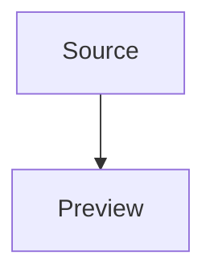

# Glitchpad Markdown Fixture

This original fixture exercises **strong**, _emphasized_, ~~deleted~~, `inline code`, and [external](https://example.com) text.

## Repeated _heading_

- [x] completed task
- [ ] pending task

| Feature   | State |
| --------- | ----- |
| Tables    | ready |
| Footnotes | ready |

> Local rendering keeps document content inside the document surface.

Footnote reference.[^note]

## Repeated heading

[^note]: Original fixture footnote.
