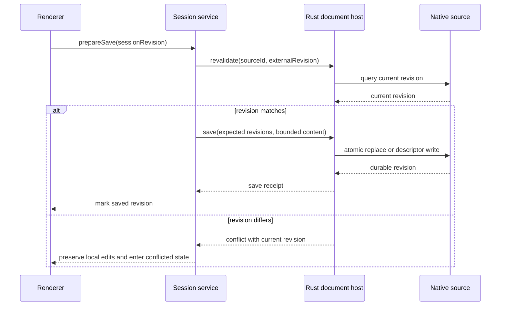

# Contract: Document Host

**Schema version**: 1

## Boundary

The document host is the only component permitted to acquire native sources, hold filesystem handles or Android URI grants, read raw bytes, observe external revisions, write sources, and persist recovery data. The TypeScript shell and renderers receive opaque source identifiers and bounded value objects.

## Operations

| Operation | Input | Output | Required failure classes |
| --- | --- | --- | --- |
| `acquire` | Dialog, drop, command-line, association, or Android-intent request | `DocumentSourceSummary` | cancelled, denied, unavailable, invalid request |
| `read_range` | source ID, offset, length, cancellation token | bytes and end-of-source flag | unsupported seek, budget exceeded, changed, revoked, I/O |
| `open_stream` | source ID, byte budget, cancellation token | bounded stream token | unsupported, budget exceeded, revoked, I/O |
| `query_metadata` | source ID | host/provider metadata facts | unsupported fields, revoked, I/O |
| `revalidate` | source ID, expected external revision | current revision and equality result | unavailable, revoked, I/O |
| `watch` | source ID | ordered change events | unsupported, watcher overflow, revoked |
| `save` | source ID, expected external revision, session revision, bytes/stream, text profile | durable revision | conflict, read-only, partial-write prevented, revoked, storage full, I/O |
| `save_as` | source ID, suggested name/type, bytes/stream, text profile | new source summary and durable revision | cancelled, denied, storage full, I/O |
| `write_recovery` | recovery value object and quota context | durable record receipt | quota blocked, storage full, I/O |
| `remove_recovery` | record ID and expected revision | removal receipt | not found, I/O |
| `close` | source ID | close receipt | pending operation, I/O |

## Security invariants

- A source ID is unguessable, process-local, and authorized for one document session.
- No operation accepts an arbitrary filesystem path, shell command, URL, or Android URI from renderer code.
- Byte counts, offsets, stream totals, timeouts, and concurrent operations are validated in Rust before native I/O.
- Android grants are accepted only from system-delivered intents or the system document picker. Persistable permission is requested only when the provider and intent grant it.
- Logs may contain operation name, source kind, duration, byte count, and stable error code. Logs must not contain file contents, full paths, raw content URIs, EXIF values, or recovery text.

## Save protocol

## Platform obligations

Desktop adapters must preserve permissions where supported, write a sibling temporary file, flush file data, atomically replace the destination, and sync the parent directory where the host provides that primitive. If atomic replacement is unavailable, the host must disclose the weaker guarantee before the write and must retain a recoverable backup until success.

Android adapters must prefer a writable descriptor for the existing URI. A provider that does not support a safe replacement remains read-only for in-place save; `save_as` uses `ACTION_CREATE_DOCUMENT`. A revoked grant transitions the session to `conflicted` or `failed` without discarding buffered edits.
