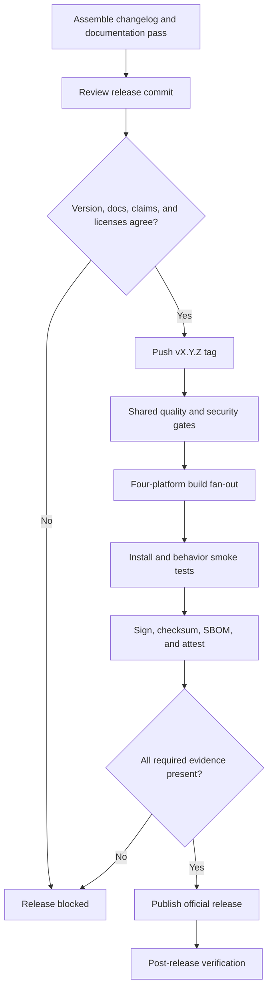

# Contract: Release Gates

## Authority

The root Rust workspace package version is the canonical product version after repository foundation. `tauri.conf.json`, root and application `package.json`, Android version name, this technical specification, changelog release heading, release tag, artifact names, SBOM metadata, and provenance statements mirror that value. A mismatch blocks release before native builds begin.

## Required gates

| Gate | Required evidence | Failure result |
| --- | --- | --- |
| Specification | Completed release documentation pass, matching specification version, no unreconciled completed slices | Block tag creation |
| Changelog | Assembled non-empty release section from reviewed fragments | Block tag creation |
| Capability claims | Renderer registry, associations, dialog filters, appendix matrix, README, and release notes agree | Block tag creation |
| Source quality | Format, lint, typecheck, unit, contract, integration, property, and required fuzz regression suites pass | Block build fan-out |
| Security | Dependency advisories, license policy, secret scan, CSP tests, parser limits, and hostile corpus pass | Block build fan-out |
| Documentation | Markdown format/lint, internal anchors, external links, Mermaid render, terminology, UTF-8/BOM/mojibake, and version checks pass | Block build fan-out |
| Platform build | Required Windows, macOS, Linux, and Android artifacts build from locked inputs | Block publication |
| Package smoke | Install, launch, association/open-with, core view/edit/save, metadata, recovery, upgrade where applicable, and uninstall pass | Block platform artifact |
| Supply chain | Signature, SHA-256 checksum, SBOM, provenance attestation, `LICENSE`, `NOTICE`, and third-party notices exist | Block platform artifact |
| Final join | Every release-blocking platform and documentation gate succeeds | Permit publication |
| Post-release | Assets downloadable, checksums valid, signatures verify, store/direct metadata correct, and clean-device launch succeeds | Mark release failed and halt promotion |

## Documentation pass receipt

The release commit must contain a machine-readable receipt listing the target version, prior version, completed Spec Kit slices reviewed, affected specification sections, capability rows changed, platform rows changed, security changes, contributor-tool changes, changelog fragment set, approver, and UTC completion timestamp. Release CI validates the receipt against repository state but does not generate or commit it.

