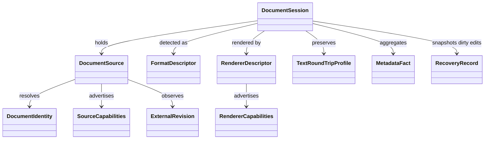
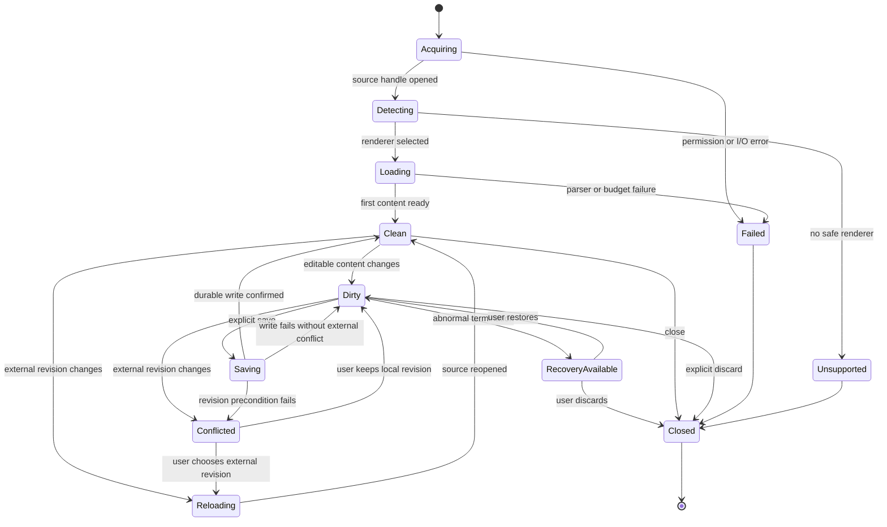

# Data Model: Glitchpad Document Runtime

**Date**: 2026-08-30

## Ownership rule

Rust owns native source handles, source capabilities, external revisions, raw-byte access, format evidence, normalized metadata, save preconditions, and recovery persistence. TypeScript owns the UI projection of a document session, active renderer state, editor buffers, selections, navigation, and compact shell state. Cross-boundary messages are serializable value objects with explicit schema versions; native handles never expose paths or URI permissions to renderers.

## `DocumentSource`

| Field | Type | Rule |
| --- | --- | --- |
| `source_id` | UUID | Unique for the native handle lifetime; never reused |
| `schema_version` | positive integer | Reject unsupported future versions |
| `kind` | `desktop_path` or `android_uri` | Concrete source semantics remain visible |
| `display_name` | string | Provider- or filesystem-derived, sanitized for UI |
| `native_handle` | opaque token | Scoped to one application session; never persisted or logged |
| `capabilities` | `SourceCapabilities` | Operations are checked individually |
| `permission_state` | enum | `active`, `temporary`, `persisted`, `revoked`, `unavailable` |
| `opened_revision` | `ExternalRevision` | Save conflict precondition |

### Identity rules

- Desktop identity uses platform file identity when available: volume plus file index on Windows, device plus inode on Unix hosts. A normalized absolute path is a fallback and is revalidated after rename or replacement.
- Android identity uses provider authority, document ID when available, and canonical URI. It never depends on resolving a filesystem path.
- Two open requests with the same stable identity focus one existing tab. Requests with uncertain identity remain separate and display that identity could not be proven.

## `SourceCapabilities`

| Capability | Meaning |
| --- | --- |
| `read` | Source can provide bytes from the beginning |
| `seek` | Source supports offset and bounded ranged reads |
| `stream` | Source supports sequential streaming |
| `stat` | Source provides at least size or one timestamp |
| `watch` | Host can deliver change notifications |
| `revalidate` | Host can compare an external revision before save |
| `write` | Existing source accepts replacement or truncating writes |
| `atomic_replace` | Host can replace without exposing a partially written file |
| `persist_permission` | Android grant can survive process termination |
| `rename` | Source can be renamed through the host |
| `delete_observation` | Host can distinguish deletion or revocation from temporary failure |

Unavailable capabilities are data, not errors. Renderers and shell commands must degrade from the advertised set.

## `ExternalRevision`

| Field | Type | Rule |
| --- | --- | --- |
| `observed_at` | UTC timestamp | Host observation time, not source modification time |
| `size` | optional unsigned integer | Bytes when supplied |
| `modified_at` | optional timestamp | Preserve provider precision and provenance |
| `identity_generation` | optional string | File ID, provider document ID, ETag, or equivalent |
| `quick_fingerprint` | optional digest | Bounded first/last-block digest; never treated as cryptographic identity |
| `full_sha256` | optional digest | Calculated only on explicit user request or conflict escalation |

Revision equality uses all available stable fields. A missing field cannot be replaced with a fabricated value.

## `FormatDescriptor`

| Field | Type | Rule |
| --- | --- | --- |
| `family` | stable identifier | `markdown`, `text`, `image`, `pdf`, `docx`, `odt`, `binary`, `unknown` |
| `variant` | optional identifier | Exact language, image codec, container, or office subtype |
| `confidence` | integer 0 through 100 | Derived from evidence weights |
| `claimed_extension` | optional string | Informational evidence |
| `claimed_mime` | optional string | Informational evidence |
| `evidence` | ordered evidence list | Signature, parser probe, BOM, encoding, filename, MIME, shebang, modeline, heuristic |
| `conflicts` | evidence list | Preserved when evidence disagrees |
| `user_override` | optional stable identifier | Applies to this session unless explicitly saved as a preference |

Parser-probe and signature evidence outrank extension and MIME evidence. Detection stops when its byte, time, or parser budget is exhausted and returns the best safe descriptor with a warning.

## `DocumentSession`

| Field | Type | Owner | Rule |
| --- | --- | --- | --- |
| `session_id` | UUID | Rust and TypeScript | Unique across one process |
| `source_id` | UUID | Rust | Required until source is closed |
| `session_revision` | unsigned integer | TypeScript | Increments on every editable-state change |
| `external_revision` | `ExternalRevision` | Rust | Last confirmed source revision |
| `format` | `FormatDescriptor` | Rust | May be overridden through a recorded user action |
| `renderer_id` | stable string | TypeScript | Must correspond to a registered renderer |
| `state` | session-state enum | TypeScript | Transition rules below |
| `dirty` | boolean | TypeScript | Derived from editor revision versus saved revision |
| `navigation_state` | renderer value object | Renderer | Bounded and non-sensitive |
| `warnings` | ordered list | Shared | User-visible and testable |

## `RendererDescriptor` and `RendererCapabilities`

| Field | Rule |
| --- | --- |
| `renderer_id` | Stable namespaced identifier |
| `supported_families` | One or more exact format families/variants |
| `maturity` | `foundation`, `planned`, `experimental`, `stable`, `deprecated`, `unsupported` |
| `capabilities` | Independent booleans for `view`, `edit`, `save`, `save_as`, `search`, `navigate`, `zoom`, `rotate`, `print`, `copy`, `inspect` |
| `limits` | Byte, decoded-memory, page, pixel, entry, expansion, recursion, and timeout budgets |
| `worker_policy` | `required`, `preferred`, or `main_thread_bounded` |
| `platforms` | Explicit target set |
| `introduced_in` | Product version when first activated; absent before activation |

## `TextRoundTripProfile`

| Field | Values |
| --- | --- |
| `encoding` | UTF-8, UTF-16LE, UTF-16BE, or a named supported legacy encoding |
| `bom` | `present` or `absent` |
| `newline` | `lf`, `crlf`, `cr`, `mixed`, or `none` |
| `terminal_newline` | boolean |
| `decode_errors` | byte offsets and recovery action |
| `round_trip_safe` | boolean |

Save is disabled when decoding required replacement characters and the user has not explicitly selected an encoding or lossy-save action. Mixed newlines are preserved per line until a user explicitly normalizes them.

## `MetadataFact`

| Field | Rule |
| --- | --- |
| `key` | Stable namespaced key such as `host.modified_at` or `exif.DateTimeOriginal` |
| `label` | Localizable display label |
| `value` | Typed scalar, timestamp, dimensions, rational, coordinate, list, or structured object |
| `source` | `host`, `provider`, `embedded`, `derived`, or renderer ID |
| `availability` | `available`, `not_provided`, `unsupported`, `redacted`, `error`, or `pending` |
| `unit` | Optional stable unit |
| `sensitivity` | `normal`, `location`, `identity`, or `private` |
| `copyable` | Explicit boolean |
| `evidence` | Source field, byte range, or derivation name when safe to expose |

Facts with location sensitivity are collapsed by default. Checksums are pending until the user requests calculation.

## `RecoveryRecord`

| Field | Rule |
| --- | --- |
| `record_id` | UUID |
| `schema_version` | Migration and rejection authority |
| `session_identity_hint` | Redacted display name and stable identity hash, never a raw Android URI grant |
| `base_external_revision` | Revision from which edits began |
| `saved_session_revision` | Last durable editor revision |
| `recovered_session_revision` | Snapshot revision |
| `content` | Complete editable text or bounded delta chain |
| `text_profile` | Encoding and newline contract |
| `created_at` and `expires_at` | UTC; seven-day maximum retention |

Recovery files use application-private storage, owner-only permissions where supported, atomic writes, and a total default quota of 256 MiB desktop or 128 MiB Android. The oldest inactive record is removed first when the quota is reached; the active dirty document must be warned before it loses recovery coverage.

## `PreferenceState`

The v0.1.0 preference schema contains theme (`system`, `light`, `dark`), editor font family and size, line wrapping, tab width, Markdown default mode, and explicit per-extension language overrides. It contains no account, synchronization, workspace, recent-file list, telemetry, or remote-resource setting.
