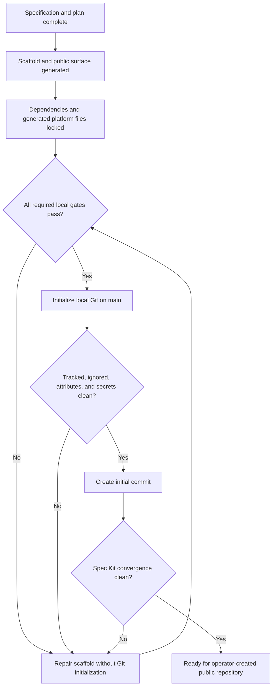

# Data Model: Repository Foundation

**Date**: 2026-08-30

## VersionAuthority

| Field | Rule |
| --- | --- |
| Product | Root Cargo workspace package version is canonical once created |
| Specification | `docs/glitchpad-technical-specification.md` mirrors product version |
| JavaScript package | Root and application package versions mirror product version |
| Tauri | `tauri.conf.json` mirrors product version |
| Android | Generated Gradle version name mirrors product version |
| Release | Tag, changelog, artifacts, SBOM, and provenance mirror product version |

## VerificationGate

| Field | Rule |
| --- | --- |
| ID | Stable command/status name |
| Scope | Documentation, native, frontend, security, platform, package, or aggregate |
| Command | Repository-owned foreground command |
| Required | Whether failure blocks merge/release |
| Evidence | Exit status plus retained workflow/log artifact where applicable |
| Dependencies | Gates that must complete before evaluation |

## PublicSurface

| Field           | Rule                                                      |
| --------------- | --------------------------------------------------------- |
| Repository path | `ShruggieTech/glitchpad`                                  |
| Product status  | Foundation, no application binaries                       |
| Version         | 0.0.0                                                     |
| License         | Apache-2.0                                                |
| Claims          | Current and roadmap capabilities remain visibly separated |
| Links           | Internal tracked files or final organization URLs only    |

## GitSnapshot

| Field | Rule |
| --- | --- |
| Branch | `main` |
| Commit count | One after this feature |
| Identity | Existing maintainer configuration |
| Remotes | None |
| Tracked tree | Public source, docs, specs, locks, workflows, metadata |
| Excluded tree | Secrets, dependencies, build output, caches, local state, active Spec Kit pointer |
| Encoding | UTF-8 without BOM for text; binary formats explicitly attributed |

## State transition

