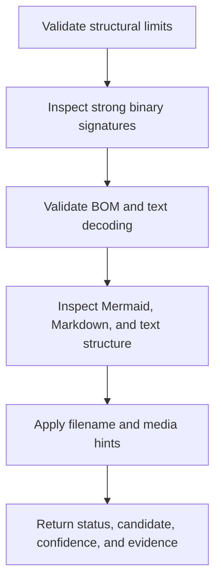

# Detection Contract

## Input bounds

The default detector accepts at most 65,536 probe bytes, 4,096 UTF-8 bytes for a display name, 256 UTF-8 bytes for a media type, and emits at most 32 evidence records. Inputs exceeding a structural limit return `oversized`; a larger source represented by a bounded probe is valid and sets `truncated`.

## Evidence order

Strong contradictory content prevents an extension from selecting a text format. Filename and media hints may raise confidence only when content remains compatible.

## Initial format rules

| Candidate | Required evidence |
| --- | --- |
| Mermaid | Valid text plus a leading Mermaid diagram directive such as `flowchart`, `graph`, `sequenceDiagram`, `classDiagram`, `stateDiagram`, `erDiagram`, `journey`, `gantt`, `pie`, `quadrantChart`, `requirementDiagram`, `gitGraph`, `mindmap`, `timeline`, `zenuml`, `sankey-beta`, `xychart-beta`, `block-beta`, `packet-beta`, `architecture-beta`, `kanban`, or `radar-beta`; `.mmd` or `.mermaid` is supporting evidence only. |
| Markdown | Valid text plus Markdown structural evidence or a compatible Markdown filename hint. Mermaid fenced blocks remain Markdown documents. |
| Source code | Valid text plus a recognized source extension; the language value is a hint and not an executable mode. |
| Plain text | Valid text with no stronger supported structure. |
| Unsupported binary | A recognized binary signature, NUL-heavy undecodable content without a supported text encoding, or content that cannot be safely classified. |

## Text decoding

UTF-8 is accepted with or without BOM. UTF-16 little-endian and big-endian are accepted only when their BOM is present. Legacy encodings and BOM-less UTF-16 return an explicit undecodable-byte decision instead of lossy decoding.

Newline analysis reports LF, CRLF, CR, mixed, none, or unknown. Terminal-newline intent is reported only when the probe contains the complete source; otherwise it is unknown.

## Cancellation

The detector performs no I/O and has no externally visible side effects. The host may return `cancelled` before the bounded call, discard a stale result as `source_revised`, return `inaccessible` when a probe cannot be obtained, and avoid scheduling work for a closed session.

## Outcomes

`supported`, `ambiguous`, `unsupported`, `encrypted`, `malformed`, `oversized`, `inaccessible`, `binary`, `cancelled`, and `source_revised` are distinct stable outcomes. A recognized encrypted container returns `encrypted`; structurally recognizable but invalid supported content returns `malformed`; recognized or strongly indicated binary input returns `binary`; content outside the implemented format set returns `unsupported`.

## Determinism

The same input bytes, safe source facts, and limits must produce byte-for-byte equivalent serialized results. Wall-clock timing, locale, platform path rules, and ambient filesystem state are not inputs.
