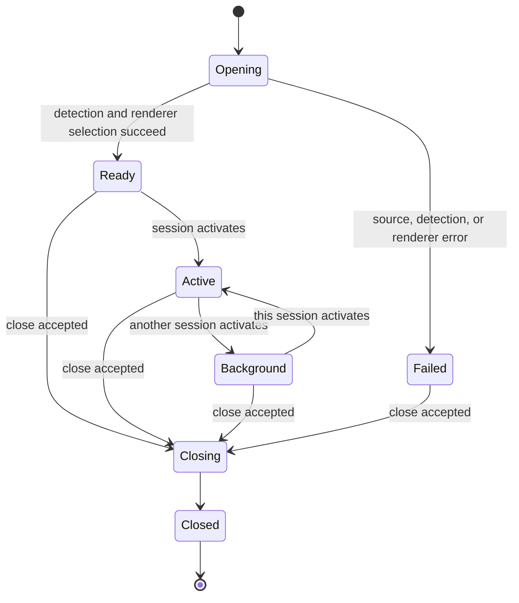

# Data Model: Document Foundation and Content Shell

## Document identity

`DocumentIdentity` carries an authority, scope, opaque token, and strength. The token is compared only when authority and scope declare compatible semantics. The user-visible title and location are never identity inputs.

| Field | Type | Rule |
| --- | --- | --- |
| `authority` | Stable string enum | Identifies the issuer, such as filesystem, Android document provider, synthetic fixture, or unknown. |
| `scope` | String | Names the comparison domain controlled by the authority. |
| `token` | String | Opaque normalized identifier with no required path semantics. |
| `strength` | `strong`, `weak`, or `unavailable` | Only `strong` identities permit automatic same/different conclusions. |

`IdentityMatch` is `same`, `different`, or `uncertain`. Automatic deduplication occurs only for `same`.

## Source descriptor and capabilities

`SourceDescriptor` contains safe facts that a host can provide without reading the entire source: identity, display name, optional media type, optional byte length, optional modification timestamp, source kind, and independently advertised capabilities.

`SourceCapabilities` contains explicit booleans for `read`, `seek`, `stream`, `metadata`, `observe_revision`, `revalidate`, `write`, `replace_atomically`, `reopen`, and `reveal_location`. Capabilities do not imply one another.

## Renderer descriptor and capabilities

`RendererDescriptor` names a renderer contract and independently advertises `view`, `edit`, `navigate`, `search`, `zoom`, `copy`, `save`, and `inspect_metadata`. The shell computes commands from the intersection of renderer capabilities, source capabilities, and session state.

## Detection input and result

`DetectionInput` contains safe source facts, a byte probe, the total source length when known, and `DetectionLimits`. The probe is never larger than the configured maximum.

`DetectionResult` contains outcome, selected candidate when any, confidence, ordered evidence, optional text profile, bytes examined, and whether the source was truncated for analysis.

`FormatCandidate` is one of Markdown, Mermaid, plain text, source code with a language hint, or binary. `DetectionOutcome` is supported, ambiguous, unsupported, encrypted, malformed, oversized, inaccessible, binary, cancelled, or source-revised.

## Text profile

| Field | Values | Meaning |
| --- | --- | --- |
| `encoding` | UTF-8, UTF-8 BOM, UTF-16 LE BOM, UTF-16 BE BOM, unknown | The verified decoding representation. |
| `bom` | absent, present, unknown | The source byte-order-mark intent. |
| `newlines` | LF, CRLF, CR, mixed, none, unknown | The observed newline representation. |
| `terminal_newline` | present, absent, unknown | Whether the complete source is known to end with a newline. |
| `undecodable_bytes` | none, requires-user-decision, unsupported | The lossless handling decision for invalid input. |

## Document session

`DocumentSession` binds a stable session ID to a source descriptor, detection result, renderer descriptor, lifecycle state, dirty state, title, and monotonically increasing revision. A revision changes whenever a command-relevant property changes.

Dirty state is an orthogonal session flag rather than a lifecycle state. S005 models and displays dirty state but implements no editor or save operation.

## Session registry

`SessionRegistry` owns ordered sessions and one optional active session ID. Opening a source compares its identity against every non-closed session. A same match activates the existing session; uncertain or different identities create a new session.

Registry invariants:

- Session IDs are unique and stable for the registry lifetime.
- At most one session is active.
- The active session, when present, exists and is not closed.
- Closing the active session selects the nearest surviving neighbor, preferring the following tab and then the preceding tab.
- Reordering changes presentation order without changing session identity or revision.
- Background sessions retain their lifecycle and dirty state.

## Tab projection

`TabProjection` contains ordered inline tabs, ordered overflow tabs, active session ID, and overflow-open state. The active tab is always inline. Default inline capacity is five and may be supplied as a smaller positive capacity by a future measured layout adapter.

## Command descriptor

`CommandDescriptor` contains a stable command ID, label, optional shortcut, enabled state, target session ID, and target revision. Execution validates both the target and revision so a command cannot silently apply to a newly active document.

## Error model

`CoreError` contains a stable category, safe user-facing summary, explicit retryability, explicit recoverability, and structured context that excludes file contents. Categories cover invalid input, unsupported input, resource limit, capability denied, stale session, not found, conflict, and internal invariant violation.

## Contract envelope

Every serialized top-level contract uses `ContractEnvelope<T>` with `contract_version` and `payload`. S005 uses contract version 1. Unknown versions must be rejected before payload execution.
