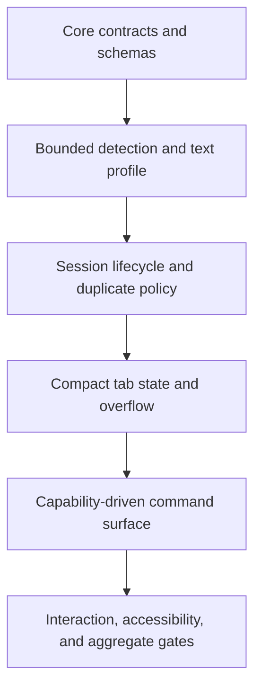

# Implementation Plan: Document Foundation and Content Shell

**Branch**: `005-document-foundation-shell` | **Date**: 2026-08-30 | **Spec**: [spec.md](spec.md)

**Input**: Feature specification from `specs/005-document-foundation-shell/spec.md`

## Summary

S005 establishes the platform-independent document contracts, bounded format and text detection, in-memory session lifecycle, compact tab shell, and capability-driven command surface required by GitHub Issues #45, #48, #49, and #51. Rust is the authoritative domain layer and publishes versioned serializable contracts; TypeScript projects those contracts into a minimal React shell whose document surface retains at least 90 percent of a 1280 by 800 viewport. The slice deliberately uses fixture-backed source descriptors and sessions so native file adapters, persistence, editors, and production renderers remain later work.

## Technical Context

**Language/Version**: Rust 1.96.0 with edition 2024; TypeScript 6.0.2; React 19.2.8

**Primary Dependencies**: Serde 1.0.229 for contract serialization; Schemars 1.2.2 for JSON Schema derivation; React 19.2.8 for the shared interface; axe-core 4.13.0 as an accessibility test dependency; Tauri 2 remains the host family but is not extended in this slice

**Storage**: In-memory session and tab state only; no persistence, file writes, or native source adapters

**Testing**: Rust unit and contract tests through `cargo test`; Vitest 4.1.11 and React Testing Library 16.3.2 for model and interaction tests; direct axe-core checks for automated accessibility rules; repository aggregate gate through `cargo xtask check`

**Target Platform**: Shared behavior for Windows, macOS, Linux, and Android; implementation runs in the existing Tauri-compatible WebView shell without Electron

**Project Type**: Cross-platform desktop and Android application with a platform-independent Rust domain crate and shared TypeScript/React interface

**Performance Goals**: Complete bounded detection within 100 milliseconds for a 64 KiB probe on supported development hardware; update active tab and command state within one animation frame; retain at least 90 percent of an 800-pixel-high reference viewport for document content

**Constraints**: Offline operation; no file upload or telemetry; no unbounded file reads; no native filesystem assumptions in core identity; UTF-8 without BOM; Apache-2.0-compatible dependencies; semantic keyboard, pointer, touch, focus, zoom, and announcement behavior; Mermaid flow diagrams use top-to-bottom layout

**Scale/Scope**: One authoritative document contract family, one bounded detector, one in-memory session registry, one compact shell, four bundled GitHub Issues, and representative fixture sessions sufficient to verify the contracts without implementing native opening or production rendering

## Constitution Check

### Before Phase 0 research

| Principle | Result | Evidence |
| --- | --- | --- |
| P1. The file owns the viewport | PASS | The shell has compact tabs and active-document commands only, prohibits permanent navigation, and sets a measurable 90 percent document-area requirement. |
| P2. Local files remain local | PASS | Detection and session behavior are local and offline; fixture descriptors replace network or upload behavior. |
| P3. Cross-platform behavior is foundational | PASS | Identity and source contracts represent paths and Android-style URIs without treating either as universal, and shared behavior has no host dependency. |
| P4. Untrusted input fails safely | PASS | Detection is bounded, evidence-based, explicit about ambiguity and unsupported bytes, and never trusts an extension alone. |
| P5. Specifications and releases move together | PASS | Work remains unreleased under Spec Kit at product version 0.0.0; documentation impact is recorded for the future release pass. |
| P6. Verification precedes claims | PASS | Every requirement maps to automated tests or an explicit quickstart check, with the aggregate gate required before completion. |
| P7. Decisions are explicit and proportional | PASS | Research records all architecture-affecting decisions, and persistence, adapters, editors, renderers, metadata, and packaging remain excluded. |
| P8. Apache-2.0 and license compatibility | PASS | New dependencies are permissive or weak-copyleft test-only dependencies accepted by the repository license gate, and exact versions are lockfile-controlled. |

### After Phase 1 design

All constitution gates remain PASS. The data model keeps privileged I/O outside the core, contracts make resource bounds and uncertainty explicit, the shell exposes only active-document capabilities, and the verification contract provides issue-level evidence. No exception or complexity waiver is required.

## Project Structure

### Documentation for this feature

```text
specs/005-document-foundation-shell/
├── checklists/
│   └── requirements.md
├── contracts/
│   ├── core-contracts.md
│   ├── detection.md
│   ├── shell.md
│   └── verification.md
├── data-model.md
├── plan.md
├── quickstart.md
├── research.md
├── spec.md
└── tasks.md
```

### Source code at the repository root

```text
crates/glitchpad-core/
├── src/
│   ├── contracts.rs
│   ├── detection.rs
│   ├── lib.rs
│   └── session.rs
└── tests/
    └── contract_schema.rs

apps/glitchpad/
├── src/
│   ├── components/
│   │   ├── CommandBar.tsx
│   │   ├── DocumentSurface.tsx
│   │   └── TabStrip.tsx
│   ├── domain/
│   │   ├── commands.test.ts
│   │   ├── commands.ts
│   │   ├── contracts.ts
│   │   ├── tabs.test.ts
│   │   └── tabs.ts
│   ├── App.test.tsx
│   ├── App.tsx
│   └── styles.css
└── package.json
```

**Structure Decision**: The existing workspace separation remains intact. `glitchpad-core` owns portable contracts, detection, and session policy; `apps/glitchpad` owns the React projection, interaction semantics, and visual layout. S005 does not add a host adapter or a third runtime layer.

## Delivery Sequence



## Complexity Tracking

No constitution violations require justification.
