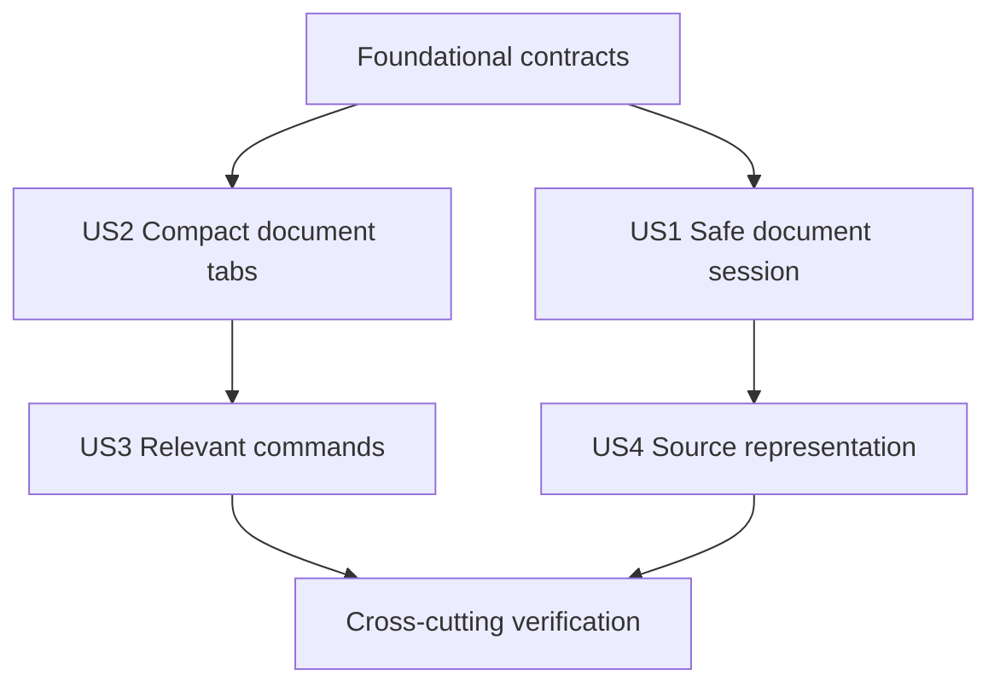

# Tasks: Document Foundation and Content Shell

**Input**: Design documents from `specs/005-document-foundation-shell/`

**Prerequisites**: `plan.md`, `spec.md`, `research.md`, `data-model.md`, `contracts/`, and `quickstart.md`

**Tests**: S005 requires automated tests and explicit manual checks for every acceptance criterion. Story tests are written before the corresponding implementation and must fail for the intended missing behavior.

**Organization**: Tasks are grouped by user story while preserving separate acceptance evidence for GitHub Issues #45, #48, #49, and #51.

## Format: `[ID] [P?] [Story] Description`

- **[P]**: Can run in parallel because the task changes different files and has no unmet dependency on another marked task.
- **[Story]**: Maps the task to a user story from `spec.md`.
- Every task names its concrete file path.

## Phase 1: Setup

**Purpose**: Add the contract and accessibility test dependencies and establish the source layout.

- [x] T001 Add pinned Schemars and Serde JSON dependencies for contract schemas in `Cargo.toml` and `crates/glitchpad-core/Cargo.toml`
- [x] T002 [P] Add pinned axe-core development dependency in `apps/glitchpad/package.json` and update `pnpm-lock.yaml`
- [x] T003 Create the planned Rust and TypeScript module entry points in `crates/glitchpad-core/src/lib.rs` and `apps/glitchpad/src/domain/contracts.ts`

---

## Phase 2: Foundational contracts

**Purpose**: Deliver the issue #45 contract vocabulary that blocks detection, sessions, shell state, and command derivation.

**Critical**: No user story implementation begins until these contracts compile and serialize.

- [x] T004 [P] Write failing identity, capability, error-safety, and versioned-envelope tests in `crates/glitchpad-core/src/contracts.rs`
- [x] T005 [P] Write failing JSON Schema and representative serialization tests in `crates/glitchpad-core/tests/contract_schema.rs`
- [x] T006 Implement document identity, the complete independent source and renderer capability sets, renderer descriptor, contract envelope, and safe retryable/recoverable core errors in `crates/glitchpad-core/src/contracts.rs`
- [x] T007 Implement and export contract version 1 JSON Schema generation in `crates/glitchpad-core/src/contracts.rs` and `crates/glitchpad-core/src/lib.rs`
- [x] T008 Mirror the version 1 serialized contracts and exhaustive TypeScript unions in `apps/glitchpad/src/domain/contracts.ts`

**Checkpoint**: Issue #45 contract behavior is independently testable and every later layer can consume explicit capabilities and errors.

---

## Phase 3: User Story 1 - Receive a safe document session (Priority: P1)

**Goal**: Convert bounded source evidence into a deterministic detected or failed in-memory document session without reading beyond the supplied probe.

**Independent Test**: Supply Markdown, Mermaid, plain-text, source-code, conflicting binary, and oversized fixture probes; verify explicit evidence and status, duplicate strong identities activate one session, uncertain identities remain separate, and failures expose no content.

### Tests for User Story 1

- [x] T009 [P] [US1] Write failing bounded format detection, evidence-order, disagreement, truncation, determinism, every required outcome, and limit tests for issue #48 in `crates/glitchpad-core/src/detection.rs`
- [x] T010 [P] [US1] Write failing explicit lifecycle, 100-delivery deduplication, activation, close-successor, and background-state tests for issue #45 in `crates/glitchpad-core/src/session.rs`

### Implementation for User Story 1

- [x] T011 [US1] Implement the pure 64 KiB bounded detector, evidence model, complete outcome vocabulary, Markdown, Mermaid, text, source hint, and binary decisions in `crates/glitchpad-core/src/detection.rs`
- [x] T012 [US1] Implement session IDs, lifecycle, revisions, duplicate policy, activation, close, reorder, and cyclic navigation in `crates/glitchpad-core/src/session.rs`
- [x] T013 [US1] Export detection and session contracts from `crates/glitchpad-core/src/lib.rs` and add representative issue #45 and #48 contract fixtures in `crates/glitchpad-core/tests/contract_schema.rs`

**Checkpoint**: A host-supplied bounded probe can create a safe in-memory session with explicit classification evidence and deterministic lifecycle behavior.

---

## Phase 4: User Story 2 - Work across compact document tabs (Priority: P1)

**Goal**: Present multiple independent sessions through a compact, accessible tab strip with deterministic overflow and without adding permanent non-document interface.

**Independent Test**: Render more than five sessions, activate, close, reorder, cycle, and select overflow tabs by keyboard and pointer; verify active and dirty state, deterministic focus, background preservation, empty state, and the 90 percent reference viewport contract.

### Tests for User Story 2

- [x] T014 [P] [US2] Write failing reducer tests for open, activate, close successor, reorder, cycling, dirty state, deterministic overflow, and reachability across 100 sessions for issue #49 in `apps/glitchpad/src/domain/tabs.test.ts`
- [x] T015 [P] [US2] Write failing semantic tab, keyboard, pointer, focus, overflow, live-announcement, empty-state, and layout-contract tests for issue #49 in `apps/glitchpad/src/App.test.tsx`

### Implementation for User Story 2

- [x] T016 [US2] Implement the pure tab reducer, active-inline overflow projection, and shell layout constants in `apps/glitchpad/src/domain/tabs.ts`
- [x] T017 [US2] Implement semantic automatic-activation tabs, close controls, reorder controls, overflow menu, and live announcements in `apps/glitchpad/src/components/TabStrip.tsx`
- [x] T018 [P] [US2] Implement the active tabpanel and minimal empty document state in `apps/glitchpad/src/components/DocumentSurface.tsx`
- [x] T019 [US2] Compose fixture-backed sessions, global tab shortcuts, deterministic focus handoff, and document surface selection in `apps/glitchpad/src/App.tsx`
- [x] T020 [US2] Implement compact desktop geometry, visible focus, overflow styling, coarse-pointer 44-pixel targets, and 200-percent-zoom resilience in `apps/glitchpad/src/styles.css`

**Checkpoint**: Issue #49 is demonstrable with compact tabs, deterministic overflow, preserved sessions, complete keyboard/pointer interaction, and a content-first viewport.

---

## Phase 5: User Story 3 - See only relevant commands (Priority: P2)

**Goal**: Derive an accessible command surface exclusively from the active session's source and renderer capabilities and reject stale targets.

**Independent Test**: Switch among sessions with different capabilities, verify only supported commands appear, invoke commands by pointer and keyboard, then change the session revision and verify stale execution is rejected without retargeting.

### Tests for User Story 3

- [x] T021 [P] [US3] Write failing capability-intersection, stable-label, shortcut, enabled-state, stale-target, and 100-rapid-active-switch tests for issue #51 in `apps/glitchpad/src/domain/commands.test.ts`
- [x] T022 [P] [US3] Add failing command semantics, accessible-name, keyboard, unsupported-command absence, and axe-core checks for issue #51 in `apps/glitchpad/src/App.test.tsx`

### Implementation for User Story 3

- [x] T023 [US3] Implement renderer-driven command derivation, active-session revision snapshots, and stale-target validation in `apps/glitchpad/src/domain/commands.ts`
- [x] T024 [US3] Implement the compact labeled command surface and shortcut descriptions in `apps/glitchpad/src/components/CommandBar.tsx`
- [x] T025 [US3] Integrate active-session commands and non-disruptive command status announcements in `apps/glitchpad/src/App.tsx` and `apps/glitchpad/src/styles.css`

**Checkpoint**: Issue #51 is independently testable, unsupported actions are absent, and commands cannot silently jump to another session.

---

## Phase 6: User Story 4 - Preserve source representation decisions (Priority: P2)

**Goal**: Record lossless encoding, BOM, newline, terminal-newline, and undecodable-byte decisions for future editing and saving behavior.

**Independent Test**: Detect complete and truncated UTF-8, UTF-8 BOM, UTF-16 LE BOM, UTF-16 BE BOM, LF, CRLF, CR, mixed-newline, terminal-newline, and invalid-byte fixtures and compare the exact text profile.

### Tests for User Story 4

- [x] T026 [US4] Write failing encoding, BOM, newline, terminal-newline, truncation, and undecodable-byte profile tests for issue #48 in `crates/glitchpad-core/src/detection.rs`

### Implementation for User Story 4

- [x] T027 [US4] Implement lossless text profiles and explicit undecodable-byte decisions in `crates/glitchpad-core/src/detection.rs`
- [x] T028 [US4] Add text-profile schema coverage and cross-language fixture parity in `crates/glitchpad-core/tests/contract_schema.rs` and `apps/glitchpad/src/domain/contracts.ts`

**Checkpoint**: Issue #48 representation requirements are explicit and testable without implementing editing or save behavior.

---

## Phase 7: Polish and cross-cutting verification

**Purpose**: Close the complete issue bundle with traceable evidence, documentation, licensing, and repository-wide verification.

- [x] T029 [P] Record issue #45, #48, #49, and #51 implementation evidence and manual accessibility results in `specs/005-document-foundation-shell/verification.md`
- [x] T030 [P] Update unreleased behavior and dependency attribution entries in `CHANGELOG.md`, `NOTICE`, and `changelog.d/document-foundation.added.md`
- [x] T031 Validate UTF-8 without BOM, mojibake absence, one-line Markdown paragraphs, top-to-bottom Mermaid flow direction, formatting, linting, dependency licenses, Rust tests, interface tests, and build through `cargo xtask check`
- [x] T032 Run the interaction and accessibility procedures in `specs/005-document-foundation-shell/quickstart.md` and record any environment-limited checks honestly in `specs/005-document-foundation-shell/verification.md`

---

## Dependencies and execution order

### Phase dependencies

- Setup has no dependency and begins immediately.
- Foundational contracts depend on Setup and block all user stories.
- User Story 1 depends on Foundational contracts.
- User Story 2 depends on the contract vocabulary and TypeScript projections but can use fixture sessions independently of the Rust session implementation.
- User Story 3 depends on User Story 2's active-session shell and command insertion point.
- User Story 4 depends on User Story 1's detector and remains independently testable through focused detection fixtures.
- Polish depends on all selected user stories.

### User story dependency graph



### Parallel opportunities

- T001 and T002 update independent package ecosystems.
- T004 and T005 establish independent contract test layers.
- T009 and T010 cover detection and session behavior in separate modules.
- T014 and T015 cover pure state and interface behavior in separate test files.
- T017 and T018 implement separate shell components after the reducer contract exists.
- T021 and T022 cover command policy and rendered accessibility in separate test files.
- T029 and T030 update independent verification and release-note files.

## Parallel examples

### User Story 1

```text
Task T009: Detection contract tests in crates/glitchpad-core/src/detection.rs
Task T010: Session lifecycle tests in crates/glitchpad-core/src/session.rs
```

### User Story 2

```text
Task T014: Pure tab reducer tests in apps/glitchpad/src/domain/tabs.test.ts
Task T015: Rendered shell interaction tests in apps/glitchpad/src/App.test.tsx
```

### User Story 3

```text
Task T021: Command policy tests in apps/glitchpad/src/domain/commands.test.ts
Task T022: Rendered command accessibility tests in apps/glitchpad/src/App.test.tsx
```

## Implementation strategy

### MVP first

1. Complete Setup and Foundational contracts.
2. Complete User Story 1 and verify safe bounded sessions independently.
3. Complete User Story 2 and verify the content-first tab shell.
4. Continue directly through User Stories 3 and 4 under the authorized autopilot protocol.

### Incremental integration

1. Compile and test Rust contracts before detector and session policy.
2. Test the pure TypeScript tab reducer before rendering shell controls.
3. Integrate capability-driven commands only after active-session semantics are stable.
4. Run focused tests at each checkpoint and the complete aggregate gate after all issue-level acceptance evidence exists.

## Notes

- Every checkbox is marked complete only after its described code, test, or evidence exists.
- Tests precede the implementation they specify and must demonstrate the missing behavior before implementation.
- S005 does not implement native file adapters, persistence, recovery, editors, production renderers, metadata extraction, packaging, file associations, or release activation.
