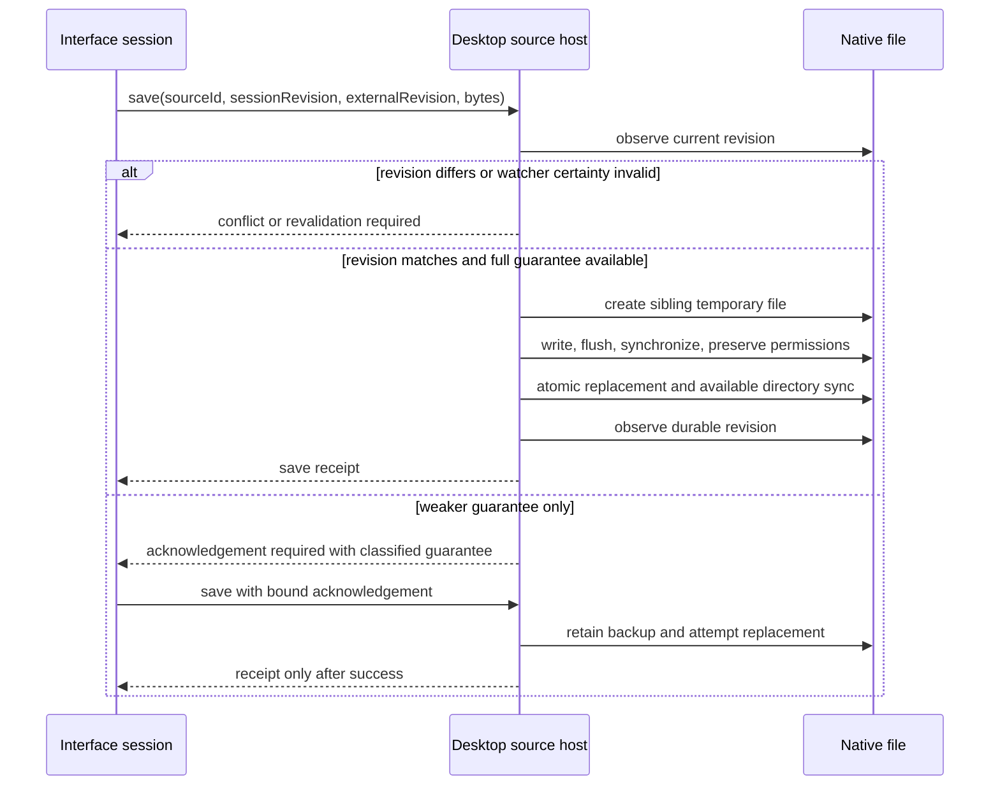

# Contract: Desktop Source Host

**Contract version**: 1

## Boundary

Only trusted native application code may call `acquire`. Interface code may call bounded operations using an opaque source ID. No interface operation accepts a path, shell command, raw file handle, or unrestricted URL.

## Operations

| Operation | Caller input | Safe output | Required failures |
| --- | --- | --- | --- |
| `acquire` | Trusted delivery kind and native path | Desktop source summary | cancelled, invalid input, denied, unavailable, unsupported source |
| `read_range` | Source ID, offset, length, operation budget | Bounded bytes and end-of-source | not found, capability denied, budget exceeded, changed, revoked, I/O |
| `open_stream` | Source ID, offset, total budget | Opaque stream lease | not found, capability denied, budget exceeded, changed, revoked, I/O |
| `read_stream` | Stream lease, chunk length | Bounded bytes and end-of-source | not found, budget exceeded, changed, revoked, I/O |
| `query_metadata` | Source ID | Safe metadata facts | not found, capability denied, revoked, unavailable, I/O |
| `start_watch` | Source ID | Watch receipt | not found, capability denied, backend unavailable |
| `drain_events` | Source ID, maximum count | Ordered source events | not found, invalid input |
| `revalidate` | Source ID, expected revision | Revalidation result | not found; all source availability failures are values |
| `save` | Source ID, expected revisions, bounded bytes, optional weaker acknowledgement | Durable save receipt | not found, conflict, read-only, acknowledgement required, storage full, partial write prevented, revoked, I/O |
| `close` | Source ID | Close receipt | not found, pending operation, I/O |

## Security invariants

- Acquisition requests are constructed inside native delivery handlers and cannot be deserialized from renderer input.
- Source IDs and stream leases are random, process-local, single-source tokens.
- Paths remain inside host-private source records and never appear in returned values, events, logs, or safe errors.
- Every byte count and offset is checked for overflow and budget before I/O.
- Watch events are hints. Overflow, backend error, ambiguous rename, or coalescing requires revalidation.
- Save performs both session-revision and external-revision precondition checks before opening a write target.
- Close invalidates the source ID, stream leases, watcher, and pending write acknowledgement.

## Platform identity contract

| Platform | Strong evidence | Weak fallback |
| --- | --- | --- |
| Windows | Volume/file identifier obtained safely from the opened file | Normalized absolute path |
| macOS | Device and inode | Canonical or normalized absolute path |
| Linux | Device and inode | Canonical or normalized absolute path |

Strong equality requires the same authority, scope, and token. Weak evidence never causes deduplication.

## Save protocol

## Event semantics

Events are ordered per source by monotonically increasing sequence. `changed`, `renamed`, `watcher_overflow`, and `unavailable` set `revalidation_required`. `deleted` and `permission_revoked` prevent normal save. The interface must preserve dirty content for every event and error.
