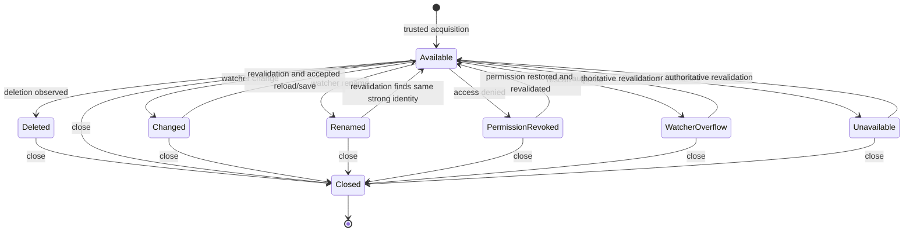

# Data Model: Desktop Source Lifecycle

## SourceId

`SourceId` is an opaque UUID string generated when a trusted desktop delivery is acquired. It is unguessable, process-local, authorizes only one source record, and becomes invalid when the record closes.

## DesktopDelivery

`DesktopDelivery` records the trusted acquisition channel (`dialog`, `drop`, `command_line`, or `association`) and is accepted only by native host code. Its path is host-private and never serialized into the interface contract.

## SourceDescriptor

The existing safe descriptor is extended so its capability set independently represents read, seek, stream, metadata/stat, watch, revision observation, revalidation, write, atomic replacement, rename observation, deletion observation, reopen, and location reveal. `reveal_location` describes a future native action and does not expose a path value.

## DesktopSourceSummary

`DesktopSourceSummary` combines `SourceId`, `SourceDescriptor`, and the observed `ExternalRevision`. This is the complete value returned from acquisition. It contains no native path or reusable file handle.

## ExternalRevision

`ExternalRevision` contains the source identity token, identity strength, byte length, modified-time fact when reliable, and a platform change token when safely available. Revisions are comparable only when their identity authority and scope agree and every advertised fact matches.

## SourceRecord

`SourceRecord` is host-private state containing the canonical native path, open or reopen strategy, safe summary, current watcher, event queue, next event sequence, stream leases, and pending weaker-write acknowledgement. It is stored only in `DesktopSourceHost` and cannot be serialized.

## SourceState

`SourceState` is the stable visible lifecycle classification: `available`, `changed`, `renamed`, `deleted`, `permission_revoked`, `watcher_overflow`, `unavailable`, or `closed`. Dirty editor state is not stored here and must remain untouched by source transitions.

## SourceEvent

`SourceEvent` contains source ID, monotonically increasing sequence, state, optional current safe display name, and a `revalidation_required` flag. It omits paths and native error messages.

## RevalidationResult

`RevalidationResult` contains source ID, the expected revision, optional current revision, and `match`, `changed`, `deleted`, `permission_revoked`, or `unavailable`. Only `match` permits a normal save to continue.

## ReadRangeRequest and ReadRangeResult

The request contains source ID, offset, requested length, and operation budget. The result contains bytes, start offset, and end-of-source flag. Validation rejects arithmetic overflow or any length beyond 1 MiB before file I/O.

## StreamLease

A stream lease binds an unguessable lease ID to one source ID, starting offset, cumulative byte budget, bytes consumed, and source revision. A changed revision, exhausted budget, close, or explicit cancellation invalidates the lease.

## DurabilityGuarantee

`DurabilityGuarantee` is `atomic_file_and_directory`, `atomic_file`, or `recoverable_non_atomic`. A save request whose guarantee is weaker than the source’s full protocol must include an acknowledgement tied to the source ID and expected external revision.

## SaveRequest and SaveReceipt

`SaveRequest` contains source ID, expected external revision, expected session revision, bounded content, and optional degraded-guarantee acknowledgement. `SaveReceipt` contains the source ID, accepted session revision, previous and new external revisions, byte count, and actual durability guarantee. The host constructs a receipt only after all required durability steps succeed.

## ExternalLinkRequest and LinkAuthorization

The request contains a target and a current user-activation proof produced by native interface handling. A successful policy decision returns a one-use authorization ID and normalized target for `https`, `http`, or `mailto`; it is not itself an operating-system launch.

## State transitions

