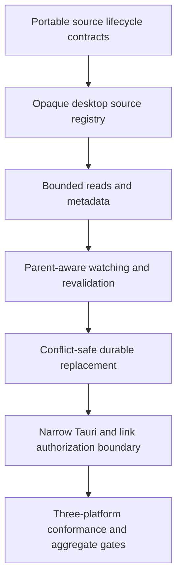

# Implementation Plan: Desktop Source Lifecycle

**Branch**: `codex/006-desktop-source-lifecycle` | **Date**: 2026-08-30 | **Spec**: [spec.md](spec.md)

**Input**: Feature specification from `specs/006-desktop-source-lifecycle/spec.md`

## Summary

S006 implements GitHub Issue #46 as a desktop-only source lifecycle. Portable Rust contracts describe opaque source IDs, external revisions, ordered source events, durability guarantees, save receipts, and link authorizations. The Tauri host owns trusted delivery paths, process-local source records, bounded reads, metadata, native watching, revalidation, conflict-safe writes, and cleanup. The design uses platform file identity where safely available, treats watcher messages as invalidation hints, prevents stale replacement, and exposes no renderer-facing arbitrary-path or shell authority.

## Technical Context

**Language/Version**: Rust 1.96.0 with edition 2024; existing TypeScript 6.0.2 contract projection only where serialized values cross the interface boundary

**Primary Dependencies**: Existing Serde 1.0.229, Schemars 1.2.2, and Tauri 2.11.5; `uuid` for process-local random source IDs; `file-id` for safe platform identity; `notify` for native desktop watchers; `atomic-write-file` for safe cross-platform replacement; `url` for strict external-link parsing

**Storage**: User-selected desktop regular files plus in-memory source records and watcher queues; no database, recovery store, session restore, or Android provider storage

**Testing**: Rust unit, contract, and host integration tests through `cargo test`; platform adapter conformance on Windows, macOS, and Linux CI; repository aggregate validation through `cargo xtask check`

**Target Platform**: Windows, macOS, and Linux desktop Tauri hosts; Android is explicitly outside S006

**Project Type**: Cross-platform desktop application with portable Rust domain contracts and a privileged Rust/Tauri native host

**Performance Goals**: Validate and begin a bounded read without scanning the full file; return no more than 1 MiB per range/chunk; drain watcher events without blocking the interface thread; revalidate with metadata-scale I/O; stream writes without a second unbounded in-memory copy inside the host

**Constraints**: Offline and account-free; no renderer paths or generic filesystem commands; no unsafe code; no silent stale overwrite; no fabricated capability; no external console; UTF-8 without BOM; Apache-2.0-compatible dependencies; Markdown paragraphs remain one physical line

**Scale/Scope**: One desktop source registry, one portable lifecycle contract family, one shared conformance suite, four trusted delivery kinds, Windows/macOS/Linux platform identity adapters, bounded read/stat/watch/revalidate/save/close operations, and narrow link authorization for issue #46

## Constitution Check

### Before Phase 0 research

| Principle | Result | Evidence |
| --- | --- | --- |
| P1. The file owns the viewport | PASS | S006 adds no permanent interface surface and exists solely to acquire and persist the active files. |
| P2. Local files remain local | PASS | All source operations are local, offline, account-free, and prohibit content logging or upload. |
| P3. Cross-platform behavior is foundational | PASS | One portable contract and conformance suite cover Windows, macOS, and Linux while Android remains explicitly separate rather than path-shaped. |
| P4. Untrusted input fails safely | PASS | Acquisition is trusted-channel-only, byte operations are bounded, capabilities are explicit, stale revisions conflict, and full-strength saves use atomic replacement. |
| P5. Specifications and releases move together | PASS | Behavior remains an unreleased S006 delta and does not change the v0.0.0 capability matrix or product version. |
| P6. Verification precedes claims | PASS | Every acceptance scenario maps to automated tests or a documented platform check, and the aggregate repository gate remains required. |
| P7. Decisions are explicit and proportional | PASS | Research records host-boundary, identity, watcher, persistence, and link-policy choices; Android, editing, recovery, and release activation are excluded. |
| P8. Apache-2.0 and license compatibility | PASS | Every added crate is reviewed through lockfile and `cargo deny`; no dependency bypass is permitted. |

### After Phase 1 design

All constitution gates remain PASS. Native authority remains confined to the host, the value model makes weak evidence and degraded guarantees explicit, save-time revalidation cannot be bypassed, and tests cover the three desktop platform families without adding Android path assumptions. No exception or complexity waiver is required.

## Project Structure

### Documentation for this feature

```text
specs/006-desktop-source-lifecycle/
├── checklists/
│   └── requirements.md
├── contracts/
│   ├── desktop-source-host.md
│   └── external-link-policy.md
├── data-model.md
├── plan.md
├── quickstart.md
├── research.md
├── spec.md
└── tasks.md
```

### Source code at the repository root

```text
crates/glitchpad-core/
├── src/
│   ├── contracts.rs
│   ├── lib.rs
│   ├── session.rs
│   └── source.rs
└── tests/
    └── contract_schema.rs

crates/glitchpad-host/
├── src/
│   ├── lib.rs
│   └── source/
│       ├── identity.rs
│       ├── mod.rs
│       ├── persistence.rs
│       └── watch.rs
└── tests/
    └── desktop_source_conformance.rs

apps/glitchpad/src/domain/
└── contracts.ts
```

**Structure Decision**: `glitchpad-core` owns serializable source lifecycle policy and pure state transitions. `glitchpad-host` owns every native path, handle, watcher, and file mutation. TypeScript mirrors only safe serialized values and receives no path-taking operation. This extends the existing two-crate boundary rather than creating a general storage abstraction or new service.

## Delivery Sequence



## Complexity Tracking

No constitution violations require justification.
