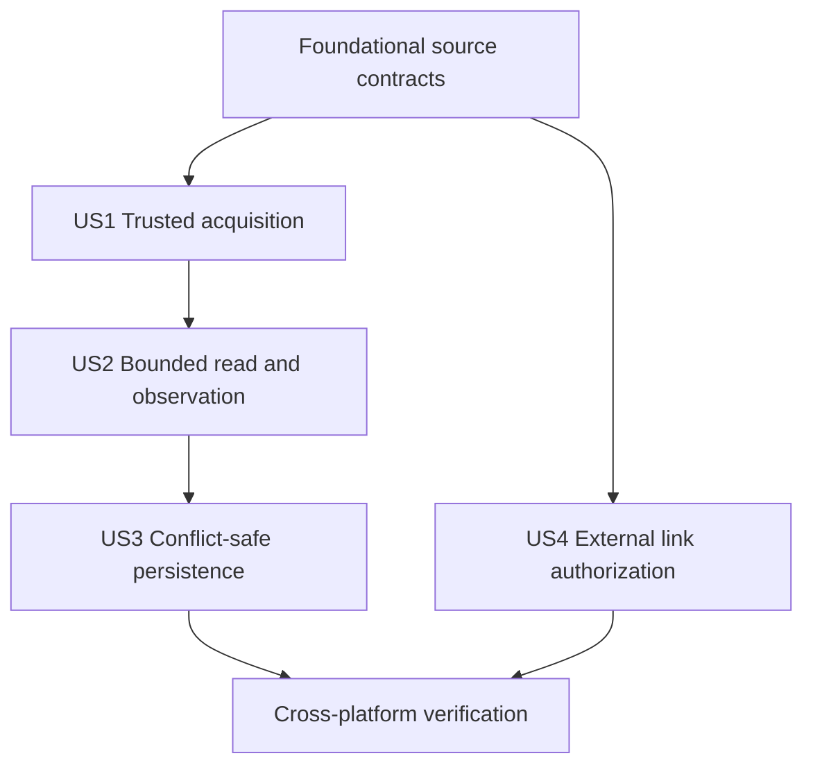

# Tasks: Desktop Source Lifecycle

**Input**: Design documents from `specs/006-desktop-source-lifecycle/`

**Prerequisites**: `plan.md`, `spec.md`, `research.md`, `data-model.md`, `contracts/`, and `quickstart.md`

**Tests**: S006 requires test-first Rust unit, contract, integration, and three-platform conformance evidence for every acceptance criterion.

**Organization**: Tasks are grouped by user story and preserve direct traceability to GitHub Issue #46.

## Format: `[ID] [P?] [Story] Description`

- **[P]**: Can run in parallel because the task changes different files and has no unmet dependency on another marked task.
- **[Story]**: Maps the task to a user story from `spec.md`.
- Every task names its concrete file path.

## Phase 1: Setup

**Purpose**: Add reviewed dependencies and establish the portable and native module boundaries.

- [x] T001 Add pinned `atomic-write-file`, `file-id`, `notify`, `url`, and `uuid` workspace dependencies in `Cargo.toml`, `crates/glitchpad-host/Cargo.toml`, `Cargo.lock`, and accepted license policy when required
- [x] T002 [P] Create the portable source lifecycle module export in `crates/glitchpad-core/src/source.rs` and `crates/glitchpad-core/src/lib.rs`
- [x] T003 [P] Create the private desktop adapter module layout in `crates/glitchpad-host/src/source/mod.rs`, `identity.rs`, `watch.rs`, and `persistence.rs`

---

## Phase 2: Foundational source contracts

**Purpose**: Define the safe values and transitions required by every desktop source operation.

**Critical**: No native acquisition or I/O implementation begins until these contracts compile, serialize, and pass pure tests.

- [x] T004 [P] Write failing source ID, revision comparison, event sequencing, revalidation, durability, save receipt, and safe-error tests in `crates/glitchpad-core/src/source.rs`
- [x] T005 [P] Write failing capability completeness and serialized source lifecycle schema tests in `crates/glitchpad-core/tests/contract_schema.rs`
- [x] T006 Implement opaque IDs, external revisions, source states/events, revalidation results, bounded request/receipt values, durability guarantees, and link authorization contracts in `crates/glitchpad-core/src/source.rs`
- [x] T007 Extend independent source capabilities and stable error categories in `crates/glitchpad-core/src/contracts.rs` without changing strong/weak identity semantics
- [x] T008 Mirror the serialized S006 contract additions in `apps/glitchpad/src/domain/contracts.ts`

**Checkpoint**: Portable S006 values are exhaustive, path-free, schema-covered, and independently testable.

---

## Phase 3: User Story 1 - Open an explicitly delivered desktop file (Priority: P1)

**Goal**: Acquire regular desktop files from trusted delivery channels into an opaque, least-authority registry with strongest-available identity.

**Independent Test**: Deliver temporary regular files through all four delivery kinds and verify opaque summaries, capability truthfulness, duplicate policy, and rejection of unsupported sources.

### Tests for User Story 1

- [x] T009 [P] [US1] Write failing trusted-delivery, regular-file rejection, opaque ID, safe summary, and close invalidation tests in `crates/glitchpad-host/tests/desktop_source_conformance.rs`
- [x] T010 [P] [US1] Write failing platform identity strength, rename stability, replacement distinction, and weak-fallback tests in `crates/glitchpad-host/src/source/identity.rs`

### Implementation for User Story 1

- [x] T011 [US1] Implement platform identity derivation through safe Unix device/inode and Windows volume/file evidence with explicit weak fallback in `crates/glitchpad-host/src/source/identity.rs`
- [x] T012 [US1] Implement trusted `DesktopDelivery`, process-local `DesktopSourceHost`, random source registry, capability derivation, safe acquisition summary, and close cleanup in `crates/glitchpad-host/src/source/mod.rs`
- [x] T013 [US1] Integrate the source host as managed Tauri state without registering a renderer path-acquisition command in `crates/glitchpad-host/src/lib.rs`

**Checkpoint**: Trusted desktop deliveries produce safe opaque records, strong duplicate identity remains usable by the session layer, and arbitrary interface paths are impossible.

---

## Phase 4: User Story 2 - Read and observe a bounded source (Priority: P1)

**Goal**: Provide bounded bytes, safe metadata, native watcher invalidation, and authoritative revalidation for an acquired source.

**Independent Test**: Exercise valid and invalid ranges, stream budgets, external mutation, rename, deletion, overflow, revocation, and backend failure against temporary files.

### Tests for User Story 2

- [x] T014 [P] [US2] Write failing range arithmetic, 1 MiB operation limit, stream budget, changed-revision, and safe metadata tests in `crates/glitchpad-host/tests/desktop_source_conformance.rs`
- [x] T015 [P] [US2] Write failing changed, rename, deletion, rescan/overflow, backend error, filtering, sequence, and revalidation tests in `crates/glitchpad-host/src/source/watch.rs`

### Implementation for User Story 2

- [x] T016 [US2] Implement bounded range and stream-lease operations plus safe metadata projection in `crates/glitchpad-host/src/source/mod.rs`
- [x] T017 [US2] Implement parent-aware recommended native watching, path filtering, stable event mapping, bounded event draining, and watcher cleanup in `crates/glitchpad-host/src/source/watch.rs`
- [x] T018 [US2] Implement authoritative revision observation and revalidation outcomes for changed, deleted, revoked, unavailable, and matching sources in `crates/glitchpad-host/src/source/mod.rs` and `identity.rs`
- [x] T019 [US2] Apply watcher and revalidation states to sessions without discarding dirty state in `crates/glitchpad-core/src/session.rs`

**Checkpoint**: All source reads are bounded, watcher uncertainty is explicit, and only revalidation can restore revision certainty.

---

## Phase 5: User Story 3 - Save without silently overwriting external work (Priority: P1)

**Goal**: Reject stale saves and return success only after the strongest available durable replacement protocol completes.

**Independent Test**: Save matching revisions, race external mutations, inject pre-commit failures, and inspect destination, backup, and receipt behavior.

### Tests for User Story 3

- [x] T020 [P] [US3] Write failing stale session/external revision, oversized payload, read-only, acknowledgement, and receipt tests in `crates/glitchpad-host/tests/desktop_source_conformance.rs`
- [x] T021 [P] [US3] Write failing sibling-temp, flush/sync ordering, permission preservation, atomic replacement, cleanup, and fault-path tests in `crates/glitchpad-host/src/source/persistence.rs`

### Implementation for User Story 3

- [x] T022 [US3] Implement full-strength atomic persistence, supported permission preservation, platform directory-durability reporting, and recoverable failure cleanup in `crates/glitchpad-host/src/source/persistence.rs`
- [x] T023 [US3] Implement save precondition validation, weaker-guarantee acknowledgement binding, durable receipt construction, and post-save revision update in `crates/glitchpad-host/src/source/mod.rs`
- [x] T024 [US3] Extend session conflict transitions and save receipt application while preserving dirty state until durable success in `crates/glitchpad-core/src/session.rs`

**Checkpoint**: A stale or partial save never replaces the destination or clears dirty state, and only a durable receipt advances the source revision.

---

## Phase 6: User Story 4 - Open external links only from explicit safe intent (Priority: P2)

**Goal**: Produce one-use authorization only for allowed normalized targets tied to current explicit user activation.

**Independent Test**: Evaluate allowed, malformed, credential-bearing, control-character, unsupported-scheme, expired, and replayed requests without launching another application.

### Tests for User Story 4

- [x] T025 [US4] Write failing scheme, normalization, credential, control-character, activation expiry, replay, and deterministic policy tests in `crates/glitchpad-host/src/source/mod.rs`

### Implementation for User Story 4

- [x] T026 [US4] Implement explicit user-activation proofs and one-use external-link authorizations without an arbitrary operating-system opener in `crates/glitchpad-host/src/source/mod.rs`

**Checkpoint**: Untrusted document content cannot launch an external target, and allowed link intent is narrow, normalized, explicit, and single-use.

---

## Phase 7: Polish and cross-cutting verification

**Purpose**: Complete issue #46 with platform evidence, documentation impact, licensing, and repository-wide validation.

- [x] T027 [P] Add Windows, macOS, and Linux execution of the shared desktop adapter conformance test to `.github/workflows/ci.yml`
- [x] T028 [P] Record issue #46 requirement-to-test mapping, platform evidence, durability guarantees, and honest manual-check limits in `specs/006-desktop-source-lifecycle/verification.md`
- [x] T029 [P] Add the unreleased host lifecycle entry and dependency attribution updates in `CHANGELOG.md`, `NOTICE`, and `changelog.d/desktop-source-lifecycle.added.md`
- [x] T030 Validate UTF-8 without BOM, mojibake absence, one-line Markdown paragraphs, top-to-bottom Mermaid direction, formatting, linting, dependency licenses, Rust tests, interface checks, documentation, and public surface through the hosted composite equivalent of `cargo xtask check`
- [x] T031 Run the available platform and manual procedures in `specs/006-desktop-source-lifecycle/quickstart.md` and record any non-local platform evidence as CI-required rather than locally verified in `verification.md`

---

## Dependencies and execution order

### Phase dependencies

- Setup begins immediately.
- Foundational contracts depend on Setup and block all native source behavior.
- User Story 1 depends on Foundational contracts.
- User Story 2 depends on User Story 1’s source registry and platform identity.
- User Story 3 depends on authoritative revalidation from User Story 2.
- User Story 4 depends only on Foundational IDs and errors and may proceed after that checkpoint.
- Polish depends on every selected user story.

### User story dependency graph

### Parallel opportunities

- T002 and T003 create independent core and host module boundaries.
- T004 and T005 cover pure contract behavior and serialization separately.
- T009 and T010 cover registry acquisition and platform identity separately.
- T014 and T015 cover I/O budgets and watcher mapping separately.
- T020 and T021 cover host save policy and persistence mechanics separately.
- T027, T028, and T029 update independent workflow, verification, and release-delta files.

## Implementation strategy

### MVP first

1. Complete Setup and Foundational contracts.
2. Complete trusted acquisition and verify opaque source authority independently.
3. Add bounded reads, watching, and revalidation before any write behavior.
4. Add stale-safe persistence only after revision certainty is tested.
5. Complete link authorization and the full platform conformance matrix under the authorized autopilot protocol.

### Incremental integration

1. Compile and schema-test portable contracts before native I/O.
2. Test identity and acquisition against temporary files before watchers.
3. Treat every watcher result as invalidation until revalidation tests pass.
4. Fault-test persistence before exposing save through the registry.
5. Run focused tests at each checkpoint and the aggregate repository gate after issue-level evidence exists.

## Notes

- Every checkbox is marked complete only after its described code, test, or evidence exists.
- Tests precede implementation and must initially demonstrate the intended missing behavior.
- S006 does not add Android URI handling, text editing, recovery storage, Save As, routine session restore, generic shell execution, or released capability claims.
