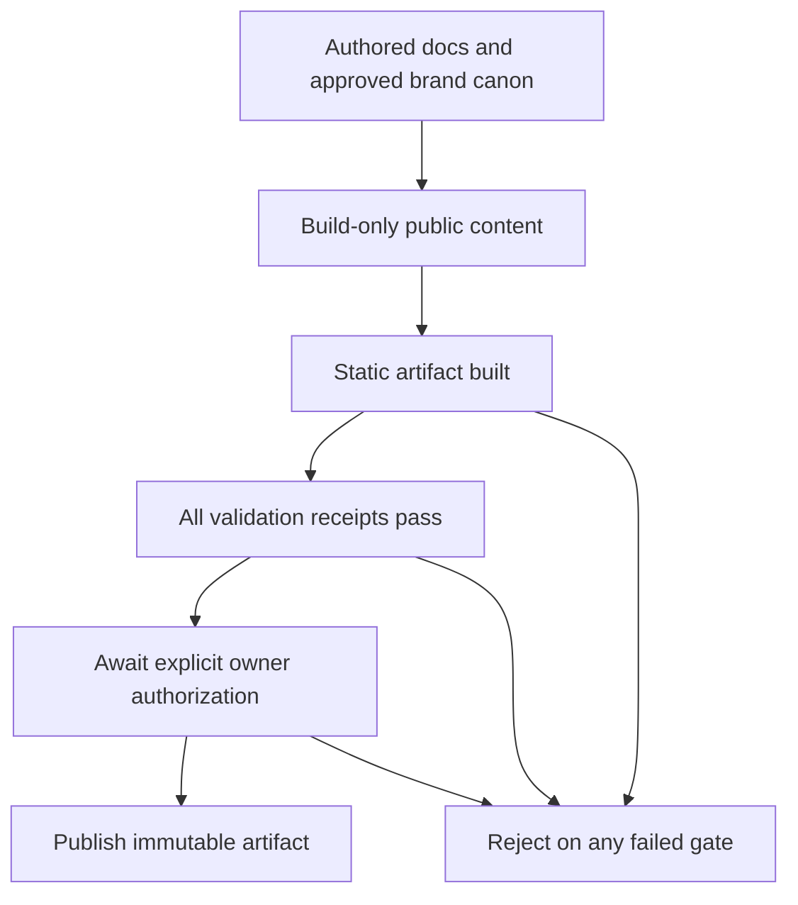

# Data Model: Brand and Public Web Foundation

## Brand Canon

Represents one approved, versioned brand delivery.

- Canon version and parent organization.
- Immutable positioning, logo geometry, color, typography, and treatment decisions.
- Manifest of governed files with byte lengths and cryptographic checksums.
- Verification receipt and reproducible generation inputs.
- Relationships: owns many brand assets, license records, rules, and integration bindings.

## Brand Asset

Represents one governed visual, typographic, interface, platform, or metadata resource.

- Stable repository-relative path.
- Asset role and approved usage surface.
- Variant semantics such as full color, monochrome, light surface, dark surface, reduced mark, or platform size.
- Checksum and byte length from the canon manifest.
- Distribution status: canonical, generated deliverable, exploratory concept, or quality-control evidence.
- License and provenance reference when the asset is not original project artwork.

## Public Claim

Represents one release-facing statement whose truth must remain aligned with repository authorities.

- Claim subject such as version, availability, platform direction, capability status, privacy, or licensing.
- Authoritative source path and source field or section.
- Public surfaces that consume the claim.
- Validation rule that detects unsupported promotion or stale values.

## Authored Documentation Source

Represents repository prose that remains authoritative when presented publicly.

- Source path and document role.
- Public route or routes derived from the source.
- Adaptation rules required for frontmatter, links, Mermaid, or MDX safety.
- Drift policy: generated copies are build-only and never edited directly.

## Public Page

Represents one statically generated visitor surface.

- Route and page role.
- Title, description, canonical URL, social-preview, icon, and theme metadata.
- Source claims and authored documentation dependencies.
- Navigation relationships and accessibility obligations.
- Required theme and viewport validation set.

## Deployment Artifact

Represents one immutable production-equivalent static export.

- Source commit identity.
- Generated route inventory and asset tree.
- Static-hosting marker and glitchpad.com domain declaration.
- Build, link, accessibility, responsive, theme, metadata, brand, and security receipts.
- Publication state: validated, authorized, deployed, or rejected.

## Deployment Gate

Represents the authorization boundary for public mutation.

- Trigger identity and source ref.
- Protected environment approval state.
- Artifact identity selected for publication.
- Permissions limited to Pages publication and identity token issuance.
- Failure state that leaves the current public site unchanged.

## State Transitions

