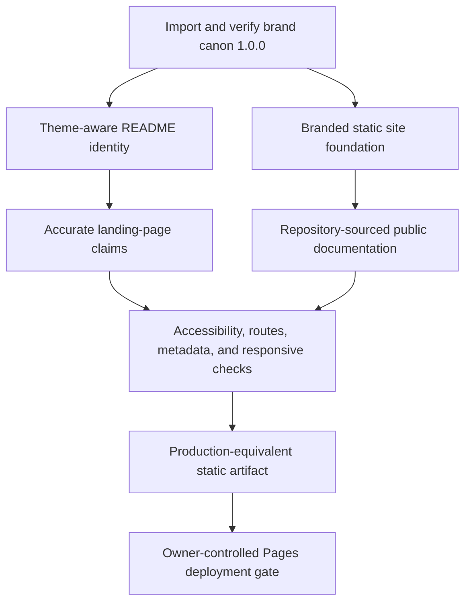

# Implementation Plan: Brand and Public Web Foundation

**Branch**: `codex/007-brand-web-foundation` | **Date**: 2026-08-30 | **Spec**: [spec.md](spec.md)

**Input**: Feature specification from `specs/007-brand-web-foundation/spec.md`

## Summary

S007 implements GitHub Issues #61 and #99 as one public-identity increment. The approved canon 1.0.0 delivery becomes the repository-owned `brand/` authority, its horizontal SVG lockups provide a color-scheme-aware README banner, and its Next.js bindings seed a static `site/` application. The site follows the proven fragcap structure with a branded landing page, Fumadocs documentation at `/docs`, prebuild adaptation from authoritative repository prose, static export, accessibility and route checks, and an owner-gated GitHub Pages deployment artifact for glitchpad.com.

## Technical Context

**Language/Version**: Node.js 24.11.0 and pnpm 10.28.2 from the root workspace; TypeScript 5.9.3 for the reference-compatible site package; existing Python brand generators and verifier from canon 1.0.0; Markdown and MDX content

**Primary Dependencies**: Next.js 16.3.0, React and React DOM 19.2.8, Fumadocs Core/UI 16.14.3, Fumadocs MDX 15.2.3, Tailwind CSS 4.2.4, next-themes, Zod 4.1.13, and Playwright 1.62.1; approved local Geist, Geist Mono, and Space Grotesk font files

**Storage**: Versioned repository files only; authored documentation remains under `docs/`, generated site content is build-only under `site/content/generated/`, and deployable output is build-only under `site/out/`

**Testing**: Canon brand verification; Node unit tests for generated content and metadata; production static build; Playwright accessibility, theme, responsive, keyboard, and route checks; existing documentation, link, secret, dependency, encoding, formatting, and CodeQL gates

**Target Platform**: GitHub README renderers plus modern desktop and mobile browsers; static hosting at the root of glitchpad.com through an explicitly authorized GitHub Pages deployment

**Project Type**: Existing cross-platform application repository plus a static public website and documentation package

**Performance Goals**: Landing and documentation pages remain usable without a server runtime, avoid remote font or telemetry requests, ship bounded first-party assets, and complete production static generation within the hosted documentation job budget

**Constraints**: Dark-first brand behavior with a light reading surface; no redesign of canon 1.0.0; no duplicate documentation authority; no account, telemetry, server runtime, remote font, or document upload; no deployment from pull requests; UTF-8 without BOM; Apache-2.0-compatible dependencies and assets; generated output is never committed over `docs/`

**Scale/Scope**: 131 canon brand files, one README banner pair, one landing route, one `/docs` index, one adapted technical-specification route, legal/support/security links, metadata and not-found surfaces, one production-equivalent static artifact, and one owner-gated Pages workflow

## Constitution Check

### Before Phase 0 research

| Principle | Result | Evidence |
| --- | --- | --- |
| P1. The file owns the viewport | PASS | S007 changes public repository and website surfaces, not the application viewport or its content-first runtime shell. |
| P2. Local files remain local | PASS | The public site is informational, has no upload, account, telemetry, or remote document-processing path, and makes the local-first boundary explicit. |
| P3. Cross-platform behavior is foundational | PASS | Website and README output are browser and renderer surfaces only; application platform contracts remain unchanged and Android issue #47 stays separate. |
| P4. Untrusted input fails safely | PASS | Site content is repository-authored at build time, Mermaid remains local, remote fonts are prohibited, and no opened document is processed by the site. |
| P5. Specifications and releases move together | PASS | Public claims are generated or checked against existing authorities and preserve the v0.0.0 pre-release status. |
| P6. Verification precedes claims | PASS | Brand, static build, links, metadata, accessibility, theme, responsive, security, license, and production-artifact checks gate readiness. |
| P7. Decisions are explicit and proportional | PASS | Research records the site topology, documentation authority, stack, asset import, and deployment gate; production DNS and application behavior are excluded. |
| P8. Apache-2.0 and license compatibility | PASS | The kit carries font licenses and provenance, added dependencies are pinned and license-scanned, and no remote build-time resource is permitted. |

### After Phase 1 design

All constitution gates remain PASS. The design adds one bounded public-site package, preserves one authored documentation authority, imports the approved brand canon without reopening it, and retains owner control over production mutation. No exception or complexity waiver is required.

## Project Structure

### Documentation for this feature

```text
specs/007-brand-web-foundation/
├── checklists/
│   └── requirements.md
├── contracts/
│   ├── brand-integration.md
│   └── public-site.md
├── data-model.md
├── plan.md
├── quickstart.md
├── research.md
├── spec.md
└── tasks.md
```

### Source code at the repository root

```text
brand/
├── logos/
├── favicons/
├── fonts/
├── tokens/
├── components/
├── nextjs/
├── enforcement/
├── build/
├── manifest.json
├── README.md
└── VERIFY.md

site/
├── app/
│   ├── (home)/
│   ├── docs/[[...slug]]/
│   ├── global.css
│   ├── layout.tsx
│   └── not-found.tsx
├── components/
├── content/docs/
├── lib/
├── public/
├── scripts/
├── tests/
├── next.config.mjs
├── package.json
├── playwright.config.mjs
└── source.config.ts

.github/workflows/
└── docs.yml

README.md
package.json
pnpm-lock.yaml
pnpm-workspace.yaml
```

**Structure Decision**: `brand/` is the immutable approved design authority and contains both source and verification evidence. `site/` mirrors the proven fragcap Next.js/Fumadocs static-site boundary. Root `docs/` remains authored source, while `site/scripts/prebuild.mjs` generates build-only MDX adaptations and public metadata. `site/out/` is the only deployable artifact and remains ignored.

## Delivery Sequence



## Complexity Tracking

No constitution violations require justification.
