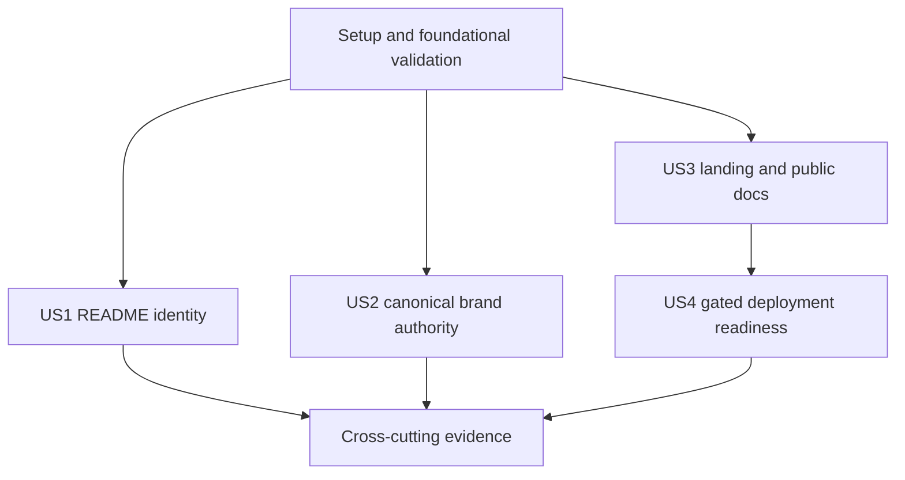

# Tasks: Brand and Public Web Foundation

**Input**: Design documents from `specs/007-brand-web-foundation/`

**Prerequisites**: `plan.md`, `spec.md`, `research.md`, `data-model.md`, `contracts/`, and `quickstart.md`

**Tests**: S007 requires automated contract, unit, production-browser, accessibility, link, metadata, responsive, theme, brand, and hosted artifact evidence.

## Phase 1: Setup

**Purpose**: Establish the approved source inputs and package boundaries.

- [ ] T001 Import the complete approved canon 1.0.0 delivery into `brand/` without modifying governed files
- [ ] T002 Add the `site/` workspace package boundary and pinned scripts/dependencies in `pnpm-workspace.yaml`, `package.json`, `site/package.json`, and `pnpm-lock.yaml`
- [ ] T003 Extend generated-output and dependency exclusions for the site in `.gitignore` and the root lint/format configuration
- [ ] T004 Record S007 issue and user-visible change traceability in `changelog.d/brand-web-foundation.added.md`

---

## Phase 2: Foundational Validation and Site Infrastructure

**Purpose**: Provide the shared verification and static-site infrastructure required by every story.

**Critical**: Complete this phase before user-story implementation.

- [ ] T005 Add deterministic canon manifest, UTF-8, production-reference, and license checks in `scripts/check-brand.mjs`
- [ ] T006 Integrate brand and website checks into repository validation in `crates/xtask/src/docs.rs`, `package.json`, and `.github/workflows/ci.yml`
- [ ] T007 Create static-export, documentation-source, and metadata configuration in `site/next.config.mjs`, `site/source.config.ts`, `site/tsconfig.json`, `site/postcss.config.mjs`, and `site/next-env.d.ts`
- [ ] T008 Create authoritative-source adaptation and static-host marker generation in `site/scripts/prebuild.mjs` and `site/scripts/postbuild.mjs`
- [ ] T009 Create production-server and route/link audit support in `site/scripts/serve-export.mjs` and `site/scripts/audit-export.mjs`
- [ ] T010 Add shared local fonts, canonical brand assets, icons, manifest, and social preview under `site/public/`

**Checkpoint**: The brand authority and empty static-site shell can be validated without public content.

---

## Phase 3: User Story 1 - Recognize the official project immediately (Priority: P1)

**Goal**: Display the approved Glitchpad horizontal identity at the top of the README in light and dark rendering environments.

**Independent Test**: Validate the picture-source contract and render the README in both color schemes with images enabled and disabled.

### Tests for User Story 1

- [ ] T011 [US1] Add README banner source, fallback, alternative-text, and canonical-path assertions in `scripts/check-brand.mjs`

### Implementation for User Story 1

- [ ] T012 [US1] Add the color-scheme-aware approved horizontal banner before the existing heading in `README.md`

**Checkpoint**: The repository entry point independently presents the approved identity in light and dark themes.

---

## Phase 4: User Story 2 - Reuse one verified brand authority (Priority: P1)

**Goal**: Make canon 1.0.0 a complete, verified, repository-owned source for every future brand integration.

**Independent Test**: Compare all imported files with `brand/manifest.json`, exercise the verifier against controlled drift, and inspect asset classification and licensing guidance.

### Tests for User Story 2

- [ ] T013 [P] [US2] Add manifest coverage, checksum mismatch, missing-license, mojibake, and forbidden production-reference fixtures in `scripts/check-brand.test.mjs`
- [ ] T014 [P] [US2] Add hosted execution of the canon verifier and its declared dependencies in `.github/workflows/ci.yml`

### Implementation for User Story 2

- [ ] T015 [US2] Document canonical, generated, exploratory, and quality-control asset boundaries plus regeneration and provenance in `brand/README.md`
- [ ] T016 [US2] Wire the deterministic brand checker into contributor and aggregate check documentation in `CONTRIBUTING.md` and `README.md`

**Checkpoint**: Maintainers can select and verify approved assets without consulting the external ZIP or using exploratory files.

---

## Phase 5: User Story 3 - Understand Glitchpad and reach its documentation (Priority: P1)

**Goal**: Deliver an accurate branded landing page and repository-sourced public documentation under `/docs`.

**Independent Test**: Build the static site and navigate every required route with current claims, local assets, source traceability, keyboard operation, and responsive light/dark presentation.

### Tests for User Story 3

- [ ] T017 [P] [US3] Add unit tests for claim sourcing, technical-specification adaptation, route inventory, and required metadata in `site/tests/content-contract.test.mjs`
- [ ] T018 [P] [US3] Add Playwright coverage for landing, documentation, legal, support, security, and not-found routes in `site/tests/public-routes.spec.mjs`
- [ ] T019 [P] [US3] Add Playwright light/dark, keyboard, reduced-motion, responsive-overflow, and automated accessibility coverage in `site/tests/accessibility.spec.mjs`

### Implementation for User Story 3

- [ ] T020 [US3] Implement canonical local fonts, theme provider, skip link, shared layout, navigation, and footer in `site/app/layout.tsx`, `site/app/global.css`, `site/components/`, and `site/lib/`
- [ ] T021 [US3] Implement the accurate pre-release landing-page pitch and primary actions in `site/app/(home)/page.tsx` and `site/app/(home)/layout.tsx`
- [ ] T022 [US3] Implement Fumadocs source loading and the `/docs` shell in `site/lib/source.ts`, `site/app/docs/layout.tsx`, `site/app/docs/[[...slug]]/page.tsx`, and `site/mdx-components.tsx`
- [ ] T023 [US3] Add the public documentation index and generated technical-specification navigation in `site/content/docs/index.mdx` and `site/content/docs/meta.json`
- [ ] T024 [US3] Implement license, support, security, and not-found routes from repository authorities in `site/app/(home)/license/page.tsx`, `site/app/(home)/support/page.tsx`, `site/app/(home)/security/page.tsx`, and `site/app/not-found.tsx`
- [ ] T025 [US3] Add complete canonical, favicon, manifest, theme, and social-preview metadata in `site/app/layout.tsx`, `site/app/icon.tsx`, and `site/app/opengraph-image.tsx`

**Checkpoint**: A first-time visitor can understand the product and navigate authoritative public documentation on a complete static site.

---

## Phase 6: User Story 4 - Validate a deployable static site without accidental publication (Priority: P2)

**Goal**: Produce a production-equivalent Pages artifact in review while keeping public deployment owner-controlled.

**Independent Test**: Run pull-request validation with read-only permissions, inspect the export and domain markers, and verify that only explicit workflow dispatch can reach the protected deployment job.

### Tests for User Story 4

- [ ] T026 [P] [US4] Add workflow contract checks for permissions, triggers, environment protection, artifact path, `.nojekyll`, and `CNAME` in `scripts/check-config.mjs`
- [ ] T027 [P] [US4] Add production artifact route, asset, external-request, and marker assertions in `site/tests/export-contract.test.mjs`

### Implementation for User Story 4

- [ ] T028 [US4] Add build-on-review and explicitly dispatched protected Pages deployment in `.github/workflows/docs.yml`
- [ ] T029 [US4] Document Pages, custom-domain, DNS, rollback, and first-publication authorization steps in `site/README.md`

**Checkpoint**: Hosted validation proves deployment readiness while S007 performs no public infrastructure mutation.

---

## Phase 7: Polish and Cross-Cutting Concerns

**Purpose**: Reconcile documentation, issue traceability, and final evidence across the complete slice.

- [ ] T030 [P] Reconcile brand and public-site architecture as an unreleased delta in `docs/glitchpad-technical-specification.md`
- [ ] T031 [P] Update Issue #61 and Issue #99 acceptance traceability with the implemented paths and validation evidence
- [ ] T032 Run all quickstart and hosted validation scenarios and record exact evidence in `specs/007-brand-web-foundation/verification.md`
- [ ] T033 Complete a final mojibake, prohibited-em-dash, Markdown physical-line, Mermaid-TB, public-claim, and clean-worktree audit across S007 files

---

## Dependencies and Execution Order

### Phase Dependencies

- **Phase 1** has no feature dependencies and starts after the S007 branch is created.
- **Phase 2** depends on Phase 1 and blocks every user story.
- **User Story 1** depends on the imported canon and checker, then can finish independently.
- **User Story 2** depends on the canon and checker, then can finish independently of website content.
- **User Story 3** depends on the static-site foundation and public assets, then can finish independently of deployment.
- **User Story 4** depends on a buildable User Story 3 artifact.
- **Phase 7** depends on every included story.

### User Story Dependencies

### Parallel Opportunities

- T011/T012 and T013-T016 can progress independently after T005 establishes the checker contract.
- T017, T018, and T019 target independent test files and can be authored in parallel before the matching site implementation.
- T020, T023, and T024 affect separate surfaces once T007-T010 are complete.
- T026 and T027 validate separate workflow and artifact contracts.
- T030 and T031 can proceed in parallel before final evidence assembly.

## Implementation Strategy

### MVP First

Complete Phases 1 through 4 to land the approved canon, README banner, and verified repository brand authority as an independently reviewable identity increment.

### Full S007 Increment

Continue directly through User Stories 3 and 4 under the authorized autopilot protocol, then complete reconciliation, hosted evidence, convergence, and PR review before handoff.

## Format Validation

All tasks use the required checkbox, sequential ID, optional parallel marker, user-story label where applicable, imperative description, and explicit file-path format.
