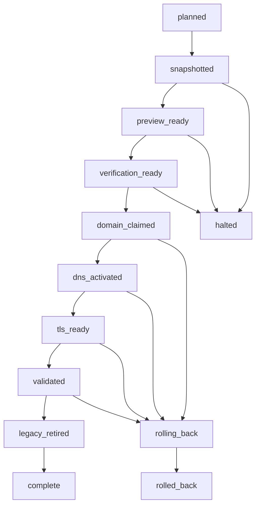

# Data Model: Production Domain Cutover

## Migration Run

Represents one controlled S009 execution.

| Field | Meaning | Validation |
| --- | --- | --- |
| `run_id` | Stable timestamp-based identifier | UTC timestamp, unique within evidence directory |
| `source_revision` | Reviewed repository revision deployed to production | Full commit identifier on `main` |
| `operator` | Authenticated authority executing the run | Account name only, no credential data |
| `started_at` / `completed_at` | Execution boundaries | UTC ISO-8601; completion absent until final checkpoint |
| `state` | Current migration state | One allowed state below |
| `checkpoint_results` | Ordered evidence entries | Every completed mutation has exactly one result |
| `rollback_state` | Recovery status and reason | Required if state becomes `rolling_back` or `rolled_back` |

### State transitions

## Zone Snapshot

Represents a secret-free point-in-time Cloudflare configuration record.

| Field | Meaning | Validation |
| --- | --- | --- |
| `captured_at` | Snapshot time | UTC ISO-8601 |
| `account` / `zone` | Scoped provider identifiers and names | Must equal ShruggieTech and `glitchpad.com` authorities |
| `dns_records` | Record identity, type, name, value, TTL, priority, proxy state, timestamps | Every live record appears exactly once |
| `dnssec` | Status and public DS facts | No private key material |
| `zone_settings` | Setting identifier, value, editability, modification time | Every returned setting appears exactly once |
| `page_rules` | User-defined Page Rules | Complete definitions when present |
| `zone_rulesets` | Managed summary or complete user-defined rules | Managed rules carry identity/version/counts; custom rules carry bodies |
| `account_rulesets` | Relevant account-level rulesets | Same managed/custom rule policy |
| `account_lists` | Bulk redirect lists and counts | Complete user-defined metadata when present |
| `workers_routes` | Route patterns and script bindings | Complete when present |
| `email_routing` | Status, DNS state, and redacted rule structure | Destinations and matcher values redacted |
| `ssl` | SSL mode, universal status, and public certificate-pack summary | No certificate private material |

## Configuration Decision

Represents the disposition of one audited object.

| Field | Meaning | Validation |
| --- | --- | --- |
| `surface` | DNS, setting, rule, route, email, certificate, or Pages | Controlled vocabulary |
| `object_id` | Provider identifier or stable compound key | Resolves to one snapshot object |
| `classification` | `retain`, `replace`, or `retire` | Exactly one value |
| `rationale` | Why the classification is safe and in scope | Non-empty and provider-specific |
| `replacement` | Expected final object | Required for `replace` |
| `rollback` | Prior value or restoration action | Required for `replace` and `retire` |
| `status` | Planned or applied state | `planned`, `applied`, `verified`, or `rolled_back` |

## Pages Attachment

Represents a repository's hosting state.

| Field | Meaning | Validation |
| --- | --- | --- |
| `repository` | Repository owner and name | Source or destination repository |
| `enabled` | Whether Pages is active | Boolean |
| `build_type` | Workflow or legacy publication | Matches provider response |
| `source` | Legacy branch/path when applicable | Required only for legacy build type |
| `cname` | Attached custom hostname | Null, preview, or apex according to checkpoint |
| `deployment_revision` | Published commit | Required for destination proof |
| `status` | Build/deployment state | Must be successful before progression |
| `https_enforced` | Provider HTTPS enforcement | True only after approved certificate |
| `certificate` | State and covered hostnames | No private certificate material |

## Domain Verification Challenge

Represents organization ownership proof.

| Field | Meaning | Validation |
| --- | --- | --- |
| `organization` | GitHub organization | Exactly `shruggietech` |
| `domain` | Verified apex | Exactly `glitchpad.com` |
| `record_name` | Provider-issued TXT name | Organization-scoped challenge hostname |
| `record_value` | Provider-issued TXT content | Persisted as public DNS evidence |
| `dns_record_id` | Cloudflare record identifier | Resolves to one retained TXT record |
| `state` | Pending or verified | `verified` required before completion |

## Cutover Checkpoint

Represents one ordered production step.

| Field | Meaning | Validation |
| --- | --- | --- |
| `sequence` | Dependency order | Unique positive integer, no gaps |
| `name` | Human-readable operation | Unique within run |
| `prerequisites` | Required prior evidence | Every reference must already pass |
| `expected_before` | Exact state guard | Must match live state before mutation |
| `mutation` | Intended external change | One bounded change or atomic provider batch |
| `expected_after` | Immediate success condition | Testable provider or public observation |
| `stop_conditions` | Conditions that prohibit continuation | Non-empty for every mutation |
| `rollback_action` | Recovery for this step | Defined before execution |
| `observed_at` / `evidence` | Timestamp and sanitized result | Required after execution |

## Production Smoke Result

Represents one public post-cutover observation.

| Field | Meaning | Validation |
| --- | --- | --- |
| `target` | Hostname, URL, DNS type, or certificate | From required smoke inventory |
| `resolver_or_client` | Observation source | Identifies authoritative/public DNS or HTTP/TLS client |
| `expected` | Contract value | Fixed before request |
| `observed` | Sanitized response | No cookies or credentials |
| `passed` | Contract result | Boolean |
| `observed_at` | Observation time | UTC ISO-8601 |

## Relationships

- One Migration Run owns one pre-cutover Zone Snapshot, one final-state snapshot, many Configuration Decisions, many Cutover Checkpoints, and many Production Smoke Results.
- Every replace or retire Configuration Decision references one pre-cutover object and at least one rollback action.
- The destination Pages Attachment moves from absent to preview, apex, HTTPS-enforced, and validated states within one Migration Run.
- The Domain Verification Challenge is created before claim transfer, retained in final DNS, and referenced by both the organization verification checkpoint and final snapshot.
- Legacy retirement depends on all required Production Smoke Results passing.
