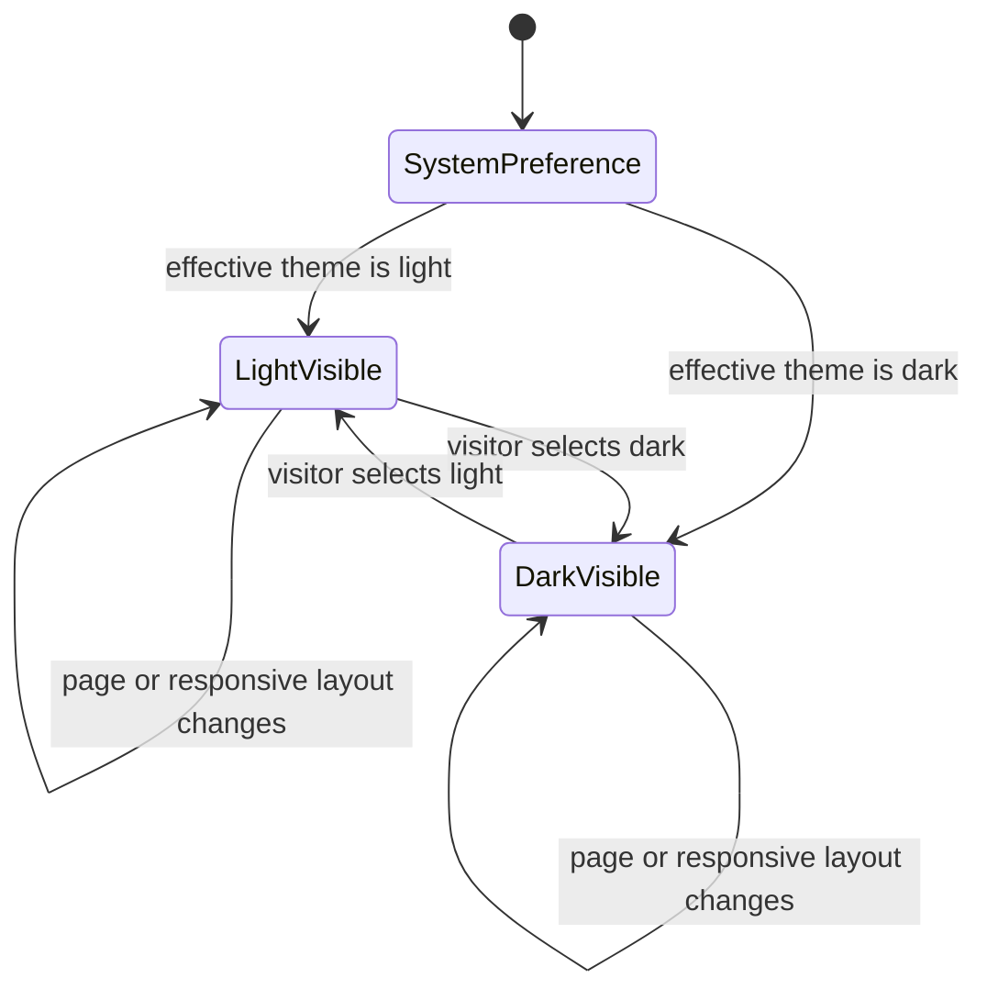

# Data Model: Theme-Aware Lockup Accessibility

S010 changes static presentation contracts rather than persistent application data. The following entities describe the governed relationships that validators and browser evidence must enforce.

## Lockup variant

| Field | Meaning | Validation |
| --- | --- | --- |
| Canonical path | Approved source under `brand/logos/svg/` | Path is recorded by the canon manifest and bytes remain unchanged |
| Integrated path | Active website copy under `site/public/logos/` | Bytes equal the canonical source |
| Foreground | Primary artwork color | White for dark surfaces; black for light surfaces |
| Target surface | Surface family on which the artwork is legible | Exactly one of `dark` or `light` |
| Semantic role | Whether the asset contributes an accessible name | Decorative on the website; informative through the README fallback image |

## Theme mapping

| Surface | README resource | Website resource | Expected state |
| --- | --- | --- | --- |
| Dark | `brand/logos/svg/glitchpad-horizontal-white.svg` | `/logos/glitchpad-horizontal-white.svg` | White artwork visible |
| Light | `brand/logos/svg/glitchpad-horizontal-black.svg` | `/logos/glitchpad-horizontal-black.svg` | Black artwork visible |

The README dark mapping is a media source and the light mapping is the fallback image. The website mappings are class-selected visual variants controlled by the active document theme.

## Accessible header identity

| Field | Rule |
| --- | --- |
| Stable name | Exactly one textual `Glitchpad` name is available to the enclosing home link |
| Visual variants | Two decorative images may exist in a responsive lockup instance |
| Visible variant | Exactly one image is visible for the active theme |
| Responsive copies | Layout-specific copies may exist in the DOM, but exactly one named home link is visible in the active viewport |
| Navigation target | The named link continues to target `/` |

## Validation evidence

| Evidence | Proves |
| --- | --- |
| README structural fixtures | Correct association, ordering, fallback, alternative text, width, and rejection of detached or reversed markup |
| Public-copy byte comparison | Canonical white and black SVGs are the exact website assets |
| Browser theme matrix | Initial preference, explicit switching, exact visible source, stable link name, single visible variant, and responsive overflow behavior |
| Full repository check | Compatibility with brand, site, documentation, encoding, dependency, security, and product validation |

## State transitions

Every state retains the same accessible home-link name; only the decorative visible resource changes.
