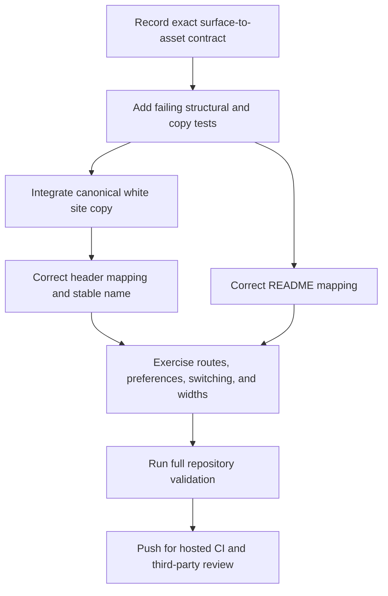

# Implementation Plan: Theme-Aware Lockup Accessibility

**Branch**: `codex/010-theme-lockup-accessibility` | **Date**: 2026-09-01 | **Spec**: [spec.md](spec.md)

**Input**: Feature specification from `specs/010-theme-lockup-accessibility/spec.md`

## Summary

S010 resolves GitHub Issues #104 and #106 as one brand-accessibility correction. The README will bind GitHub's dark color preference to the canonical white horizontal lockup and retain the black lockup as the light-surface fallback. The public site will add a byte-identical white integration copy, name variants by target surface, expose one stable textual name independent of visual selection, and test exact visible assets across initial preferences, explicit switching, routes, and responsive widths. Focused structural validation will reject reversed or detached README mappings, while the existing byte-copy contract will reject site asset drift.

## Technical Context

**Language/Version**: Node.js 24.11.0 and pnpm 10.28.2 from the root workspace; TypeScript 5.9.3; Markdown, HTML, CSS, and SVG integration files

**Primary Dependencies**: Existing Next.js 16.3.0, React and React DOM 19.2.8, Fumadocs Core/UI 16.14.3, Tailwind CSS 4.2.4, next-themes through Fumadocs, Node's built-in test runner, and Playwright 1.62.1; no new dependency

**Storage**: Versioned repository files only; canonical SVGs remain under `brand/`, governed public copies remain under `site/public/logos/`, and generated site output remains ignored

**Testing**: Node unit tests for README structure and brand-copy integrity; production static build; Playwright theme, accessible-name, visibility, route, and responsive checks; existing brand, documentation, link, encoding, dependency, security, and full repository gates

**Target Platform**: GitHub README renderers plus the production static site in supported modern desktop and mobile browsers

**Project Type**: Existing cross-platform application repository with a static public website and repository documentation surface

**Performance Goals**: Theme switching changes the visible lockup without navigation or reload and adds no network request, script, dependency, or measurable build-time burden beyond the existing bounded test matrix

**Constraints**: Canonical `brand/` files remain byte-for-byte unchanged; exact white-on-dark and black-on-light associations; one accessible home-link name; no duplicate visible lockups; no hosting, DNS, product runtime, or release-claim changes; UTF-8 without BOM; top-to-bottom Mermaid only

**Scale/Scope**: Two canonical horizontal variants, one README banner, one shared site navigation title used by landing and documentation layouts, three representative viewport widths, two color preferences, explicit theme switching, two changelog fragments, and one focused S010 artifact set

## Constitution Check

### Before Phase 0 research

| Principle | Result | Evidence |
| --- | --- | --- |
| P1. The file owns the viewport | PASS | S010 changes public identity surfaces only and does not alter the application viewport. |
| P2. Local files remain local | PASS | No file handling, upload, account, network-processing, or telemetry behavior changes. |
| P3. Cross-platform behavior is foundational | PASS | The correction applies to browser and GitHub renderer surfaces without changing host contracts. |
| P4. Untrusted input fails safely | PASS | Only repository-authored static markup, styles, tests, and governed assets are affected. |
| P5. Specifications and releases move together | PASS | S010 records the unreleased correction and preserves all v0.0.0 claims. |
| P6. Verification precedes claims | PASS | Structural unit tests, byte-copy validation, browser evidence, and full hosted checks gate completion. |
| P7. Decisions are explicit and proportional | PASS | The plan fixes the exact association, naming, semantics, and validation gaps without redesigning the brand or site. |
| P8. Apache-2.0 and license compatibility | PASS | S010 adds no dependency or third-party asset and reuses approved Apache-2.0 project artwork. |

### After Phase 1 design

All constitution gates remain PASS. The design changes only bounded integration copies and consumers, preserves the canonical brand authority, introduces no dependency or runtime architecture, and maps every acceptance criterion to automated or explicit review evidence. No exception or complexity waiver is required.

## Project Structure

### Documentation for this feature

```text
specs/010-theme-lockup-accessibility/
├── checklists/
│   └── requirements.md
├── contracts/
│   └── theme-lockup.md
├── data-model.md
├── plan.md
├── quickstart.md
├── research.md
├── spec.md
└── tasks.md
```

### Source code at the repository root

```text
README.md
changelog.d/
├── 104.fixed.md
└── 106.fixed.md
scripts/
├── check-brand.mjs
└── check-brand.test.mjs
site/
├── app/
│   └── global.css
├── lib/
│   └── layout.shared.tsx
├── public/
│   └── logos/
│       ├── glitchpad-horizontal-black.svg
│       └── glitchpad-horizontal-white.svg
└── tests/
    ├── accessibility.spec.mjs
    └── theme-lockup.spec.mjs
```

**Structure Decision**: Preserve the existing public-site and brand-validator boundaries. `brand/` remains the immutable canon, `site/public/logos/` contains only active byte-governed integration copies, the shared Fumadocs layout remains the single header identity source, and a dedicated browser specification owns the cross-route theme matrix instead of expanding unrelated accessibility coverage.

## Delivery Sequence



## Complexity Tracking

No constitution violations require justification.
