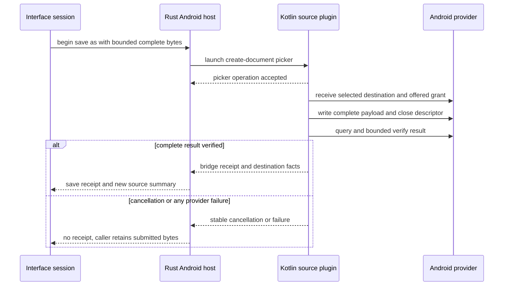

# Contract: Android Source Host

**Contract version**: 1

## Boundary

The Android plugin is native application code. It may receive Android intents and picker results, hold raw content URIs and descriptors, query provider metadata, request offered grants, and perform bounded provider I/O. Renderer code receives only opaque source IDs and safe value objects. No renderer-facing operation accepts or returns a path, URI, native bridge token, descriptor, intent, or unrestricted provider command.

## Acquisition flows

| Flow | Native origin | Persistence rule | Result |
| --- | --- | --- | --- |
| View | `ACTION_VIEW` initial or redelivered intent data | Temporary even if a sender includes a persistable flag | Accepted Android source or safe rejection |
| Share | `ACTION_SEND` with exactly one distinct content item | Temporary even if a sender includes a persistable flag | Accepted Android source or safe rejection |
| Open | Glitchpad-initiated `ACTION_OPEN_DOCUMENT` result | Request only returned read/write modes when persistence is offered; verify actual held grant | Accepted Android source, cancellation, or safe rejection |
| Save As | Glitchpad-initiated `ACTION_CREATE_DOCUMENT` result | Request only returned read/write modes when persistence is offered; verify actual held grant | Save receipt with new source, cancellation, or safe failure |

`ACTION_SEND_MULTIPLE`, text-only shares, distinct multiple items, non-content schemes, directory MIME, virtual documents, absent read authority, and unsupported actions are rejected before registration.

## Rust host operations

| Operation | Caller input | Safe output | Required failures |
| --- | --- | --- | --- |
| `drain_android_deliveries` | Maximum count | Accepted source summaries and safe rejections | invalid input, unavailable plugin |
| `open_android_document` | Optional MIME/type hints | Acquired source after the one-use invoke receives its picker result | unavailable activity, cancellation, provider failure |
| `read_android_range` | Source ID, offset, length, operation budget | Bounded bytes and end-of-source | not found, unsupported seek, budget exceeded, changed, revoked, unavailable |
| `open_android_stream` | Source ID, offset, total budget | Opaque stream lease | not found, budget exceeded, revoked, unavailable |
| `read_android_stream` | Stream ID and chunk length | Bounded bytes and end-of-source | not found, budget exceeded, revoked, unavailable |
| `query_android_metadata` | Source ID | Safe metadata facts with optional length/time | not found, revoked, unavailable |
| `revalidate_android_source` | Source ID and expected revision | Current revision and explicit status | not found; provider availability failures are safe values where possible |
| `save_android_source_as` | Source ID, suggested name/type, bounded complete bytes | Save As receipt after the one-use invoke receives its picker result | invalid input, budget exceeded, cancellation, unavailable activity |
| `restore_android_sources` | No URI or path input | Revalidated summaries and needs-redelivery/revoked records | unavailable plugin, corrupted private record ignored safely |
| `close_android_source` | Source ID | Close receipt | not found, pending operation, unavailable plugin |

## Native plugin commands

Rust may call Kotlin through typed mobile-plugin commands that exchange bridge tokens and bounded values only. Open and Save As each use one pending Tauri invoke as their one-use authorization; the activity callback resolves or rejects that same invoke, so no second public picker-ID state machine exists. Kotlin command results may include safe metadata, provider capability hints, actual grant state, optional size/time, bounded bytes, and stable native result codes. They must not include URI strings, paths, document content outside a declared bounded byte result, or raw exception messages.

## Security invariants

- Public source and stream IDs are random process-local Rust authorizations; Kotlin bridge tokens are separate random native-private authorizations.
- A raw URI may exist only in the Kotlin in-memory registry or versioned application-private restoration store for an actually persisted grant.
- Every offset, chunk length, stream total, queue maximum, restoration count, metadata string, and save payload is bounded before native I/O.
- Provider work runs off the Android main thread and uses cancellation-aware descriptor/query operations where supported.
- Seek is advertised only after an opened descriptor accepts a seek probe. A pipe or stream-only source never receives range capability.
- Persisted authority is verified against held permissions and provider access before a restored source becomes available.
- Provider flags and write permission do not imply safe replacement. Unknown providers expose no direct-update capability.
- Close, revocation, native registry replacement, and completed lease budgets invalidate every associated descriptor and token.
- Stable errors contain no URI, path, provider exception text, content, or unrestricted native diagnostic value.

## Identity and revision

Strong Android identity requires a `DocumentsContract` document URI with provider authority and durable document ID. Generic content sources are weak or unavailable. External revisions include that identity plus every observed optional size, modification, and provider change fact. Revalidation reports changed when any comparable observed fact differs and never treats an unavailable query as equality.

## Save As protocol

