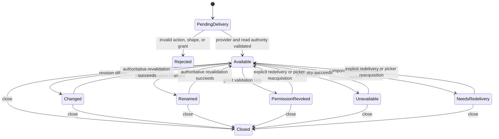

# Data Model: Android Source Lifecycle

## Android delivery

| Field | Meaning | Validation |
| --- | --- | --- |
| Delivery kind | Inbound view, inbound share, open result, or create result | Exactly one recognized kind |
| Native bridge token | Random Kotlin-private reference to one URI | Never serialized beyond the Rust plugin boundary as a URI |
| Grant offer | Read, write, and persistable bits observed on the delivery/result | Unknown bits ignored; inbound persistence ignored |
| Origin | Cold start, new intent, or picker result | Used for lifecycle and persistence policy only |
| Distinct item count | Number of unique content items after compatibility normalization | Must equal one |

## Android source record

| Field | Meaning | Validation |
| --- | --- | --- |
| Source ID | Public process-local authorization | Random, unguessable, never restored across process death |
| Bridge token | Native-private registry authorization | Random and invalidated on close or native registry replacement |
| Descriptor | Safe display metadata, identity, media type, optional size, and capabilities | No raw URI or path |
| External revision | Provider identity plus optional size, modified time, and change token | Missing evidence remains unknown |
| Grant state | Actual temporary or persisted read/write authority | Derived from held permission, not requested permission |
| Lifecycle state | Available, changed, renamed, deleted, permission revoked, unavailable, needs redelivery, or closed | Every uncertain state requires authoritative revalidation |
| Active leases | Bounded sequential or seekable descriptor leases | Maximum 32 per source; closed at budget, EOF, revocation, or source close |

## Grant state

| Field | Meaning | Validation |
| --- | --- | --- |
| Read held | Provider read authority currently validated | Required for acquisition success |
| Write held | Provider write authority currently validated | Does not imply safe replacement |
| Persisted read | Read mode confirmed in persisted permissions | Picker results only |
| Persisted write | Write mode confirmed in persisted permissions | Picker results only |
| Restorable | Source may have a private restoration record | True only when a persisted mode is actually held |
| Last validation | Available, revoked, missing, or unavailable | Rechecked before restore and privileged I/O |

## Provider revision

The shared `ExternalRevision` retains identity, optional byte length, optional modified time, and optional provider change token. Equality requires every observed comparable fact to match. Missing facts remain `None`; they are never replaced by zero, an empty string, or a presentation fallback.

## Restoration record

| Field | Meaning | Validation |
| --- | --- | --- |
| Native URI | Provider authority required to restore the held grant | Application-private only; excluded from backup, logs, errors, and interface values |
| Persisted modes | Read/write modes actually confirmed | At least read must be held |
| Last identity evidence | Provider authority and document ID when strong | Used only as an expected value for revalidation |
| Last display metadata | Optional bounded display name and media type | Presentation only; never identity |
| Record version | Private persistence schema version | Unknown versions ignored safely |

The store contains at most 64 records. A record is removed when the source is explicitly closed and forgotten, its persisted permission is released, or restoration proves that authority no longer exists. Temporary deliveries never create restoration records.

## Provider save request and receipt

S011 implements Save As to a picker-selected destination. The request contains a bounded complete payload, suggested display name and media type, and remains owned by one pending Tauri invoke until its activity result arrives. The receipt contains the byte count, resulting Android source summary, new external revision, and the provider-backed durability classification. Cancellation, partial writes, close errors, re-read mismatch, and provider failure issue no receipt.

## State transitions

