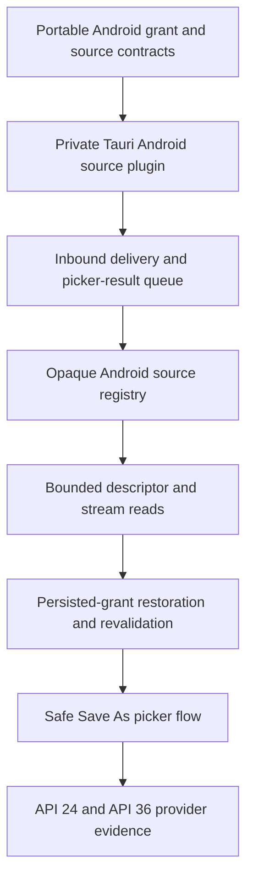

# Implementation Plan: Android Source Lifecycle

**Branch**: `codex/011-android-source-lifecycle` | **Date**: 2026-09-01 | **Spec**: [spec.md](spec.md)

**Input**: Feature specification from `specs/011-android-source-lifecycle/spec.md`

## Summary

S011 implements GitHub Issue #47 as a provider-native Android source lifecycle. A private Tauri mobile plugin owns Android `Intent`, `Uri`, `ContentResolver`, grant, descriptor, picker, and lifecycle mechanics in Kotlin. Portable Rust policy owns delivery acceptance, opaque source and stream identifiers, capability derivation, bounded I/O requests, identity comparison, revision checks, error classification, restoration policy, and renderer-facing commands. Initial `ACTION_VIEW` and single-item `ACTION_SEND` deliveries and `onNewIntent` redeliveries enter one queue; Open and Save As use Glitchpad-initiated `ACTION_OPEN_DOCUMENT` and `ACTION_CREATE_DOCUMENT` pickers. Unknown third-party providers default to Save As because Android offers no portable atomic replacement contract.

## Technical Context

**Language/Version**: Rust 1.96.0 with edition 2024; Kotlin through the repository-pinned Android Gradle toolchain; TypeScript 6.0.2 contract projection only for values that cross the interface boundary

**Primary Dependencies**: Existing Tauri 2.11.5 mobile plugin API, Serde 1.0.229, Schemars 1.2.2, and UUID 1.26.0; Android platform `Intent`, `ContentResolver`, `DocumentsContract`, `ParcelFileDescriptor`, and activity-result APIs; existing AndroidX test dependencies expanded only where instrumentation requires them

**Storage**: In-memory Rust source registry, native Kotlin URI/descriptor registry, and bounded application-private restoration records only for grants actually persisted; no document-content cache, recovery snapshot store, database, or temporary-grant persistence

**Testing**: Rust unit, schema, contract, and host tests; Kotlin JVM tests for pure parsing/state rules; Android instrumentation against an isolated test `DocumentsProvider`; API 24 and API 36 x86_64 emulator jobs; existing aggregate `cargo xtask check` and Android ARM64 debug APK build

**Target Platform**: Android 7.0/API 24 through Android 16/API 36 under the existing single-task Tauri activity; desktop behavior must remain unchanged

**Project Type**: Cross-platform Tauri application with portable Rust domain policy and a narrow Android Kotlin platform bridge

**Performance Goals**: Parse and enqueue an intent without provider I/O on the activity callback; execute provider I/O off the main thread; return no more than 1 MiB per range or stream chunk; cap in-memory save payloads at the existing 16 MiB host limit; restore and revalidate at most 64 persisted source records; complete synchronous metadata evidence within the specification's 200 ms Android detection budget where the provider responds

**Constraints**: Offline and account-free; no renderer paths or raw URIs; no generic filesystem authority; no unsafe Rust or custom JNI; no shared business rules in Kotlin; no fabricated size, seek, write, persistence, or identity strength; no release MIME filters; no direct update claim for unknown providers; UTF-8 without BOM; Apache-2.0-compatible dependencies; Markdown prose remains one physical line

**Scale/Scope**: One private Android source plugin, one Android host registry, four intent/result flow kinds, bounded read/stream/metadata/revalidate/Save As/close operations, persisted-grant restoration, controlled provider fixtures, and two required emulator API levels for issue #47

## Constitution Check

### Before Phase 0 research

| Principle | Result | Evidence |
| --- | --- | --- |
| P1. The file owns the viewport | PASS | S011 adds source acquisition and persistence plumbing only, with no permanent application chrome. |
| P2. Local files remain local | PASS | Provider content and metadata remain on-device; raw URIs and content are excluded from interface values and diagnostics. |
| P3. Cross-platform behavior is foundational | PASS | Shared Rust contracts remain authoritative while Android URI and grant semantics are modeled directly instead of being disguised as paths. |
| P4. Untrusted input fails safely | PASS | Intent shapes, provider metadata, grants, offsets, budgets, descriptors, revisions, and write behavior are validated before authority is advertised or used. |
| P5. Specifications and releases move together | PASS | Android source behavior remains an unreleased S011 delta and release intent filters or support claims remain unchanged. |
| P6. Verification precedes claims | PASS | Every acceptance flow maps to Rust, JVM, or controlled-provider instrumentation evidence on both required Android API levels. |
| P7. Decisions are explicit and proportional | PASS | Research records the mobile plugin boundary, inbound-versus-picker correction, grant model, provider identity, Save As default, restoration, and emulator evidence without adding recovery or editor policy. |
| P8. Apache-2.0 and license compatibility | PASS | The design prefers platform and existing repository dependencies; any new AndroidX or CI action is pinned and checked before adoption. |

### After Phase 1 design

All constitution gates remain PASS. The interface receives no URI or path, Android lifecycle mechanics remain inside a private plugin, Rust owns policy, persisted authority is revalidated before use, unknown providers cannot claim atomic replacement, and API 24/API 36 tests exercise real `ContentResolver` behavior. No exception or complexity waiver is required.

## Project Structure

### Documentation for this feature

```text
specs/011-android-source-lifecycle/
├── checklists/
│   └── requirements.md
├── contracts/
│   ├── android-source-host.md
│   └── android-test-evidence.md
├── data-model.md
├── plan.md
├── quickstart.md
├── research.md
├── spec.md
└── tasks.md
```

### Source code at the repository root

```text
crates/glitchpad-core/
├── src/
│   ├── contracts.rs
│   └── source.rs
└── tests/
    └── contract_schema.rs

crates/glitchpad-android-source/
├── android/
│   ├── build.gradle.kts
│   └── src/
│       ├── main/java/com/shruggietech/glitchpad/source/AndroidSourcePlugin.kt
│       └── test/java/com/shruggietech/glitchpad/source/DeliveryPolicyTest.kt
├── src/
│   ├── lib.rs
│   ├── mobile.rs
│   └── models.rs
├── build.rs
└── Cargo.toml

crates/glitchpad-host/
├── src/
│   ├── android_source/
│   │   ├── mod.rs
│   │   └── policy.rs
│   └── lib.rs
└── tests/
    └── android_source_contract.rs

crates/glitchpad-host/gen/android/app/
├── build.gradle.kts
└── src/androidTest/
    ├── AndroidManifest.xml
    └── java/com/shruggietech/glitchpad/source/
        ├── AndroidSourceInstrumentedTest.kt
        ├── FixtureDocumentsProvider.java
        └── RestorationInstrumentedTest.kt

crates/xtask/
└── src/main.rs

.github/workflows/ci.yml
```

**Structure Decision**: A dedicated private plugin crate is the supported Tauri Rust-to-Kotlin boundary and keeps Android Gradle sources out of the shared host crate. `glitchpad-core` owns portable value contracts, `glitchpad-host` owns Android source policy and public commands, and the plugin owns only platform mechanics plus native-private URI authority. The generated `MainActivity` remains unchanged because Tauri already forwards initial load and new intents to plugins.

## Delivery Sequence



## Delivery Boundaries

- S011 changes `ExternalRevision.byte_length` and `SourceMetadata.byte_length` from mandatory to optional because Android providers may legally omit size. Desktop observations continue to populate `Some(length)`, so this corrects a flawed cross-platform assumption without weakening desktop evidence.
- Inbound acquisition supports `ACTION_VIEW` and exactly one distinct `ACTION_SEND` content item. Open and Save As are app-initiated picker requests whose results enter the same acquisition policy.
- Unknown providers advertise no direct-update capability even when they report write support. S011 implements Save As for new destinations; provider-specific recoverable non-atomic updates require later explicit evidence and acknowledgement policy rather than an unsafe generic path.
- S011 stores native-private raw URIs only when required to restore an actually persisted grant. Those records are excluded from backup and diagnostics, capped at 64 entries, and revalidated before creating new process-local public IDs.
- S011 does not add release intent filters, editor buffers, recovery snapshots, dirty-close prompts, renderer integration, or format activation.

## Complexity Tracking

No constitution violations require justification. The new private plugin crate is necessary because Android platform APIs cannot be implemented safely in portable Rust and Tauri's plugin boundary avoids custom JNI and generated-activity coupling.
