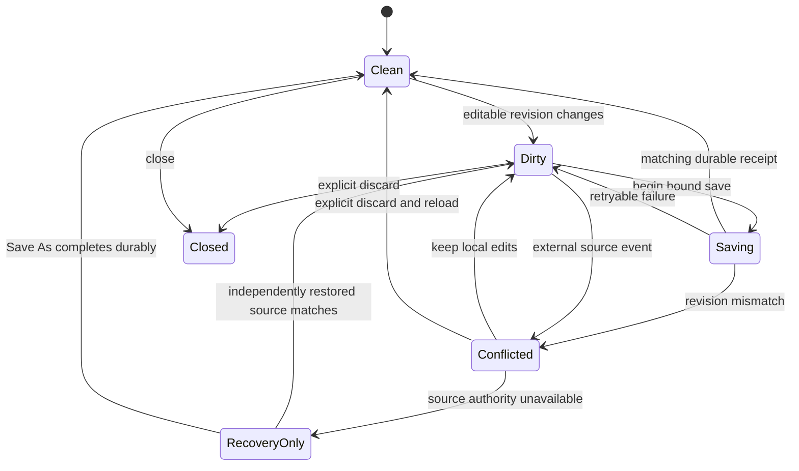

# Data Model: Conflict-Safe Recovery

## Session safety projection

| Field | Rule |
| --- | --- |
| `source_id` | Opaque native authority associated with the live session; never persisted in recovery |
| `focus` | `active` or `background`; independent of edit integrity |
| `integrity` | `clean`, `dirty`, `saving`, `conflicted`, or `recovery_only` |
| `session_revision` | Increments on every editable-state or safety-decision change |
| `saved_session_revision` | Revision proven by the last current durable receipt |
| `external_revision` | Last native revision accepted as the session's save base |
| `source_state` | Current availability evidence, independent of focus and integrity |
| `pending_save` | Optional exact save transaction; at most one current transaction |
| `pending_transition` | Optional close, reload, or exit request awaiting resolution |
| `recovery_coverage` | `none`, `current`, `stale`, or `unavailable` plus safe warning code |

## Save transaction

| Field | Rule |
| --- | --- |
| `operation_id` | One-use opaque identifier |
| `source_id` | Must match the session and receipt |
| `session_revision` | Exact buffer revision submitted |
| `expected_external_revision` | Exact native revision revalidated before mutation |
| `payload_bytes` | Complete bounded payload length |
| `payload_digest` | Domain-separated SHA-256 equality evidence |
| `mode` | Ordinary save, Save As, or explicitly confirmed overwrite |
| `durability` | Minimum reviewed durability classification |

## Destructive-transition request

| Field                 | Rule                                                |
| --------------------- | --------------------------------------------------- |
| `kind`                | Close, reload, or application exit                  |
| `target_sessions`     | Ordered bounded session IDs                         |
| `unresolved_sessions` | Dirty targets not yet saved or explicitly discarded |
| `status`              | Awaiting decision, saving, cancelled, or resolved   |

Clean targets resolve immediately. A dirty target remains live until a matching receipt or explicit discard resolves it. Cancellation preserves every target's buffer and state.

## Recovery record envelope

| Field | Rule |
| --- | --- |
| `schema_version` | Exactly 1 for S012; future versions are isolated and preserved |
| `record_id` | UUID matching the strict filename stem |
| `display_hint` | Sanitized and bounded to 255 Unicode scalar values |
| `source_identity_hash` | Domain-separated SHA-256, never raw identity evidence |
| `base_revision_hash` | Domain-separated SHA-256 of safe revision evidence |
| `saved_session_revision` | Last durably saved editor revision |
| `snapshot_session_revision` | Dirty revision represented by `content` |
| `text_profile` | Existing encoding, BOM, newline, terminal-newline, and round-trip facts |
| `created_unix_ms` | First snapshot time |
| `updated_unix_ms` | Current snapshot time and deterministic quota ordering key |
| `expires_unix_ms` | No more than seven days after update |
| `content` | Complete bounded editable text, maximum 16 MiB UTF-8 bytes |
| `content_sha256` | Accidental-corruption evidence for the exact content bytes |
| `eviction_eligible` | True only for expired, superseded, or explicitly resolved coverage |

## Recovery inventory entry

| Field | Rule |
| --- | --- |
| `record_id` | Safe opaque handle for one inventory lifetime |
| `display_hint` | Bounded user-facing hint |
| `updated_unix_ms` | Used for presentation and deterministic cleanup |
| `expires_unix_ms` | Seven-day boundary |
| `committed_bytes` | Actual serialized file size counted against quota |
| `status` | Available, expired, corrupted, unsupported, or coverage-at-risk |

Inventory errors expose only status and counts. They never expose file paths, record IDs in diagnostics, hashes, source evidence, or content.

## State transitions

Focus remains active or background throughout these integrity transitions and is intentionally not represented in this state diagram.
