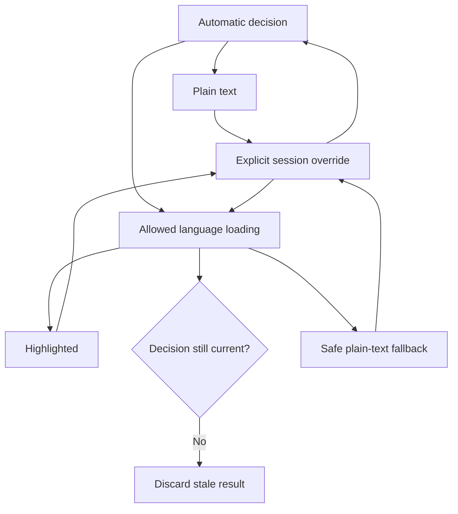

# Data Model: Text and Source Editor

## Text Document

Represents one bounded editable document.

- `session_id`: Stable shell session identifier.
- `source_id`: Optional opaque native authority.
- `revision`: Monotonic editable revision.
- `saved_revision`: Last durably saved revision.
- `normalized_text`: Editor-facing text with one internal line separator.
- `raw_text`: Authoritative decoded text retaining original newline tokens.
- `profile`: Current text profile.
- `language`: Current language decision.
- `mode`: `editable`, `large_read_only`, or `refused`.
- `integrity`: Existing clean, dirty, saving, conflicted, or recovery-only state.

Validation rules:

- Editable source bytes are at most 32 MiB.
- Any line longer than 2 MiB forces plain-text language mode.
- `revision` increases for every accepted content transaction and never for selection-only transactions.
- `raw_text`, when normalized, must equal `normalized_text` after every accepted transaction.
- A save payload is valid only for the exact current revision and a round-trip-safe profile or exact lossy authorization.

## Text Profile

Describes serialization decisions independently from language selection.

- `encoding`: UTF-8, UTF-8 with BOM, UTF-16LE with BOM, UTF-16BE with BOM, or unresolved.
- `bom`: Present, absent, or unresolved.
- `newline_counts`: Constant-size LF, CRLF, and CR counts used for compact status and insertion policy; the ordered separator sequence remains authoritative in `raw_text` instead of being duplicated into an unbounded object array.
- `insertion_newline`: Separator used for newly inserted line breaks.
- `terminal_newline`: Present, absent, or unresolved.
- `undecodable_bytes`: None, requires user decision, or unsupported.
- `round_trip_safe`: Derived save eligibility.

Relationships:

- One text document owns one current text profile.
- Profile decisions never select a language.
- Existing newline tokens in `raw_text` remain unchanged unless the corresponding boundary is edited.

## Language Decision

Describes non-executing syntax selection.

- `language_id`: Canonical allowlisted ID or `plain_text`.
- `confidence`: Low, medium, or high.
- `evidence`: Bounded filename, extension, shebang, modeline, and content facts.
- `conflicts`: Bounded contradictory facts.
- `origin`: Automatic or explicit session override.
- `load_revision`: Revision token for asynchronous module loading.
- `status`: Plain, loading, highlighted, unavailable, cancelled, or failed.
- `fallback_code`: Stable content-free reason when highlighting is unavailable.

State transitions:

## Editor Transaction

Represents one atomic editor update.

- `before_revision`: Required current revision.
- `after_revision`: Next revision for a document change; unchanged for selection-only work.
- `changes`: Ordered non-overlapping normalized ranges and inserted text.
- `selection`: Resulting bounded primary and secondary ranges.
- `user_event`: Edit, input, delete, move, select, undo, redo, replace, indent, or programmatic synchronization.

Validation rules:

- Stale `before_revision` rejects the transaction.
- Read-only mode rejects every transaction containing changes.
- Accepted document changes update the raw shadow before publishing the next session revision.
- Undo, redo, and replace are ordinary revision-advancing changes.

## Search Session

Represents active document-local search.

- `query`: Bounded literal query.
- `case_sensitive`: Match option.
- `whole_word`: Match option when supported.
- `matches`: Bounded current-document ranges or incremental large-view count.
- `selected_match`: Optional current result.
- `document_revision`: Revision to which results apply.
- `operation_id`: Cancellation and stale-result identity.
- `status`: Idle, searching, complete, cancelled, or failed.

## Large-Text View

Represents a source-backed read-only projection.

- `source_id`: Opaque host authority.
- `byte_length`: Observed or incrementally enforced size.
- `external_revision`: Revision used for every bounded read.
- `encoding`: Verified supported text encoding.
- `chunk_budget`: Maximum bytes per native response.
- `line_index`: Bounded sparse byte offsets for navigation.
- `visible_window`: Current requested byte and line range.
- `decoded_window`: Bounded currently rendered text.
- `operation_id`: Current read, index, or search request.
- `status`: Loading, ready, searching, cancelled, changed, unavailable, or refused.

Validation rules:

- Mode begins above 32 MiB and ends at 256 MiB inclusive.
- No edit, replace, recovery, save, or Save As capability is advertised.
- Every read has a byte budget and expected external revision.
- Chunk decoding retains partial multibyte and newline state across boundaries.
- Superseded, hidden, changed-source, and disposed results cannot publish.

## Editor Status

A compact projection of user-relevant facts: encoding and BOM, newline pattern and terminal newline, language and decision origin, round-trip safety, source size and editor mode, plus highlighting, indexing, search, cancellation, or safe fallback status.

The projection contains no source locator, raw provider URI, content excerpt, credential, or unrestricted native handle.
