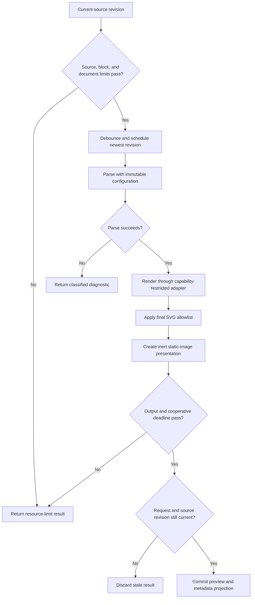

# Contract: Mermaid Renderer

**Date**: 2026-09-03

## Purpose

This contract defines the shared boundary for standalone Mermaid documents and fenced Mermaid blocks in Markdown. It governs capability advertisement, detection, render requests, revision safety, output security, errors, limits, metadata, accessibility, and disposal. It does not define a public plugin API.

## Format registration

| Property | Contract |
| --- | --- |
| Format identifier | `mermaid` |
| Standalone extensions | `.mmd`, `.mermaid` |
| Embedded identifier | Markdown fenced code block with normalized information string `mermaid` |
| Data class | Editable text source for standalone files; parent-owned source range for embedded blocks |
| Stable target | v0.1.0 after the complete activation matrix passes |
| Default mode | Rendered for valid source; source for empty, malformed, unsupported, or over-limit source without a prior valid preview |

An extension or declared media type is candidate evidence only. Standalone detection verifies a bounded decoded prefix for a supported Mermaid diagram declaration or valid Mermaid frontmatter followed by a declaration. A user override may select Mermaid for ambiguous text. Detection never modifies source.

## Advertised capabilities

| Capability | Standalone writable | Standalone read-only | Embedded Markdown |
| --- | --- | --- | --- |
| Render | Yes | Yes | Yes, inline |
| Source mode | Yes | Yes | Through parent Markdown source mode |
| Edit, replace, undo/redo | Yes | No | Through writable parent Markdown |
| Save and Save As | Yes | Save As when host permits | Through parent Markdown |
| Find source | Yes | Yes | Through parent Markdown |
| Find rendered labels | Yes | Yes | Through parent Markdown search |
| Fit, zoom, reset, pan | Yes | Yes | Yes for focused diagram |
| Copy source and selected labels | Yes | Yes | Yes |
| Metadata inspector | Yes | Yes | Parent metadata plus focused-block diagram facts |
| Export rendered output | No | No | No |

## Request boundary

The application sends a request only after source and document preflight limits pass. The restricted renderer context accepts this logical shape:

| Field | Required behavior |
| --- | --- |
| `requestId` | Unique and echoed unchanged |
| `ownerId` | Opaque session or block identity; no native source authority |
| `sourceRevision` | Exact revision used for commit validation |
| `sourceText` | Bounded text only; no path, URI, recovery record, or unrelated Markdown |
| `theme` | Bundled normalized theme token |
| `fallbackLabel` | Localized inert text generated outside the renderer context |
| `limits` | Immutable application-owned values |

The renderer adapter returns a `DiagramRenderResult` and no application side effects. Its module graph contains no file, save, external-link, native-bridge, storage, or network gateway. Strict application CSP denies document-content connections, child browsing contexts, objects, media, and base changes.

## Configuration invariants

- `startOnLoad` is false.
- `securityLevel` is strict.
- The secure-key set includes every Mermaid default secure key plus application-reviewed keys affecting executable content, HTML labels, remote resources, fonts, logging, deterministic identifiers, text size, edges, and error rendering.
- Source configuration cannot raise a limit, loosen security, enable callbacks, insert executable HTML, or select a remote resource.
- Diagram type, authored direction, comments, safe style choices, and accepted appearance settings remain source-controlled.
- Project documentation's top-to-bottom convention is not applied to user files.
- Deterministic identifiers use request-scoped seeds and cannot collide across simultaneously displayed diagrams.

## Render sequence

## SVG output allowlist

The application-owned sanitizer accepts only the minimum SVG structures required by the enabled Mermaid diagram corpus. It strips or rejects scripts, `foreignObject`, animation, event attributes, embedded HTML, forms, external references, URL-bearing styles, remote fonts and images, navigation targets, unsafe data URLs, base changes, and unknown namespaces. Link-looking labels remain inert text. Identifiers and local fragment references are rewritten with a request-specific prefix. Any sanitizer rejection returns an internal-renderer failure and does not insert partial output. Accepted output is displayed only as a static image object URL, never injected as live SVG markup.

The sanitizer preserves safe SVG accessibility structures, text, shapes, paths, markers, clipping, masks, gradients, transforms, presentation attributes, deterministic local fragment references, and bundled theme styles only when covered by fixtures.

## Revision and cancellation rules

1. Each source-changing editor transaction advances `sourceRevision`.
2. The 300 ms debounce retains only the newest unscheduled revision.
3. Starting a request supersedes the prior request for the same owner.
4. A tab switch, close, source reload, renderer replacement, application background transition, or newer revision requests cancellation when work is no longer useful.
5. A result commits only when its request, owner, source revision, and current session generation all match.
6. A stale or cancelled result is discarded without changing diagnostics, preview, dirty state, or source.
7. A cooperative result that exceeds five seconds is rejected and its generation is invalidated before later work. Hard preflight bounds remain enforceable even though the shared WebView cannot preempt a synchronous Mermaid engine call.

## Failure contract

| Category | User result | Preview behavior | Source behavior |
| --- | --- | --- | --- |
| Malformed | Syntax diagnostic with line/column when reliable | Keep and label last valid preview as stale; otherwise source mode | Preserve and remain editable/saveable |
| Unsupported | Parser-version-aware unsupported result | Same as malformed | Preserve and remain editable/saveable |
| Resource limit | Name observed value and maximum without exposing sensitive source | Keep last valid preview as stale; no new render | Preserve and remain editable/saveable within text limits |
| Cancelled | Usually silent; announce only when user explicitly requested work | No change | No change |
| Internal failure | Stable retry/source-mode message with diagnostic identifier | Keep last valid preview as stale | Preserve; no stack trace or source dump |

An embedded block failure renders a bounded fallback at that block's source position. It cannot suppress surrounding Markdown or another block.

## Accessibility contract

- Successful output exposes a diagram role description.
- Authored `accTitle` and `accDescr` survive sanitation and label the rendered SVG.
- An unannotated standalone diagram receives a localized label derived from filename and detected diagram type.
- An unannotated embedded diagram receives a localized label derived from diagram type and one-based block position.
- A source-mode command is adjacent in the accessibility command order.
- SVG children cannot trap sequential focus; Glitchpad owns zoom, pan, search, and mode controls outside the SVG.
- Parse, limit, stale-preview, and internal failure states use live announcements without repeating on every keystroke.

## Metadata contract

The inspector adds `diagram.type`, `diagram.parser_version`, `diagram.parse_status`, `diagram.preview_revision`, `diagram.current_revision`, `diagram.preview_stale`, `diagram.authored_title`, `diagram.authored_description`, `diagram.source_bytes`, `diagram.edge_count`, `diagram.output_bytes`, `diagram.parse_duration_ms`, `diagram.render_duration_ms`, and `diagram.limit_result` when each fact is available. Facts carry provenance and availability state; derived counts are not presented as embedded metadata.

## Activation evidence

- Valid fixtures for every enabled Mermaid diagram type and both standalone extensions.
- Embedded fixtures containing zero, one, many, malformed, over-limit, and mixed valid/invalid blocks.
- Exact source round trips across encoding, BOM, newline, comment, directive, whitespace, and direction variants.
- Security fixtures for scripts, HTML, callbacks, links, CSS URLs, remote images/fonts, unsafe data URLs, configuration overrides, and sanitizer bypass attempts with zero execution, navigation, native calls, or network requests.
- Stale-result, rapid-edit, timeout, cancellation, tab-switch, close, background, and context-recycle tests.
- Keyboard, touch, screen-reader, 200 percent zoom, reflow, contrast, authored annotation, and fallback-label evidence.
- Detection, file dialog, desktop association, Android intent/provider, package install, open-with, save, recovery, and uninstall tests on every release platform.
- License, notice, SBOM, provenance, vulnerability, and locked-dependency gates for Mermaid and the complete sanitization/rendering dependency graph.
