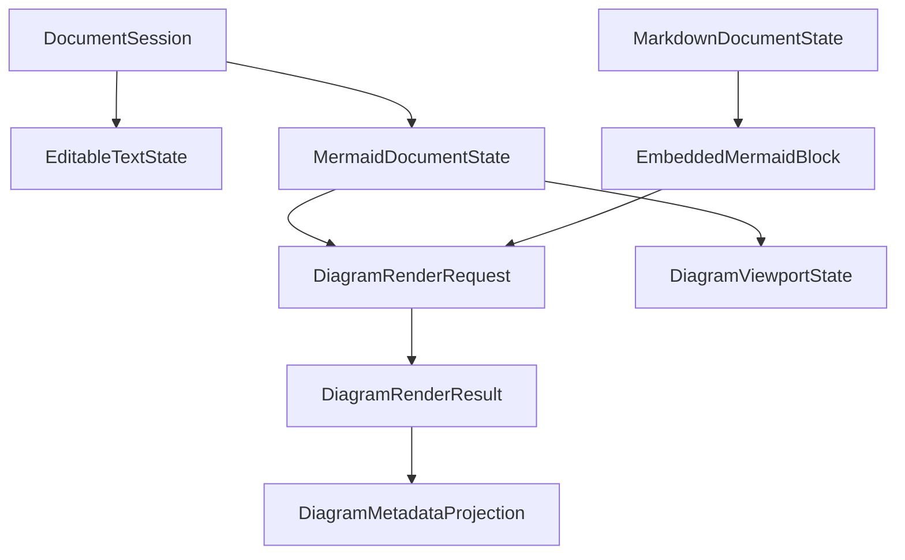
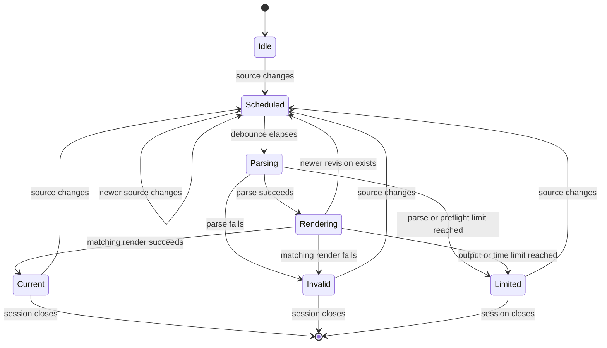

# Data Model: Mermaid Viewing and Editing

**Date**: 2026-09-03

## Relationship overview

## MermaidDocumentState

Represents Mermaid-specific state attached to one standalone editable-text document session.

| Field | Type | Rules |
| --- | --- | --- |
| `sessionId` | Document session identifier | Stable for the open tab; unique within the process |
| `sourceRevision` | Monotonic revision | Advances for each editor transaction that changes source |
| `mode` | `rendered`, `source` | Rendered is initial for valid source; source is initial for empty or unrenderable source |
| `parseState` | `idle`, `scheduled`, `parsing`, `valid`, `invalid`, `limited`, `failed` | Applies only to the current source revision |
| `currentRequestId` | Optional render request identifier | At most one current request per document |
| `latestValidPreviewRevision` | Optional source revision | Never greater than `sourceRevision` |
| `latestResult` | Optional DiagramRenderResult | Must match `currentRequestId` before commit |
| `viewport` | DiagramViewportState | Session-only projection; never serialized into source |
| `diagnostic` | Optional DiagramDiagnostic | Bounded and safe for display/log redaction |

### State transitions

## EmbeddedMermaidBlock

Represents one fenced Mermaid region inside a Markdown source revision.

| Field | Type | Rules |
| --- | --- | --- |
| `documentSessionId` | Document session identifier | Parent Markdown session |
| `blockId` | Revision-local stable identifier | Derived from parser node identity, not user content alone |
| `sourceRange` | Start/end offsets and lines | Must map exactly to the parent Markdown source revision |
| `sourceRevision` | Parent source revision | Invalidates the block when the parent changes |
| `sourceText` | Bounded string | Maximum 256 KiB encoded UTF-8 for rendering |
| `ordinal` | Positive integer | One-based source order, used in fallback labels |
| `renderState` | Diagram render state | Independent of other blocks |
| `latestResult` | Optional DiagramRenderResult | Commit only when document, block, and revision all match |

An embedded block has no independent dirty state, save command, recovery record, encoding profile, or source handle. The parent Markdown document owns all of those concerns.

## DiagramRenderRequest

| Field | Type | Rules |
| --- | --- | --- |
| `requestId` | Unique opaque identifier | Never reused during a process run |
| `owner` | Standalone session or embedded block identity | Must resolve to one active source revision |
| `sourceRevision` | Monotonic revision | Exact commit precondition |
| `sourceText` | Bounded string | Copied only after size preflight passes |
| `theme` | Normalized theme token | Bundled theme values only |
| `locale` | Supported locale identifier | Used for generated fallback labels only |
| `limits` | DiagramLimitProfile | Application-owned and not source-overridable |
| `createdAt` | Monotonic timestamp | Timeout and diagnostics only |

## DiagramRenderResult

| Field | Type | Rules |
| --- | --- | --- |
| `requestId` | Request identifier | Must equal the owner's current request before commit |
| `sourceRevision` | Source revision | Must equal the owner's current revision before current-preview commit |
| `status` | `success`, `malformed`, `unsupported`, `limited`, `cancelled`, `internal-failure` | Exhaustive user-visible classification |
| `diagramType` | Optional normalized type | Returned from successful parse when available |
| `sanitizedSvg` | Optional inert SVG tree/string | Present only for success and only after final allowlist sanitation |
| `diagnostics` | Bounded list of DiagramDiagnostic | Maximum count and text size enforced by contract |
| `accessibility` | DiagramAccessibilityFacts | Authored and fallback label state |
| `measurements` | DiagramRenderMeasurements | Parse/render/sanitize duration, source bytes, edges, output bytes |
| `parserVersion` | Locked runtime version | Exposed in metadata and diagnostics |

## DiagramDiagnostic

| Field | Type | Rules |
| --- | --- | --- |
| `category` | Parse, syntax support, limit, cancellation, or internal | Stable application category, not raw exception class |
| `message` | Safe bounded text | No source dump, locator, stack trace, or markup interpretation |
| `line` | Optional positive integer | Included only when parser evidence is reliable |
| `column` | Optional positive integer | Included only when parser evidence is reliable |
| `limitName` | Optional limit identifier | Required for a limit result |
| `observed` | Optional numeric value | Safe value such as bytes, edges, milliseconds, or output bytes |
| `maximum` | Optional numeric value | Corresponding fixed application limit |

## DiagramViewportState

| Field | Type | Rules |
| --- | --- | --- |
| `fitMode` | `fit`, `actual`, `custom` | Initial value is `fit` |
| `zoom` | Decimal scale | Clamped to 0.1–8.0 |
| `panX`, `panY` | Finite coordinates | Clamped so content cannot become permanently unreachable |
| `searchQuery` | String | Session-only and not sent into source |
| `searchMatches` | Ordered label/source references | Invalidated on source revision change |
| `focusedMatch` | Optional index | Must be valid within `searchMatches` |

## DiagramAccessibilityFacts

| Field | Type | Rules |
| --- | --- | --- |
| `roleDescription` | Diagram type or generic diagram | Always present on successful output |
| `title` | Authored or generated string | Always non-empty on successful output |
| `titleOrigin` | `authored`, `generated` | Determines metadata presentation |
| `description` | Optional authored string | Preserved when supplied and safe |
| `sourceRouteAvailable` | Boolean | Always true for standalone and editable Markdown contexts |

## DiagramLimitProfile

| Limit | Standalone | Embedded |
| --- | --- | --- |
| Decoded source bytes eligible for render | 1 MiB | 256 KiB per block; 1 MiB aggregate per Markdown document |
| Edge count | 2,000 | 2,000 per block |
| Blocks per Markdown document | Not applicable | 64 |
| Sanitized SVG bytes | 8 MiB | 8 MiB per block, bounded by active document memory budget |
| Cooperative wall-time deadline | 5 seconds | 5 seconds per block |
| Concurrent request per owner | 1 | 1 per block, scheduled within document budget |
| Concurrent application render contexts | 2 | Shared global limit of 2 |

The limit profile is application-owned, included in release evidence, and may change only through a dated Spec Kit decision with performance and hostile-input measurements.
