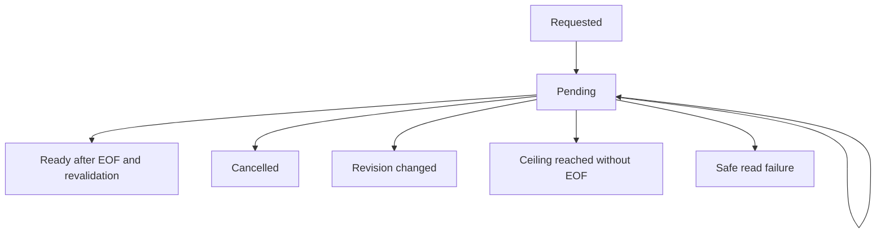

# Data Model: Contextual Metadata Inspector

## Metadata catalog entry

- Stable namespaced `key`, one of five `group` values, `value_kind`, localization `label_key`, default `sensitivity`, `copy_policy`, and applicability.
- Keys are unique. Producers cannot add unknown keys or override group, label, sensitivity, or copy policy.

## Metadata fact

- `key`; `availability` (`available`, `not_provided`, `unsupported`, `redacted`, `pending`, `errored`); optional typed `value`; stable `unit`; `provenance`; optional safe error code; external/session/renderer revision bindings.
- Available facts require a valid value. Non-available facts never carry a hidden value. Errored facts carry only a bounded stable code.
- Integer and timestamp wire values use decimal strings where JavaScript precision could be lost.

## Metadata snapshot and contribution

- A snapshot binds a bounded keyed fact map to `session_id`, `source_id`, session revision, and external revision.
- A contribution binds one producer's atomic fact set to expected session and source/render currency.
- Transition: `created -> accepted` only when the target and revisions match; otherwise `created -> stale_discarded`. Accepted work replaces only that producer's keys and never document/editor/viewport/recovery state.

## Source metadata snapshot

- Path-free native observation: source ID, external revision, display name, source kind, optional byte length and modified/created/accessed nanosecond timestamps, write state, and identity confidence.
- Optional values remain absent when not reliably supplied. No native locator is serialized.

## Integrity operation

- Ephemeral host state: request/source IDs, expected external revision, processed/total bytes, private hasher/stream, state, and digest only when ready.

Every terminal state retires native operation state. Only ready contains a digest.

## Inspector state

- Open state, owning session ID, focus origin, phone expansion, per-fact disclosure, and one announcement.
- Session change or close clears disclosure and pending announcements. Dismissal restores a still-connected opener.
