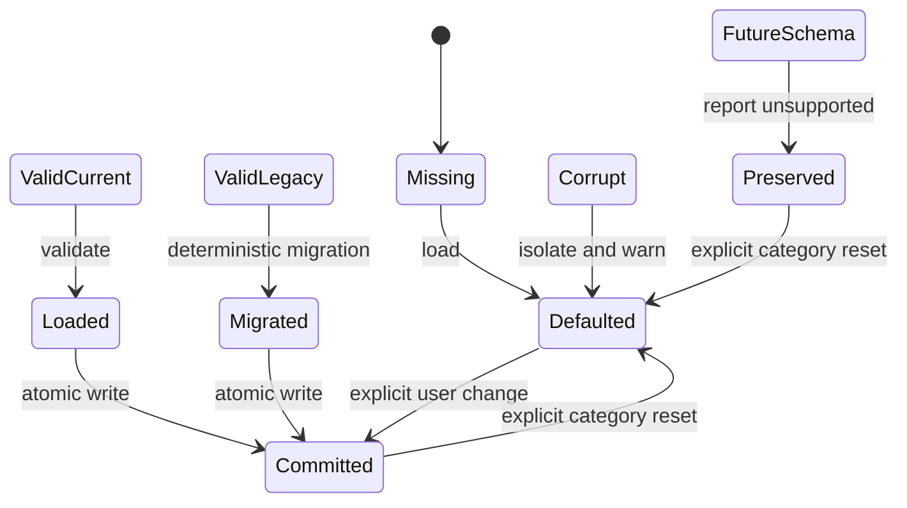

# Data Model: Bounded Local Persistence

## Preference envelope

| Field | Rule |
| --- | --- |
| `schema_version` | Exactly 1 for S017; future values are preserved and not overwritten |
| `theme` | `system`, `light`, or `dark` |
| `editor_font_family` | Bounded safe font token, 1 through 128 scalar values |
| `editor_font_size` | Integer from 8 through 72 CSS pixels |
| `line_wrap` | Boolean |
| `tab_width` | Integer from 1 through 16 columns |
| `markdown_default_mode` | `rendered` or `source` |
| `language_overrides` | At most 128 normalized extension-to-language entries |

Each invalid preference field falls back independently. Unknown object fields are rejected as corruption so misspelled or injected state cannot silently become policy.

## Window projection

| Field | Rule |
| --- | --- |
| `active_session_index` | Optional index clamped to the persisted session count |
| `inspector` | `closed`, `metadata`, `preferences`, or `diagnostics` |
| `sessions` | Ordered set of at most 32 session projections |

Geometry is excluded from S017 because platform window-state rules are not yet specified. The projection never contains editor buffers or renderer output.

## Session projection

| Field | Rule |
| --- | --- |
| `session_key` | Bounded opaque identifier unique within this projection |
| `display_hint` | Sanitized bounded name for user recognition |
| `renderer_id` | Stable renderer identifier |
| `presentation_mode` | Optional bounded renderer presentation mode |
| `source_reference` | Optional native-owned durable restoration reference |
| `recovery_record_id` | Optional opaque recovery UUID for a dirty session |

A session with neither restorable source authority nor a recovery reference is omitted. A session projection never contains source bytes, source identity evidence, raw revision evidence, selections, search strings, or rendered output.

## Diagnostic event

| Field | Rule |
| --- | --- |
| `occurred_unix_ms` | Bounded UTC timestamp used for deterministic ordering and expiry |
| `level` | `info`, `warning`, or `error` |
| `event_id` | Stable allowlisted identifier |
| `platform` | `windows`, `macos`, `linux`, `android`, or `unknown` |
| `component` | Stable allowlisted component identifier |
| `duration_ms` | Optional non-negative bounded duration |
| `byte_count` | Optional non-negative bounded byte count |
| `error_code` | Optional stable bounded machine-readable code |

No arbitrary message, key, value, path, URI, source name, metadata value, excerpt, recovery data, or stack trace is accepted.

## Load result

| Field | Rule |
| --- | --- |
| `status` | `defaulted`, `loaded`, `migrated`, `corrupt`, `unsupported`, or `unavailable` |
| `value` | Valid current value or stable defaults |
| `warning_code` | Optional stable content-free classification |

## State transitions

## Retention and cleanup

- Preference and current session records have one current committed snapshot each and no rolling history.
- Diagnostics retain no more than 2,000 events, 2 MiB serialized, or seven days. Cleanup applies age first, then removes oldest entries until count and byte limits pass.
- Recovery cleanup remains governed by S012. S017 may hold only opaque recovery references and never deletes recovery while resetting another category.
