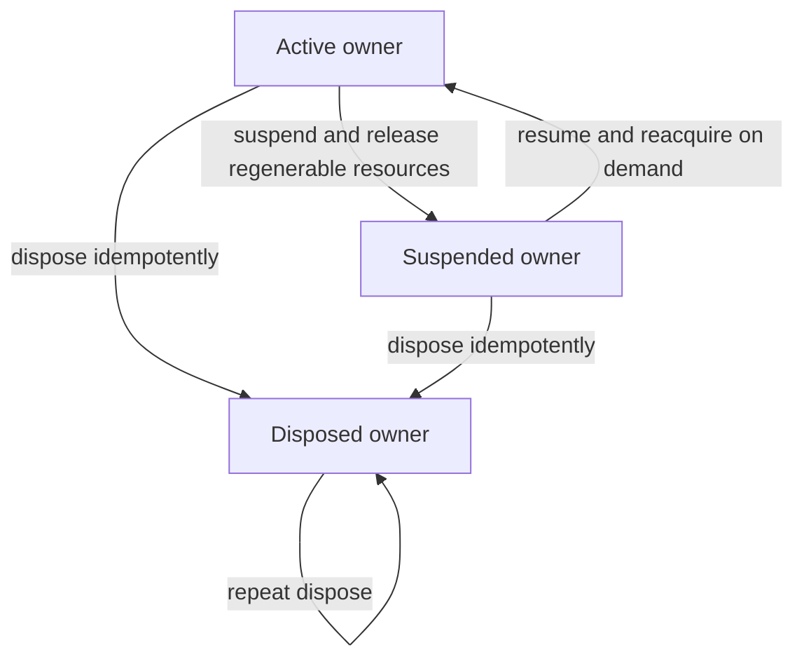

# Data Model: Enforce Performance Budgets

## Performance Budget Catalog

| Field | Meaning | Validation |
| --- | --- | --- |
| `schema_version` | Catalog wire version | Positive integer; currently `1` |
| `catalog_version` | Comparable policy version | Non-empty stable identifier |
| `metrics` | Ordered metric definitions | Unique stable IDs; every required v0.1.0 metric appears once |
| `profiles` | Approved reference and hosted profiles | Unique IDs with platform, evidence class, and bounded environment facts |
| `scenarios` | Workload identities | Unique IDs; byte fixtures carry SHA-256 digests |

## Performance Metric

| Field | Meaning | Validation |
| --- | --- | --- |
| `id` | Stable metric identity | Lower snake case, allowlisted |
| `unit` | `milliseconds`, `bytes`, or `count` | Must match thresholds and aggregation |
| `aggregation` | `p95`, `maximum`, `minimum`, or `invariant` | Explicit for every metric |
| `target` | Inclusive passing threshold | Finite non-negative number or invariant value |
| `hard_limit` | Inclusive warning ceiling | Same unit as target and not below target |
| `direction` | Whether lower or higher is better | `at_most` for current v0.1 metrics |
| `minimum_samples` | Smallest valid run | Positive and no greater than maximum |
| `maximum_samples` | Evidence storage bound | At most 1,000 |
| `applicability` | Platforms, profiles, scenario, activation | All references resolve in the catalog |
| `release_profiles` | Exact evidence profiles required by the release gate | Unique catalog profile IDs; non-empty for required metrics and empty for inactive metrics |
| `failure_invariants` | Non-percentile hard failures | Stable allowlisted identifiers |

## Reference Profile

| Field | Meaning | Validation |
| --- | --- | --- |
| `id` | Stable profile identity | Unique and versioned through catalog changes |
| `platform` | Desktop family or Android | `windows`, `macos`, `linux`, or `android` |
| `evidence_class` | Claim strength | `reference`, `hosted_smoke`, or `structural` |
| `hardware_class` | Comparable CPU/RAM/device description | Bounded content-free text |
| `operating_system` | Required OS family/version range | Bounded content-free text |
| `runtime` | WebView/browser/runtime requirement | Bounded content-free text |
| `minimum_memory_bytes` | Minimum installed memory for the profile | Positive safe integer |

## Performance Scenario

| Field | Meaning | Validation |
| --- | --- | --- |
| `id` | Stable workload identity | Unique and allowlisted |
| `kind` | `fixture` or `interaction` | Determines digest rules |
| `fixture_path` | Repository-relative governed source | Required only for stored byte fixtures; no traversal |
| `sha256` | Exact fixture bytes | Lowercase 64-character digest when fixture-backed |
| `state` | Cold/warm applicability | `cold`, `warm`, or `either` |
| `description` | Bounded workload definition | No native paths or document payloads |

## Evidence Record

| Field | Meaning | Validation |
| --- | --- | --- |
| `schema_version` | Evidence wire version | Exactly supported version |
| `catalog_version` | Policy used for classification | Must equal active catalog |
| `metric_id` / `scenario_id` / `profile_id` | Catalog references | Must resolve and be mutually applicable |
| `evidence_class` | Claim strength | Must equal profile declaration |
| `build_profile` | Measured binary kind | `release` for reference claims; `production_web` or `debug_smoke` only where declared |
| `build_id` | Content-free source/build identifier | Bounded stable token, never a path |
| `runtime_version` | Measured WebView/browser version | Bounded content-free string |
| `cold_state` | Whether startup caches were cleared | Boolean consistent with scenario |
| `samples` | Raw observations | Finite non-negative, within metric bounds; omitted for invariant summaries |
| `median` / `p95` / `maximum` | Derived observations | Must exactly match deterministic calculation |
| `peak_memory_bytes` | Platform process memory | Required only by applicable memory metrics |
| `invariants` | Stable outcome flags | Only metric-declared keys allowed |
| `classification` | `pass`, `warning`, `failure`, or `not_applicable` | Recomputed, never trusted from input |
| `cleanup_complete` | Whether owned resources were released | Must be true for accepted evidence |
| `measured_at` | UTC timestamp | Valid canonical timestamp; retention-bounded by release workflow |

Evidence records reject keys that could contain content or native authority, including filename, path, URI, source text, environment map, command line, or free-form log fields.

## Evidence History

An evidence history is an ordered bounded list of at most 20 records for one metric. Records are comparable only when catalog version, metric, scenario digest, profile, evidence class, build profile, cold state, and method agree. A pass resets the warning streak, a warning increments it, a failure blocks immediately, and two consecutive warnings create a required follow-up. Incomparable or invalid records do not bridge a warning streak.

## Resource Ledger

| Field | Meaning | Validation |
| --- | --- | --- |
| `owner_id` | Ephemeral renderer/session identity | Bounded opaque token, not persisted |
| `lifecycle` | `active`, `suspended`, or `disposed` | Disposed is terminal |
| `counts` | Workers, object URLs, observers, subscriptions, timers, callbacks, leases, surfaces | Non-negative safe integers with fixed keys |
| `estimated_bytes` | Bounded regenerable surface estimate | Non-negative safe integer |
| `source_bytes` | Authoritative source-size input for relative limits | Non-negative safe integer; no content retained |

### Resource transitions

Suspended owners retain no worker, object URL, observer, subscription, timer, pending callback, native stream lease, or regenerable surface count. Disposed owners retain neither resources nor resumable ownership.

## Performance Gate Result

| Field | Meaning | Validation |
| --- | --- | --- |
| `status` | `pass`, `warning`, or `failure` | Failure dominates warning; warning dominates pass |
| `accepted` | Valid applicable evidence IDs | Stable sorted unique list |
| `not_applicable` | Correctly inactive metric IDs | Allowed only by catalog activation policy |
| `diagnostics` | Stable content-free policy codes | Bounded count and allowlisted code/context |
| `follow_up_metrics` | Two-warning metrics | Stable sorted unique list |

The aggregate passes only when every activation-required metric has accepted evidence from every declared release profile, no hard failure exists, cleanup is complete, and no consecutive-warning follow-up remains unresolved.
