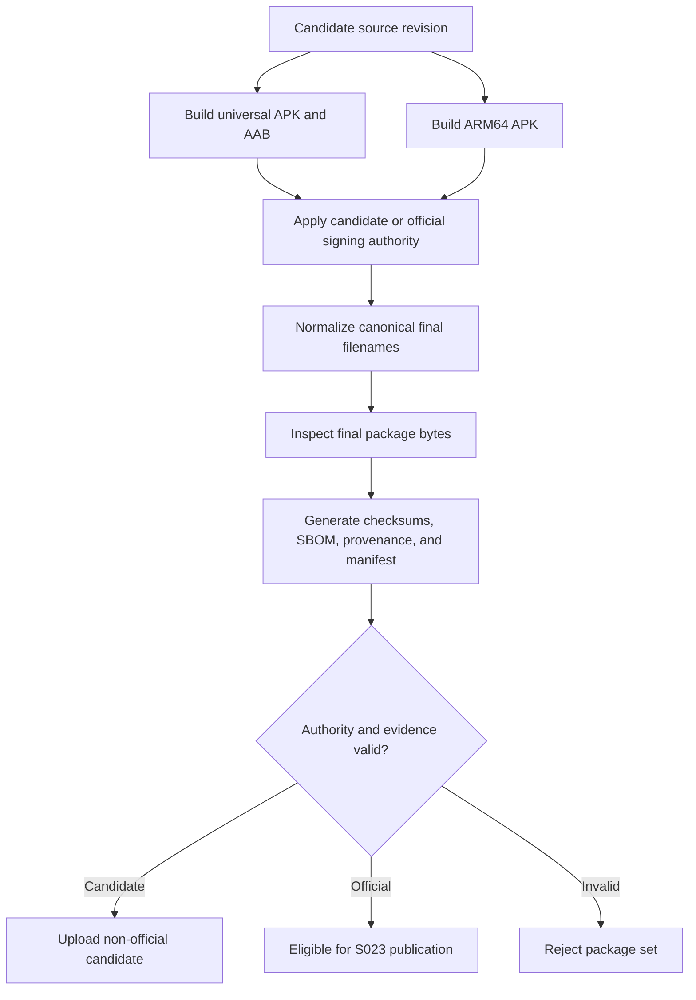

# Data Model: Ship Android Packages

## AndroidPackageContract

The versioned authority for Android package construction and inspection.

| Field | Type | Rules |
| --- | --- | --- |
| `schema_version` | integer | Exactly `1` for S022 |
| `platform` | string | Exactly `android` |
| `candidate_version` | semantic version | Exactly `0.1.0` for this slice |
| `application_id` | string | Exactly `com.shruggietech.glitchpad` |
| `version_code` | positive integer | Same across all artifacts |
| `min_sdk` | integer | Exactly `24` |
| `target_sdk` | integer | Exactly `36` |
| `artifacts` | AndroidArtifactRole[] | Exactly universal APK, ARM64 APK, and universal AAB |
| `intent_policy` | IntentPolicy | Stable text-family allowlist and forbidden claims |
| `size_budget` | SizeBudget | Universal APK target and hard limit |
| `candidate_trust` | SigningPolicy | Disposable, non-official authority |
| `official` | SigningPolicy | Authorized repository/tag and persistent certificate rules |

## AndroidArtifactRole

One required deliverable role independent of its transient build path.

| Field | Type | Rules |
| --- | --- | --- |
| `kind` | enum | `apk` or `aab` |
| `role` | enum | `universal`, `arm64`, or `play` |
| `name` | string | Canonical versioned release filename |
| `required_abis` | string[] | Universal/play: ARM64 and x86_64; ARM64: ARM64 only |
| `forbidden_abis` | string[] | Every ABI outside the role contract |

## IntentPolicy

The exact public Android document-delivery surface.

| Field | Type | Rules |
| --- | --- | --- |
| `actions` | string[] | View and single-item send only |
| `categories` | string[] | Default and browsable only where required |
| `schemes` | string[] | `content` only for external document delivery |
| `media_types` | string[] | Derived from the governed stable mapping |
| `extensions` | string[] | Derived from the governed stable capabilities |
| `forbidden_extensions` | string[] | Must include every shared forbidden extension |
| `forbidden_permissions` | string[] | Broad external-storage permissions |

## AndroidArtifactInventory

A normalized, content-free observation of one final artifact.

| Field | Type | Rules |
| --- | --- | --- |
| `artifact_name` | string | Matches one contract role |
| `kind` | enum | APK or AAB |
| `role` | enum | Universal, ARM64, or Play |
| `sha256` | lowercase hex | Digest of final signed bytes |
| `size_bytes` | non-negative integer | Actual final byte length |
| `application_id` | string | Matches contract |
| `version_name` | string | Matches candidate version |
| `version_code` | positive integer | Matches contract and peer artifacts |
| `min_sdk` | integer | Matches contract |
| `target_sdk` | integer | Matches contract |
| `abis` | string[] | Sorted and role-exact |
| `permissions` | string[] | Sorted, no forbidden permission |
| `exported_components` | object[] | Only governed activity surface |
| `intent_claims` | object[] | Normalized actions, categories, schemes, types, and suffixes |
| `debuggable` | boolean | Must be false |
| `cleartext_traffic` | boolean | Must be false |
| `signature_status` | enum | `candidate_valid`, `official_valid`, or rejected |
| `certificate_sha256` | string | Public certificate digest only |

## AndroidEvidenceManifest

The binding across all final Android deliverables.

| Field | Type | Rules |
| --- | --- | --- |
| `schema_version` | integer | Exactly `1` |
| `platform` | string | Exactly `android` |
| `version` | semantic version | Matches contract and artifacts |
| `source_commit` | string | Exact 40- or 64-character revision digest |
| `authority` | enum | `candidate` or `official` |
| `artifacts` | object[] | Exactly three role/digest/size/inventory bindings |
| `sbom` | string | Canonical Android SBOM filename |
| `provenance` | string | Canonical provenance filename |
| `generated_at` | timestamp | UTC time, freshness checked for official mode |

## AndroidSbom

CycloneDX 1.6 application inventory combining Cargo, production JavaScript, and Android runtime dependencies.

| Field | Type | Rules |
| --- | --- | --- |
| `metadata.component` | object | `Glitchpad for Android`, candidate version |
| `components` | component[] | Stable unique Cargo, npm, and Maven package URLs |
| `metadata.properties` | property[] | Source revision and all final artifact SHA-256 digests |

## State Transitions

