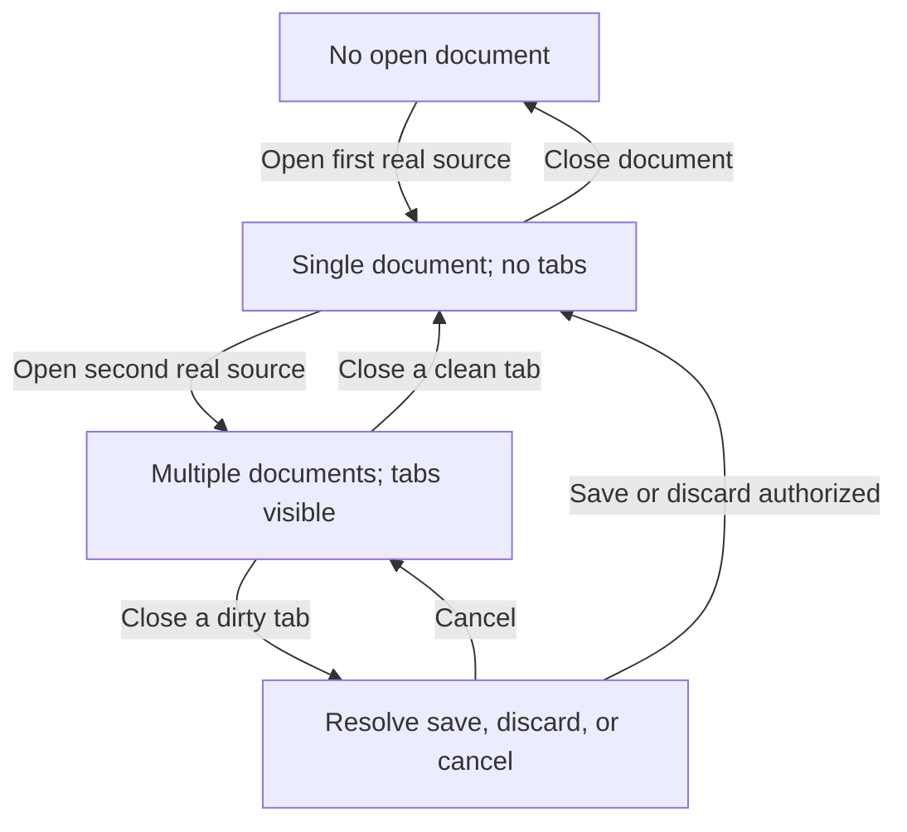

# Data Model: Content-First Desktop Hotfix

## Document session set

- **sessions**: Ordered collection of real user or explicitly recovered document sessions.
- **active session**: Optional identity of the document receiving the viewport.
- **count-derived presentation**: Empty at zero, single-document at one, concurrent-document at two or more.
- **invariants**: Production initialization contributes no synthetic member. Opening a new source activates it. Closing a dirty member requires the existing destructive-transition resolution.

## Shell presentation state

- **menu state**: Closed or open, with the menu button retained as focus-restoration owner.
- **secondary surface**: Exactly one of closed, Preferences, Diagnostics, metadata, or renderer search.
- **tab visibility**: Derived exclusively from `sessions.length >= 2`; never persisted independently.
- **content allocation**: The document surface fills the shell grid except for compact concurrent-document or transient overlay chrome.

## Desktop delivery

- **sequence**: Monotonic delivery identifier used by lifecycle evidence.
- **kind**: Dialog, drop, command line, or association.
- **status**: Opened, duplicate, or rejected.
- **source**: Real source descriptor and external revision when available.
- **transition**: Opened delivery materializes a session and activates it; duplicate delivery activates its existing session; rejected delivery creates no session and publishes a visible error.

## Packaged-user receipt

- **schema version**: Receipt contract version.
- **clean launch**: Empty-state assertion result.
- **TXT delivery**: Visible filename and bounded representative-content assertion result.
- **Markdown delivery**: Visible filename and bounded representative-content assertion result.
- **multi-document state**: Conditional tab and per-tab close assertion result.
- **prohibited state**: Fixture-name and spurious-recovery absence result.
- **document preservation**: Source digest equality before and after the probe.

## State transitions

