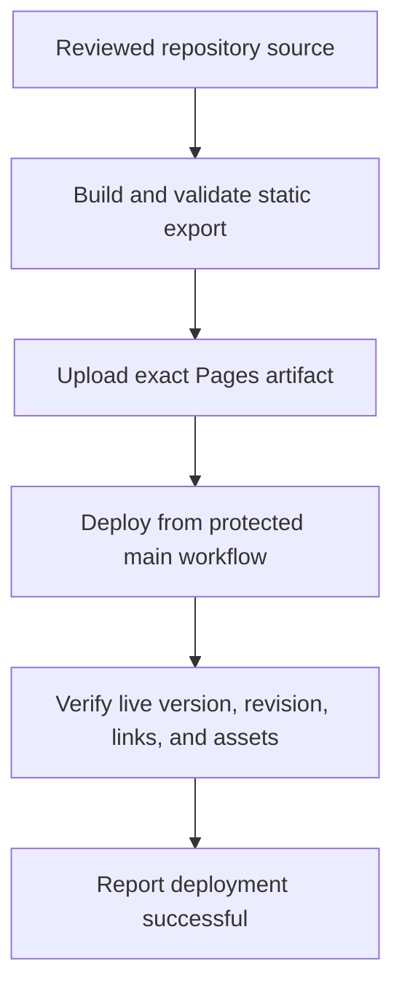

# Data Model: v0.1.2 Public Presentation Corrections

## Brand Delivery Receipt

- `brandVersion`: semantic version reported by the generated kit.
- `canonVersion`: parent ShruggieTech canon version.
- `sourceRepository`: immutable upstream repository identity.
- `sourceRevision`: exact 40-character commit used to generate the kit.
- `retrievedAt`: UTC calendar date of import.
- `kitDigest`: SHA-256 over the canonical manifest bytes.
- `publicComparisons`: publicly exposed derivative paths and observed SHA-256 values.
- `fileInventory`: governed relative path, byte length, and SHA-256 for every kit file.

Validation requires one unique relative path per file, complete digest coverage, and equality between each manifest entry and imported bytes.

## Public Identity Contract

- `brandIdea`: `View your files.`
- `descriptor`: `A fast, cross-platform viewer and editor for local files.`
- `endorsement`: `A ShruggieTech project.`
- `primaryActions`: `Download`, `Docs`.
- `currentRelease`: `v0.1.1` until the v0.1.2 release ritual.
- `lightLockup` and `darkLockup`: contextual governed asset paths.

The contract is valid only when exact strings appear on the landing page, primary navigation excludes Support/Security, and every lockup has one accessible name with visible nonzero geometry.

## Specification Control Record

- `version`: latest official product/specification version.
- `status`: normative document state.
- `issued`: original publication date.
- `updated`: date of the current revision.
- `releaseClass`: current release classification.
- `revisionHistory`: chronologically ordered dated versions.

`issued` never moves forward for ordinary revisions; `updated` equals the latest revision entry date.

## Deployment Provenance

- `productVersion`: product version represented by the export.
- `sourceRevision`: exact repository commit used to build the export.
- `builtAt`: build timestamp supplied by CI.
- `releaseUrl`: authoritative release destination.

The record is generated during the site build, shipped at `/deployment.json`, and checked against expected CI inputs after Pages deployment.

## State Transitions

