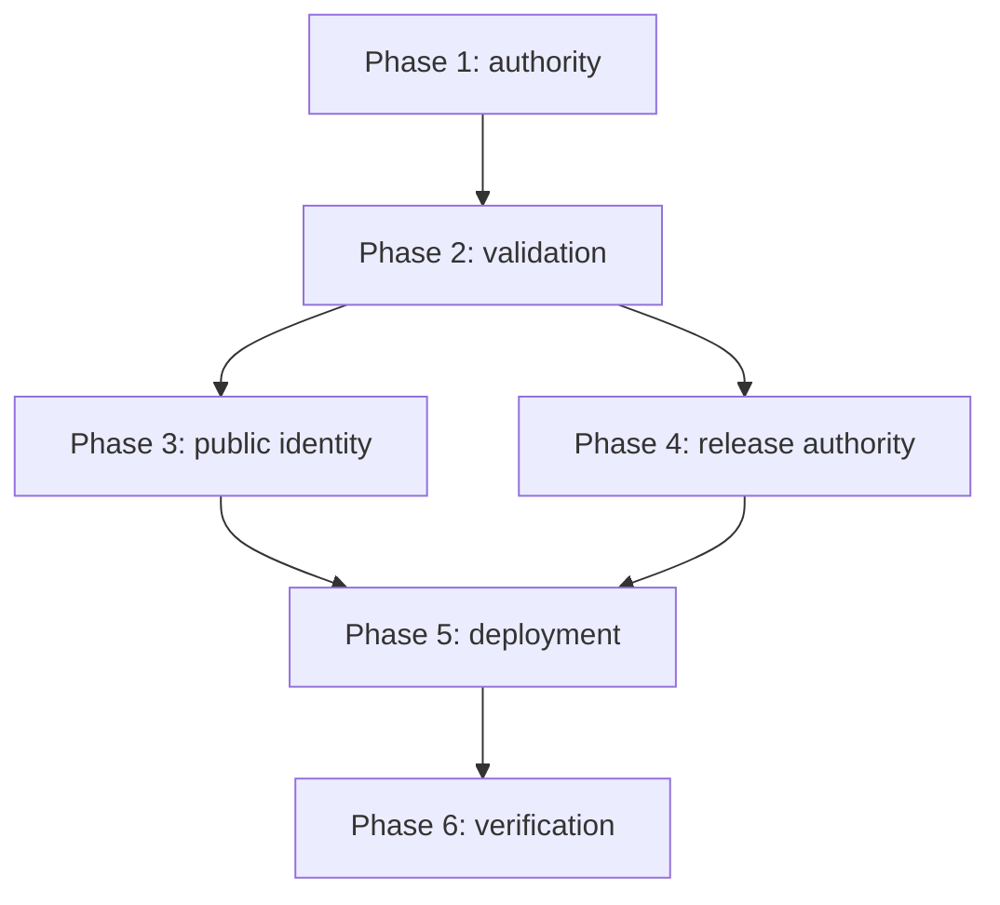

# Tasks: v0.1.2 Public Presentation Corrections

## Phase 1: Setup and authority

- [x] T001 Record the current upstream brand revision and import contract in `brand/INTEGRATION.md`
- [x] T002 Add a reproducible pinned upstream generator/import command in `scripts/sync-brand-kit.mjs`
- [x] T003 [P] Add focused mutation tests for brand freshness and receipt validation in `scripts/check-brand.test.mjs`

## Phase 2: Foundational validation

- [x] T004 Extend brand validation for upstream revision, kit digest, per-derivative hashes, and README raster visibility in `scripts/check-brand.mjs`
- [x] T005 [P] Add public release-authority mutation tests in `scripts/check-public-release.test.mjs`
- [x] T006 Implement public copy, version, availability, endorsement, action, and specification-date validation in `scripts/check-public-release.mjs`
- [x] T007 Wire the focused public-release gate into `package.json` and `crates/xtask/src/main.rs`

## Phase 3: User Story 1 - Recognize the current product and owner

- [x] T008 [US1] Import the pinned complete upstream kit and refresh exact integration copies under `brand/`, `site/public/`, `apps/glitchpad/public/`, and `crates/glitchpad-host/icons/`
- [x] T009 [US1] Replace the GitHub README banner with governed PNG lockups in `README.md`
- [x] T010 [US1] Replace landing-page copy, ownership, and concise actions in `site/app/(home)/page.tsx`
- [x] T011 [US1] Remove Support and Security from primary navigation while retaining secondary policy discovery in `site/lib/layout.shared.tsx` and `site/components/footer.tsx`
- [x] T012 [US1] Assert visible lockup geometry, canonical copy, responsive layout, and theme behavior in `site/tests/theme-lockup.spec.mjs`, `site/tests/public-routes.spec.mjs`, and `site/tests/accessibility.spec.mjs`

## Phase 4: User Story 2 - Trust public release information

- [x] T013 [US2] Generate truthful release availability and deployment inputs in `site/scripts/prebuild.mjs` and `site/lib/generated/project.ts`
- [x] T014 [US2] Reconcile current release copy in `site/content/docs/index.mdx` and `site/components/footer.tsx`
- [x] T015 [US2] Define Issued and Updated semantics and reconcile revision history in `docs/glitchpad-technical-specification.md`
- [x] T016 [US2] Update content and export contract tests in `site/tests/content-contract.test.mjs` and `site/tests/export-contract.test.mjs`

## Phase 5: User Story 3 - Deploy the reviewed site reliably

- [x] T017 [US3] Emit machine-readable build provenance in `site/scripts/prebuild.mjs` and `site/scripts/postbuild.mjs`
- [x] T018 [US3] Add bounded live production verification in `scripts/verify-site-deployment.mjs`
- [x] T019 [US3] Make successful main builds upload, deploy, and verify the exact Pages artifact while keeping pull requests non-mutating in `.github/workflows/docs.yml`
- [x] T020 [US3] Add workflow and provenance contract coverage in `scripts/check-public-release.test.mjs` and `site/tests/export-contract.test.mjs`

## Phase 6: Polish and cross-cutting verification

- [x] T021 Rebuild generated site sources and verify no stale public claims remain under `site/`
- [x] T022 Run focused brand, public-release, and site checks through `scripts/invoke-docker-hidden.ps1`
- [x] T023 Run full `cargo xtask check` through `scripts/invoke-docker-hidden.ps1`
- [x] T024 Record automated and post-deployment evidence in `specs/029-v012-public-presentation/verification.md`

## Dependencies

## Implementation Strategy

The smallest independently useful increment is the authoritative brand import plus README/site identity repair. Release metadata and deployment reliability follow in the same slice because production verification is required to prove those public corrections persist.
