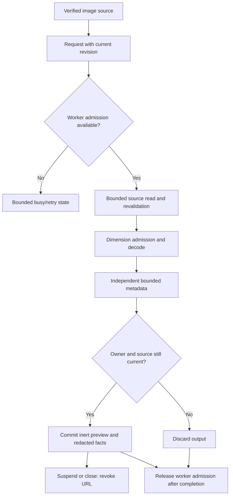

# Data Model: S039 Images

**Date**: 2026-09-15

## Image descriptor

Versioned family/variant (`raster`, `animation`, `svg`, `ico`), verified codec, original/display dimensions, checked pixels/decoded bytes, orientation, color policy/profile status, optional frame/page/entry facts, maturity, and independently advertised actions. Later-family contracts carry unavailable capabilities rather than pretending their implementations exist.

## Native image request/result

An opaque registered source ID, exact expected external revision, and bounded unique request ID identify work. Application-owned platform limits cannot be raised by callers. The result echoes request/revision, contains a descriptor, independent metadata statuses/facts, classified preview outcome, and bounded inert PNG bytes. No source path, provider URI, generic native authority, metadata markup, or sensitive value appears.

## Metadata observation

Canonical catalog key, known label, typed normalized/original value, family/tag/block provenance, public/sensitive/protected policy, availability, duplicate/conflict status, and session/external revision. Sensitive/unknown observations carry no original or display values. Known duplicate observations remain bounded and explicitly classified; inspector projection cannot silently overwrite conflicts.

## Resource owner

The native admission owner holds one permit from registration through actual worker completion. Cancellation invalidates publication and staged reads but retains the permit during synchronous decode. The interface owns only the active image's object URL and viewport state. Background/close releases it; reactivation requests a fresh generation.

## Transitions

Checked arithmetic rejects zero/overflowing dimensions. Numeric source/pixel limits and metadata bounds are immutable. Every completed result is validated before projection and every disposal path is idempotent.
